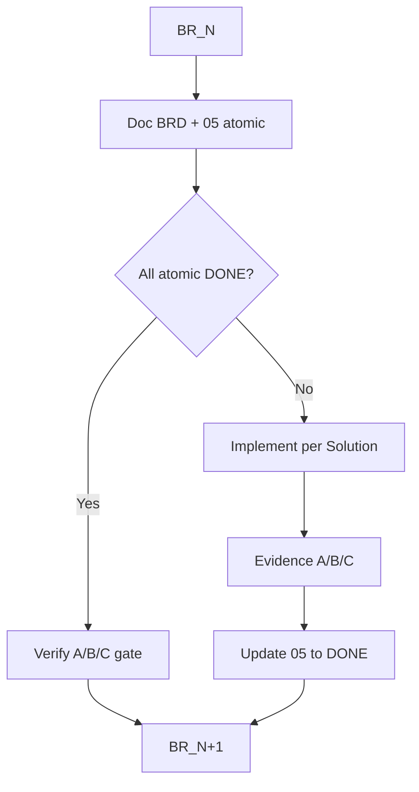

# Plan — Đóng hết BR theo BRD (từng BR một)

## Hierarchy (không đàm phán)

SoT vận hành: [`Product Backlogs/README.md`](Product%20Backlogs/README.md)

```text
01 BRD → 02 Audit → 03 SoT → 04 Solution → 05 Plan → Implementation
```

One-way: tầng dưới chỉ thực thi / cụ thể hóa; **không** redesign tầng trên.

Áp dụng task `080826_*`:

| Tầng | File |
|------|------|
| BRD | `01-Business-Requirements.md` |
| Audit | `02-*`, `02A-*` |
| SoT | `02B-Owner-Decisions.md`, `03-Source-of-Truth-Governance.md` |
| Solution | `04-Solution-Ready-to-Plan.md` |
| Plan | **file Plan này** (+ khi ship: copy `06-Plan-Execute-Close-All-BRs.md` trong task folder) |
| Verify vs BRD | `05-BRD-Completion-Checklist-Evidence.md` = artifact đo DONE (không phải tầng thiết kế lại Solution) |

- Không đổi Governance/OD trái BRD.
- Solution thiếu chữ BRD → **bổ sung implementation cho đủ BRD** (không xin bỏ BRD).
- **Definition of Done mỗi BR:** mọi atomic ID trong [05](...) của BR đó = **DONE** + evidence A/B/C.
- **Definition of Done task:** BR-01…BR-31 + BR-11A = DONE; §55 Acceptance = DONE.

## Locked Execution Decisions (tự khóa từ hierarchy — không hỏi Owner)

Các điểm Plan từng để “hoặc / optional” được **khóa** dưới đây vì đã có chữ BRD/Solution/OD. Chỉ escalate Owner nếu phát hiện **xung đột tầng cao** hoặc **thiếu quyết định** thật sự.

1. **OD-08 semantics — không đổi**  
   New/Empty trusted → Auto; Same → No Action; Conflict → Admin Review; **Missing ≠ Delete** (BR-18, Solution §11.6). Soft-flag Missing = **ngoài scope** (Solution: optional later).

2. **Change Set schema (HOW)**  
   Bảng mới `market_data_change_set_items` gắn `import_id`; class ∈ `new|fill|unchanged|conflict|missing|reject|noop`. Giữ API Apply/Reject hiện có; mọi class vào change set (BR-19 + Solution Conflict Management). Không đổi semantics Conflict/Missing.

3. **Disabled**  
   `data_sources.status = 'disabled'` → `runImport` / import-from-source **reject** (BR-13, Solution §11.5).

4. **review_required**  
   Field trust `review_required` → luôn tạo review/change-set item; **không bao giờ** auto-apply (BR-17).

5. **Divisor**  
   Migration DROP cột `sectors.divisor` / `ecosystems.divisor`; gỡ API/UI. Consumer formula (nếu còn) dùng derived `max(ticker_count,1)` inline — **không** giữ cột Master (BR-03.4, OD-05, Solution APPROVED).

6. **VNDirect quotes**  
   Internal `GET /api/market/runtime/quotes` (+ batch); FE/Admin **không** gọi host VNDirect trực tiếp (BR-11A, §55). Registry authority runtime `price`/`ohlc` cho `vndirect_finfo`.

7. **FE Master authority**  
   Production path: Master API only; **không** fallback Registry/hardcode làm SoT khi API fail — empty/error tiếng Việt (BR-29, §55).

8. **CSV / Upload**  
   Seed `manual_csv` + `internal_upload` + authority default `not_trusted`; upload → candidates → `runImport` (BR-11/12/31).

9. **SSI / FiinPro adapters**  
   Stub `loadCandidates` trả “not implemented” rõ ràng; **không** redesign domain (BR-31). Wire đầy đủ khi Owner mở phase sau — không phải gap Plan hiện tại.

10. **iFlux-owned vs external**  
    External đụng field iFlux-owned → Record + Review/Reject; **không** silent skip (BR-21.2).

11. **Audit trail**  
    `market_sot_audit` + wire `admin_id` trên Apply/Reject/import auto-apply/Admin PATCH Master (BR-23).

12. **MDM UI / route**  
    Select Source → Import; mapping 6 cột (Entity · Field · Current Source · Trust · Current Value · Last Update); alias Admin `/admin/thi-truong/data-sources` → `data/sources.html` (BR-11/16).

13. **Sector/Eco forms**  
    Center modal → right offcanvas (pattern Stocks) (BR-26).

14. **DNSE**  
    instruments → Candidate → `runImport` only; auth/rate fail → import `failed` + Master vẫn đọc được (BR-07). Không write `stocks` trong `dnse/`.

**Escalate Owner chỉ khi:** BRD tự mâu thuẫn; hoặc Solution/SoT thiếu quyết định khiến không thể thi công một atomic BRD mà không bịa semantics mới.

## Cách chạy từng BR

Với mỗi BR `N`:

1. Đọc atomic rows `BR-N.*` trong `05`.
2. Nếu toàn DONE → **Verify gate**: chạy lại A/B/C tối thiểu, xác nhận không regress, ghi timestamp verify trong `05`.
3. Nếu còn INCOMPLETE/NOT DONE → thi công theo Solution § tương ứng → deploy Production khi đụng runtime → cập nhật `05` status + evidence.
4. Không sang BR `N+1` khi BR `N` còn INCOMPLETE/NOT DONE (trừ dependency kỹ thuật bắt buộc làm sớm — ghi rõ bên dưới).



---

## Phase 0 — Baseline (trước BR loop)

- Đọc khóa: `01`, `05` §3–§6, `04` §0 Matrix + § liên quan.
- Inventory code hiện có: [`backend/src/modules/market/`](backend/src/modules/market/), [`market-mdm.service.js`](backend/src/modules/market/market-mdm.service.js), Admin `data/sources*`, `market/sectors*`, `market/ecosystems*`, FE `mock-market.js` / `watchlist-taxonomy.js` / `entity-list-page.js`, DNSE [`backend/src/modules/dnse/`](backend/src/modules/dnse/).
- Không mở BR mới ngoài BRD.

---

## BR-by-BR execution

### BR-01, BR-02, BR-05, BR-06, BR-08, BR-10, BR-14, BR-27 (đã DONE)

- **Action:** Verify-only (không rewrite).
- **Gate:** Master API CDN 200; FK còn; Cap CHECK; OD-08 A–E smoke; list timing &lt;1s; Sector PUT tickers.
- **Output:** `05` ghi `VERIFIED &lt;date&gt;` trên các atomic DONE.

### BR-03 + BR-04 — Sector/Eco + DROP divisor (BRD bắt buộc)

**BRD:** loại bỏ Divisor khỏi SoT/DB/Admin consumers (Solution đã APPROVED → được DROP).

- Migration `047_drop_market_divisor.sql`: `ALTER TABLE sectors/ecosystems DROP COLUMN divisor` (postgres owner apply như `045`).
- Gỡ divisor khỏi [`sectors-admin.service.js`](backend/src/modules/market/sectors-admin.service.js), [`ecosystems-admin.service.js`](backend/src/modules/market/ecosystems-admin.service.js), routes zod, Admin JS/HTML còn sót, eco detail preview copy (không còn Master divisor).
- Nếu formula/IG còn phụ thuộc divisor → chuyển sang derived `max(ticker_count,1)` **inline tại formula path**, không giữ cột Master.
- **Done khi:** B không còn column; C API không trả `divisor`; Admin UI không còn nhãn Divisor Master.

### BR-07 — DNSE provider operational

**BRD:** DNSE phục vụ population/sync/enrichment; không SoT.

- Thêm adapter module (modify DNSE client hoặc `market-mdm` helper): login → fetch instruments (theo catalog `GET /instruments` trong raw-catalog) → normalize Candidate `{ticker,name,exchange,market_cap?,cap_group?}`.
- `POST /admin/market/mdm/imports/from-source` body `{source_code:'dnse'}`: fetch → `runImport` (không UPDATE stocks trực tiếp từ DNSE).
- Nếu endpoint DNSE lỗi auth/rate: import status `failed` + error_summary (BR-22), Master vẫn đọc được (BR-07.3).
- **Done khi:** C chạy import-from-dnse tạo `market_data_imports` row + OD-08 classify; A không có write stocks trong `dnse/`.

### BR-09 + BR-11A + BR-15 (runtime Price/OHLC) — đóng ungoverned VNDirect

**BRD/Audit:** VNDirect direct phải vào governance.

- Registry: đảm bảo `vndirect_finfo` có field authority domain runtime (`price`, `ohlc`) — default `trusted` cho runtime read path (không ghi Master).
- Backend: `GET /api/market/runtime/quotes` (+ batch) proxy server-side sang VNDirect (hoặc wrap logic từ [`User_Web/iflux-web-ui/iflux-market-quotes.js`](User_Web/iflux-web-ui/iflux-market-quotes.js) lên service) — Public/Admin **không** gọi host VNDirect trực tiếp cho quotes.
- FE: `IfluxMarketQuotes` chỉ gọi Internal API.
- Traceability: response/meta ghi `source_code=vndirect_finfo`.
- **Done khi:** A không còn hardcode provider URL trên FE quotes; B authority rows price/ohlc; C quotes qua `/api/market/runtime/*`.

### BR-11 + BR-12 + BR-13 + BR-16 + BR-17 — MDM control plane đủ chữ BRD

**BRD bullets bắt buộc:**

1. Registry fields: name, provider, type, status, trust summary, last import, last success, import status — extend list API + UI [`sources-page.js`](Admin_Design_system/app/data/sources-page.js).
2. Seed `manual_csv`, `internal_upload` trong `data_sources` + authority defaults `not_trusted`.
3. **Disabled:** `status=disabled` (hoặc map rõ) → `runImport` reject.
4. **Review Required:** field trust `review_required` → luôn tạo conflict/review set, không auto apply.
5. MDM UI: Select Source → Import (button + optional paste JSON / file CSV cho manual) → kết quả classify.
6. Mapping view: Entity · Field · Current Source · Trust · **Current Value** · Last Update — API join sample/master field values (stock-level drill hoặc aggregate last-known) đúng chữ BR-11.6/BR-16.3.
7. Route: thêm alias Admin route slug `/admin/thi-truong/data-sources` → cùng `data/sources.html` (BR đề xuất).

**Done khi:** C import wizard hoạt động; Disabled chặn import; review_required không auto; matrix đủ 6 cột; registry đủ field tối thiểu BR-12.

### BR-18 + BR-19 + BR-20 + BR-21 + BR-22 — Change detection / Change Set / Review / History

**Thi công trên MDM service (một pipeline):**

- Trong `runImport`:
  - Tính **Missing** = tickers Master (scope active) không có trong candidate batch → ghi `missing_count` + change-set rows `class=missing`, **không DELETE**.
  - Mọi New / Fill / Unchanged / Conflict / Missing / iFlux-owned reject → ghi **change set items** (bảng mới `market_data_change_set_items` hoặc mở rộng conflicts thành change_set thống nhất với `result` ∈ apply|review|reject|noop|missing).
- BR-21.2: external đụng iFlux-owned → **Record + Review/Reject** (không skip im lặng).
- BR-20: UI Review đủ Apply / Reject / Skip(bỏ qua) + note lý do (`note`).
- BR-22: history trả đủ counters BR liệt kê + link `import_id` → change set.

**Done khi:** C một import tạo change set rows đủ class; Missing &gt;0 khi cố ý bỏ ticker; iFlux-owned tạo review record; history JSON đủ field BR-22.

### BR-23 — Audit trail SoT decisions

- Mọi Apply/Reject conflict, Admin PATCH stock Master fields, import auto-apply: ghi `market_sot_audit` (who/admin_id, what entity/field, when, from, to, source, why/note, result) — reuse pattern tối thiểu, không invent product ngoài BRD.
- Wire `admin_id` từ `req.admin` vào import/resolve/stock patch.

**Done khi:** B/C truy ngược được 1 Apply + 1 Admin PATCH đủ Who/What/When/From/To/Source/Result.

### BR-24 + BR-25 — Stocks Admin UI

- List: hiển thị **Market Cap** (số) + Nhóm vốn hóa riêng (BR-24.2).
- Verify save/close offcanvas (BR-25.3) bằng runtime click-path hoặc API+DOM contract; sửa regression nếu có.
- Mapping label↔field: đảm bảo copy/export dùng `exchange`/`cap_group` đúng.

**Done khi:** C list có đủ cột BR-24; save/close không lỗi JS.

### BR-26 — Sector/Eco Admin UI drawer

- Đổi create/edit Sector + Ecosystem từ **center modal → right offcanvas** (cùng pattern Stock [`stocks.html`](Admin_Design_system/app/market/stocks.html)).
- Đủ description field trên form; metrics giữ derived.

**Done khi:** A/C không còn modal-center cho create/edit Sector/Eco; offcanvas mở/lưu được.

### BR-28 + BR-29 + BR-30.2 — Public FE Master + consumer migration

- FE Master: bỏ fallback hardcode/`IfluxMarketRegistryStore` làm authority khi API fail trên production host — empty/error state tiếng Việt; dev-only fallback nếu cần tách bằng hostname.
- `entity-list-page` / taxonomy / header-search / watchlist: chờ `ensureMasterReady`; data từ Master API.
- Consumers trong `02` §G đánh dấu Migration Required: đóng từng consumer liên quan Master (Search, taxonomy, list/detail pages, widgets đọc registry stocks). Runtime quotes đã chuyển BR-11A.
- Evidence C: HAR hoặc curl+FE code path chứng minh `/co-phieu|/nganh|/he-sinh-thai` gọi `/api/market/master/*`.

**Done khi:** A không còn Registry làm SoT trên prod path; C master fetch trên list pages; §G Master consumers = migrated.

### BR-31 — Abstraction

- Interface mỏng `loadCandidates(sourceCode)` dùng bởi DNSE / manual_csv / (stub) ssi/fiinpro.
- Cấm branch `if (source==='dnse')` rải ngoài adapter folder.
- CSV upload → candidates → `runImport`.

**Done khi:** A một entrypoint import-from-source; thêm CSV source chạy được; SSI/FiinPro stub adapter trả clear “not implemented” mà không redesign domain.

---

## Dependency order (kỹ thuật, vẫn “xử lý từng BR”)

```text
Verify DONE BRs (01,02,05,06,08,10,14,27)
    → BR-03/04 divisor DROP
    → BR-18/19/20/21/22 change-set + missing (+ opens BR-16 classify)
    → BR-13/17 trust enforce
    → BR-11/12/16 MDM UI + registry fields + route alias
    → BR-07 DNSE adapter + BR-31 abstraction + CSV
    → BR-09/11A/15 VNDirect runtime proxy
    → BR-23 audit
    → BR-24/25 stocks UI polish
    → BR-26 drawers
    → BR-28/29/30 FE + consumers
    → Final §55 + update 05 all DONE
```

Khi một bước phục vụ nhiều BR: đóng BR theo thứ tự số sau khi evidence đủ (ví dụ change-set xong → đánh dấu BR-18,19,20,21,22 lần lượt với gate riêng).

---

## Deploy / Evidence discipline

- Mỗi cụm đụng Production: rsync backend/Admin/User_Web → apply migration (postgres owner nếu cần) → `pm2 restart iflux-api` → Cloudflare purge khi FE.
- Sau mỗi BR (hoặc cụm): cập nhật [05](Product%20Backlogs/080826_Market_Domain_Source_of_Truth_Governance/05-BRD-Completion-Checklist-Evidence.md) atomic → DONE + evidence mới.
- **Không** kết thúc task khi `05` còn INCOMPLETE/NOT DONE.

## Stop conditions (theo Product Backlogs README)

```text
Lower discovers conflict / missing higher decision
  → STOP → escalate đúng tầng → Owner quyết → cập nhật tầng cao → resume
```

- BRD tự mâu thuẫn → STOP Owner (hiện không có).
- Plan **không** được tự đổi OD-08 / SoT / Solution để “dễ code”.
- Không đánh DONE thiếu evidence B hoặc C cho hành vi dữ liệu.
- **Không còn câu hỏi Plan mở** sau Locked Execution Decisions ở trên.