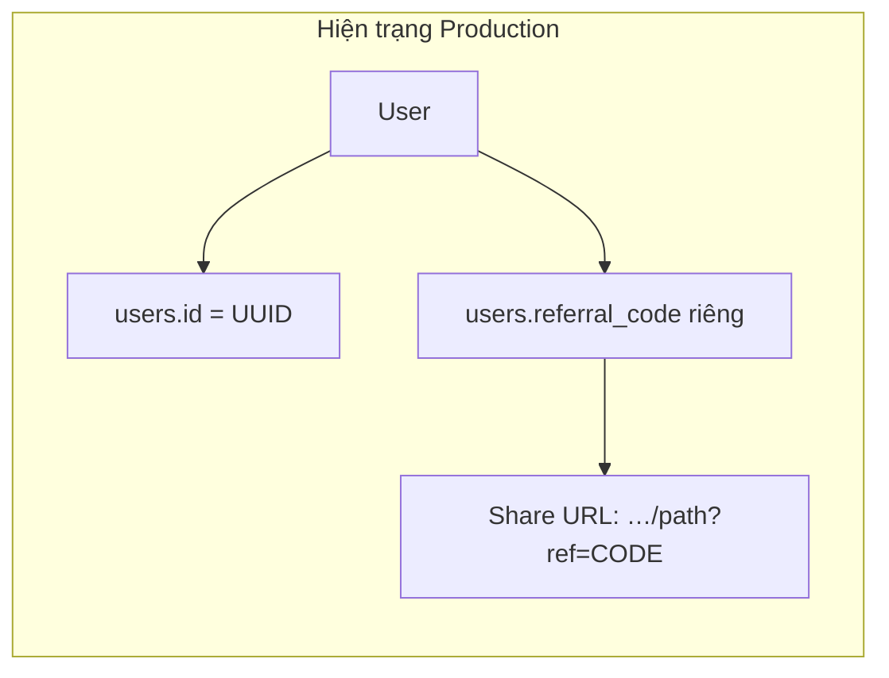
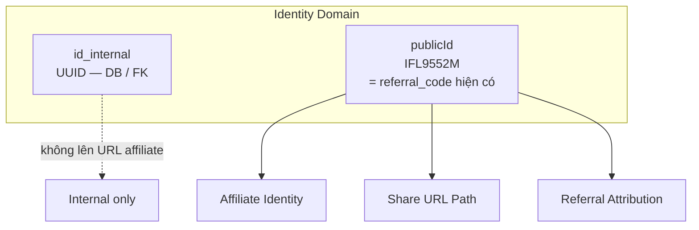
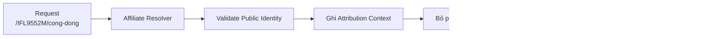
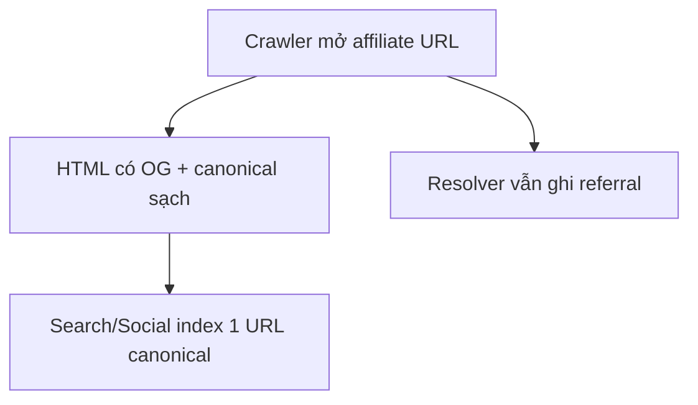

# Đặc tả Solution — Affiliate Identity & URL Path Decoration

| Trường | Giá trị |
|--------|---------|
| **Phiên bản** | v1.1 — Architecture locked |
| **Spec Status** | **APPROVED** |
| **Approved by** | Owner |
| **Date** | 2026-07-25 |
| **Implementation** | **NOT STARTED** — chỉ theo Plan FINAL · giao từng phase |
| **Domain** | Identity · Share Capability · Growth Attribution · App Runtime |
| **Nguồn** | Owner + ChatGPT · Agent · Reviewer (vòng 2 + vòng Approval) |
| **Thư mục Task** | `docs/250726_Affiliate Public Identity & Path Decorators/` |
| **Liên quan hiện trạng** | Audit + Plan path-migrate trong cùng thư mục task |
| **Governance** | `docs/SoT — Engineering Change Governance.md` · ECR-AFF-PATH-2026-07-25 **APPROVED** |
| **Product SoT** | `docs/SoT — iFlux Product Architecture (V2).md` |
| **Bước tiếp** | Plan FINAL → Execute **P0 only** (khi Owner giao) |

> **Chốt thuật ngữ (v1.1):** Affiliate Identity **không** thuộc Database Identity.  
> Nó thuộc **Public Identity Layer**.  
> `publicId := referral_code` hiện tại. **Không** dùng UUID làm mã công khai / URL.

> **Owner stamp:** Quyết định kiến trúc query → path **đã khóa** (APPROVED 2026-07-25). Không sửa solution trừ khi Owner mở lại ADR.

---

## 0. Tóm tắt một trang (đọc trước)

### Ý tưởng cốt lõi

```
UUID nội bộ  ≠  mã người dùng nhìn thấy
Public Identity (IFL…)  =  Affiliate Identity  =  Share / Referral
URL chia sẻ gắn Public Identity vào PATH
?ref= chỉ còn tương thích ngược / campaign — không còn chuẩn chính
```

### Ba lớp định danh

| Loại | Ví dụ | Mục đích |
|------|--------|----------|
| Internal ID | UUID | Database, FK, `referred_by` |
| **Public Identity** | `IFL9552M` | URL, share, referral, nhớ mã |
| Session / Auth | token | Runtime phiên đăng nhập |

### URL mẫu

| Loại | Ví dụ |
|------|--------|
| Canonical | `https://iflux.vn/cong-dong` |
| Affiliate | `https://iflux.vn/IFL9552M/cong-dong` |
| Canonical trong HTML (SEO) | luôn `/cong-dong` (không prefix) |

### Quyết định khóa (Architecture Review APPROVE)

| ID | Quyết định | Review |
|----|------------|--------|
| **ADR-AFF-001** | iFlux **không** tạo Affiliate Identity riêng. Affiliate Identity **dẫn xuất** từ Public Identity. Hiện tại `publicId := referral_code`. | **APPROVE** |
| ADR-AFF-002 | Affiliate URL = `/{publicId}/{Path}` — Path Decoration, không phải Page mới | APPROVE hướng |
| ADR-AFF-003 | `?ref=` không còn chuẩn referral user (deprecate sau P5; giữ tương thích trong migration) | APPROVE hướng |
| ADR-AFF-004 | First-touch attribution — **không đổi** trong task này (chỉ đổi Transport Layer) | **APPROVE** |
| ADR-AFF-005 | Page Runtime / Widget **không** biết referral | APPROVE hướng |
| **AFF-ID-002** | `publicId` **MUST** immutable after creation | **APPROVE có điều kiện** |
| **ADR-AFF-006** | Public Identity Stability — đổi `publicId` = **breaking change** (external links / share / attribution history) | **Thêm — APPROVE** |

### Câu trả lời kiểm chứng `referral_code` (xem §0.1)

| Câu hỏi Reviewer | Kết quả mã nguồn |
|------------------|------------------|
| A. Immutable? | Hành vi hiện tại không UPDATE — **chưa đủ**. SoT khóa **AFF-ID-002** + ADR-AFF-006 (không dựa vào “code hiện tại không update”). |
| B. Unique global? | **Có** — `referral_code VARCHAR(20) UNIQUE` (`001_init.sql`). |
| C. Mọi registered user? | Có lúc tạo tài khoản. Guest = không có mã (hợp lệ). Backfill: `registered + NULL` → generate; **không** ép cột `NOT NULL` toàn bảng nếu schema còn guest/null hợp lệ. |

→ `publicId = referral_code` **ACCEPT** với AFF-ID-002 + backfill rule + ADR-AFF-006.

---

## 0.1 Kiểm chứng Production — `referral_code` có làm Public Identity được không?

### A. Immutable?

| Bằng chứng | Chi tiết |
|------------|----------|
| Generator | `auth.service.js` → `genReferralCode()` = `'IFL' + random(5)` |
| Gán | Chỉ trong `INSERT INTO users (…, referral_code, …)` lúc đăng ký / social |
| Đổi sau | **Không** tìm thấy `UPDATE … SET referral_code` trong backend |

**Kết luận A:** Hành vi hiện tại = không đổi mã sau khi cấp.  
**Gap:** Chưa có enforcement cứng (DB trigger / cấm API). SoT phải ghi **Mutable = NO**; Implementation nên khóa.

### B. Unique global?

```sql
-- backend/migrations/001_init.sql
referral_code VARCHAR(20) UNIQUE,
```

**Kết luận B:** PASS — UNIQUE đã có. Collision lúc insert → regenerate (retry loop trong `createUserFromPending`).

### C. Dành cho mọi user?

| Đối tượng | Có mã? |
|-----------|--------|
| Guest (chưa đăng ký) | Không — đúng |
| User đăng ký email | Có — insert kèm `referral_code` |
| User social login | Có — cùng generator |
| Free / Premium / Elite | Không phân biệt tier khi cấp mã |
| Hàng cũ / edge null | Có thể null vì cột nullable |

**Kết luận C:** Mọi **registered user mới** đều có mã. Cần Phase 1: audit `WHERE referral_code IS NULL` + backfill.

### Quyết định kỹ thuật (Architecture Review locked)

```
ACCEPT:

publicId  :=  referral_code   -- cột hiện có, không tạo cột affiliate_code mới
id_internal := UUID           -- chỉ nội bộ / FK

AFF-ID-002 — immutable after creation:
  CẤM: User đổi mã | Admin sửa mã | Migration tự regenerate

Backfill (registered only):
  referral_code IS NULL  →  generate publicId
  Sau backfill: mọi registered user PHẢI có publicId
  Guest NULL = hợp lệ
  KHÔNG ép NOT NULL toàn cột nếu schema còn guest / null hợp lệ

ADR-AFF-006 — Public Identity Stability (breaking nếu đổi)

Reserved namespace: không cấp IFL trùng slug hệ thống (prefix IFL đã gần đúng)
```

---

## 0.2 Consensus — Architecture Review PASS

| Chủ đề | Kết luận |
|--------|----------|
| Path Decoration + Resolver | **PASS** |
| SEO canonical sạch | **PASS** |
| Share Foundation owner decorate | **PASS** |
| Không flip overnight / P0→P5 | **PASS** |
| Public Identity Layer (không DB UUID) | **PASS** |
| `publicId = referral_code` + AFF-ID-002 + ADR-AFF-006 | **PASS** |
| First-touch (không đổi Attribution Rule) | **PASS** |
| Implementation | **NOT STARTED** |
| Next | Owner APPROVE → Implementation Plan |
---

## 1. Mục tiêu

1. **Một User có một Public Identity ổn định** (dễ nhớ / dễ đọc) — không đồng nhất *Person* với *User Account* (merge / org / creator sau này).
2. Share URL **không phụ thuộc** query `?ref=` làm chuẩn.
3. Social Preview (Zalo / Facebook / …) ổn định hơn so với query (ít bị strip / cache lệch).
4. Không phá Page Routing Architecture (không nhân đôi route theo từng user).
5. Share Capability, Routing, SEO, Attribution dùng **cùng một mô hình**.
6. Mở rộng được: Premium referral, Trading, Report, Creator, Partner — không đổi Identity Model.

**Ngoài phạm vi tài liệu này:** công thức hoa hồng, payout, fraud scoring chi tiết.

---

## 2. Bài toán hiện tại (AS-IS ngắn)



Hệ quả AS-IS:

- Hai khái niệm định danh song song (UUID + `referral_code`).
- Share Foundation decorate bằng **query**.
- Crawler / cache / Preview từng bị ảnh hưởng bởi biến thể URL `?ref=`.
- Đã có Plan & code `?ref=` (Share Capability) — solution path này là **đổi chuẩn**, không phải chỉnh nhỏ.

---

## 3. Kiến trúc đích (TO-BE)

### 3.1 Public Identity = Affiliate Identity (không dùng UUID)



**ADR-AFF-001 (Architecture Review APPROVE):**

> iFlux không tạo Affiliate Identity riêng.  
> Affiliate Identity được **dẫn xuất** từ Public Identity của User.  
> Hiện tại `publicId := referral_code`.

**Đúng (2 lớp ID):**

```
User
 ├── id_internal (UUID)
 └── publicId (= referral_code)
         ├── Affiliate Identity
         ├── Share URL Decoration
         └── Referral Attribution
```

**Sai (3 lớp ID — cấm):**

```
User → UUID + Affiliate Code + Public ID   ← không
```

**ADR-AFF-006 — Public Identity Stability:**

> Public Identity là định danh công khai dài hạn.  
> Đổi `publicId` = **breaking change** (Zalo / Facebook / email / bookmark / attribution history).

### 3.2 Decoration nằm ngoài Page



Page Registry **chỉ** biết `/cong-dong` — không đăng ký `/{affiliate}/cong-dong`.

---

## 4. Mô hình Identity

### 4.1 Contract thực thể User (logic)

```
User
 ├── id_internal     (UUID — khóa DB, không dùng trên URL affiliate)
 ├── publicId        (IFL… — SoT Identity công khai = Affiliate Id)
 ├── profile / tier / permissions
 └── referredBy      (publicId hoặc UUID nội bộ của người giới thiệu — chốt khi thiết kế Persistence)
```

### 4.2 Quy tắc Public Identity (AFF-ID-002 + ADR-AFF-006)

| Rule | Yêu cầu |
|------|---------|
| Unique | Có |
| Đổi được sau khi cấp | **Không** — MUST immutable |
| User đổi mã | **Cấm** |
| Admin sửa mã | **Cấm** |
| Migration regenerate | **Cấm** |
| User tự đặt lúc tạo | **Không** (chỉ generator hệ thống) |
| Đổi sau = breaking | **Có** (ADR-AFF-006) |
### 4.3 Ví dụ (sau khi có Public Identity)

```json
{
  "id": "a1b2c3d4-…-uuid",
  "publicId": "IFL9552M",
  "display_name": "Nguyễn Văn A",
  "tier": "premium"
}
```

Affiliate Id dùng mọi nơi Growth/Share: **`IFL9552M`**.

---

## 5. URL Design

### 5.1 Chuẩn (AFF-003)

```
Canonical:   https://iflux.vn/{path}
Affiliate:   https://iflux.vn/{publicId}/{path}
```

Ví dụ:

| Mục đích | URL |
|----------|-----|
| Feed Cộng đồng | `/cong-dong` · `/IFL9552M/cong-dong` |
| Bài viết | `/cong-dong/bai-viet/{slug}` · `/IFL9552M/cong-dong/bai-viet/{slug}` |
| Nhà | `/nha-cua-toi` · `/IFL9552M/nha-cua-toi` |

### 5.2 Không phải Page mới

Sai (route explosion):

```
Page registry:
  /IFL9552M/cong-dong
  /IFL9553M/cong-dong
  …
```

Đúng:

```
Decoration layer:  /{publicId}
+
Canonical page:    /cong-dong
```

### 5.3 Guest vs Login (Share)

| Người share | Output |
|-------------|--------|
| Chưa đăng nhập | Canonical — `https://iflux.vn/cong-dong` |
| Đã đăng nhập | Affiliate — `https://iflux.vn/{publicId}/cong-dong` |

---

## 6. Affiliate Resolver

### 6.1 Ownership (AFF-004)

| Việc | Owner |
|------|--------|
| Nhận diện segment đầu có phải Public Identity | Platform Runtime — Affiliate Resolver |
| Validate tồn tại / active | Identity Domain |
| Ghi attribution context | Growth Domain (Resolver chỉ emit context) |
| Strip prefix → canonical path | Platform Runtime |
| Render Page | Page Runtime (**không** biết affiliate) |

### 6.2 Contract

**Input**

```
/{publicId}/{route…}
```

**Output (logic)**

```json
{
  "affiliate": {
    "publicId": "IFL9552M",
    "valid": true
  },
  "canonicalPath": "/cong-dong",
  "attribution": {
    "referrerPublicId": "IFL9552M",
    "landingPath": "/cong-dong",
    "firstSeenAt": "2026-07-25T10:00:00Z"
  }
}
```

Nếu `publicId` không hợp lệ / reserved / không tồn tại → **không** coi là affiliate; xử lý như 404 hoặc fallback route thường (chốt khi thiết kế edge case).

### 6.3 Reserved namespace (AFF — Reserved)

Không cấp / không nhận làm Affiliate Id:

```
admin, api, auth, dang-nhap, dang-ky, settings,
nha-cua-toi, thi-truong, dong-tien, cong-dong,
goi-cuoc, tai-khoan, …
```

(Identity Service chịu trách nhiệm không sinh `publicId` trùng slug hệ thống.)

---

## 7. Attribution

### 7.1 Ownership (AFF-006)

- Resolver / Client: chỉ giữ **context tạm** (session) để hoàn tất signup.
- **Server** = nguồn quyết định cuối (`referred_by` / quan hệ referral).
- Hoa hồng / campaign / reward = Monetization / Growth — **không** nằm trong Share/Page.

### 7.2 First Touch (AFF-007 / ADR-AFF-004) — **APPROVE giữ nguyên**

```
Ngày 1: User mới mở link IFL1000M  →  referrer = IFL1000M
Ngày 5: cùng người mở link IFL2000M →  vẫn giữ IFL1000M
```

Pipeline AS-IS giữ nguyên:

```
Incoming referral → cookie → registration → referred_by
```

**Phạm vi task này:** chỉ đổi **Referral Transport Layer** (`?ref=` → path).  
**Ngoài phạm vi:** Referral Business Rule / Attribution — không đổi cùng task.

Đổi first-touch / last-touch / campaign override → Business Rule riêng + cập nhật SoT.

### 7.3 Client storage (AFF-008)

Được phép (tạm):

```json
{
  "referrerPublicId": "IFL9552M",
  "firstSeenAt": "…",
  "landingPath": "/cong-dong"
}
```

Không được: coi cookie client là ownership / commission SoT.

---

## 8. SEO & Social Preview (AFF-009)

### 8.1 Vấn đề với query (đã gặp)

```
/cong-dong/bai-viet/x?ref=CODE
```

Dễ: crawler/cache phân mảnh URL · Preview lệch · xung đột với Pipeline A/B.

### 8.2 Cách path + canonical

Request affiliate:

```
/IFL9552M/cong-dong/bai-viet/{slug}
```

HTML **bắt buộc**:

```html
<link rel="canonical" href="https://iflux.vn/cong-dong/bai-viet/{slug}" />
<meta property="og:url" content="https://iflux.vn/cong-dong/bai-viet/{slug}" />
```

(cùng Metadata SoT — **không** nhét publicId vào `og:url` / canonical.)



### 8.3 Pipeline A/B

Affiliate path **phải** đi qua cùng chiến lược Preview:

- Bot whitelist → Pipeline A (OG) trên **canonical entity** (sau resolve), hoặc A hiểu cả affiliate URL nhưng emit meta sạch.
- Human / In-App → Pipeline B SPA + SoT head sạch.

Chi tiết triển khai nginx/resolver — phase Implementation (không khóa trong SoT nguyên tắc).

---

## 9. Share Capability (AFF-010)

### 9.1 Nâng cấp pipeline

```mermaid
flowchart TB
  IN[Target resource + User context] --> CHK{User đã login<br/>+ có publicId?}
  CHK -->|Không| CAN[Canonical URL]
  CHK -->|Có| DEC[Path decorate<br/>/{publicId}{path}]
  CAN --> OUT[shareUrl]
  DEC --> OUT
```

### 9.2 Ownership

| Việc | Owner |
|------|--------|
| Sinh share URL (decorate) | **Share Capability / Foundation** |
| Cung cấp `publicId` | Identity |
| Capture khi mở link | Growth + Runtime Resolver |
| Widget / Community | Chỉ gọi Share Capability — **không** tự ghép prefix |

### 9.3 Cấm

- Widget/Page tự biết `referrer` / `commission`.
- Dùng `?ref=` làm chuẩn referral user (AFF — Forbidden).
- Tạo bảng `affiliate_codes` chỉ để map 1–1 với Public Identity.

---

## 10. UX

**Trong Profile / Loyalty**

```
Mã giới thiệu của bạn
IFL9552M

Link chia sẻ
https://iflux.vn/IFL9552M/cong-dong
```

User có thể:

- nhớ / đọc mã qua điện thoại;
- nói: “Đăng ký iFlux nhập mã IFL9552M”;
- copy một link path sạch (không query).

---

## 11. Security (AFF-011)

Biết `IFL9552M` **không** đồng nghĩa quyền:

- xem profile private;
- thao tác account;
- đọc dữ liệu nội bộ.

Chỉ là **Attribution Identifier**.

---

## 12. Ownership Matrix (chốt)

| Capability | Owner |
|------------|--------|
| UUID nội bộ | Identity / DB |
| Public Identity (`IFL…`) | Identity Domain |
| Affiliate Id (= Public Identity) | Identity Domain |
| Affiliate Resolver | Platform Runtime |
| Share URL generation | Share Capability |
| Attribution relationship | Growth Domain |
| Commission / reward | Monetization Domain |
| SEO canonical / OG | Web Runtime + Article Metadata SoT |
| Page composition | Page / Product Architecture |

---

## 13. Forbidden (không được làm nếu chưa sửa SoT)

1. Tạo `affiliate_codes` table chỉ để map User.
2. Lấy `?ref=` làm **chuẩn chính** referral user.
3. Đăng ký Page `/{affiliate}/…` trong Page Registry.
4. Để Widget / Page Runtime chứa logic referral / commission.
5. Cho user / admin / migration đổi Public Identity sau khi đã cấp (AFF-ID-002 / ADR-AFF-006).
6. Đổi Share sang path **trước** khi Affiliate Resolver sống (P3 trước P2).
7. Đổi Attribution Business Rule trong cùng task đổi Transport.
---

## 14. Lợi ích dài hạn

Cùng một Public Identity phục vụ:

```
User Referral
 ├── Premium Subscription
 ├── Trading Referral
 ├── Report Sales
 ├── Creator Program
 └── Partner Network
```

không nhân đôi Identity Model.

---

## 15. Lộ trình đề xuất (không flip overnight)

| Phase | Việc | Giữ / đổi |
|-------|------|-----------|
| **P0 — Freeze** | Giữ `?ref=` hoạt động; **cấm** thêm URL builder song song | AS-IS ổn định |
| **P1 — Public Identity Contract** | `publicId = referral_code`; API `{ id_internal, publicId }`; AFF-ID-002; backfill registered null | Chưa đổi share URL production |
| **P2 — Resolver** | Runtime hiểu `/IFL…/path` → validate → attribution → canonical | Song song với `?ref=` |
| **P3 — Share Output Switch** | Share Foundation decorate **path** (chỉ **sau** khi P2 sống) | Modify `share-action-store` (CG-001) |
| **P4 — Backward Compatibility** | `?ref=` vẫn capture / (tuỳ chọn) normalize | Không gãy link cũ |
| **P5 — Remove Query Decorators** | Deprecate `?ref=` user-referral làm chuẩn | CG-020/021 |

**Cấm tuyệt đối:**

```
Share đổi → /IFLxxx/path
TRƯỚC KHI
Runtime hiểu → /IFLxxx/path
```

**Cấm:** tắt `?ref=` ở P0–P2. P3 chỉ sau P2.

---

## 16. Quan hệ với hệ `?ref=` hiện tại

| | Query `?ref=` (AS-IS gần đây) | Path `/{publicId}/…` (TO-BE) |
|--|-------------------------------|------------------------------|
| Plan đã có | Extend Share Capability Affiliate URL Decorators | Tài liệu này |
| Share Foundation | `decorateAffiliateRef` query | Cần **Modify** contract decorate path |
| Preview | Dễ lệch khi crawler/cache theo query | Path + canonical sạch — đúng hướng SEO §8 |
| Identity | `referral_code` riêng | Gộp vào Public Identity |

Đây là **đổi chuẩn kiến trúc**, không phải hotfix. Implementation phải tuân Governance: Impact Analysis → Modify owner → Cleanup `?ref=` user-referral khi đủ điều kiện.

---

# 9. Review kỹ thuật (Agent — góc nhìn mã nguồn)

> Mục đích: giúp Owner thấy chỗ proposal **đúng**, chỗ **thiếu / xung đột thực tế**, trước khi APPROVE.

### 9.1 Điểm đồng thuận mạnh

1. **Một SoT định danh cho Growth** — đúng tinh thần iFlux (giảm duplicate, tránh bảng map vô nghĩa).
2. **Decoration ≠ Page** — khớp Product Architecture (Page Registry không chứa affiliate).
3. **Canonical / OG sạch** — khớp Article Metadata SoT; sửa đúng lớp lỗi Preview từng gặp với `?ref=`.
4. **Share Capability là owner decorate** — khớp Plan Affiliate hiện tại (chỉ đổi *cách* decorate: path thay query).
5. **First-touch + server quyết định** — đúng hướng; client cookie chỉ session.

### 9.2 Điểm bắt buộc làm rõ trước khi APPROVE

#### A. “User ID” trong proposal ≠ `users.id` hiện tại

| Hiện Production | Proposal ví dụ |
|-----------------|----------------|
| `users.id` = **UUID** | `IFL9552M` |
| `users.referral_code` = VARCHAR(20) **riêng** | “Affiliate Code = User ID” |

**Phát hiện mã nguồn quan trọng:** generator hiện tại đã là:

```js
// auth.service.js
function genReferralCode() {
  return 'IFL' + Math.random().toString(36).slice(2, 7).toUpperCase();
}
```

→ Format `IFLxxxxx` **đã tồn tại** trên `referral_code`, gần khớp ví dụ proposal.  
Điểm lệch chính không phải “chưa có IFL…”, mà là: proposal gọi đó là **User ID**, trong khi DB gọi UUID là `id` và IFL… là `referral_code`.

**Đã chốt wording (v1.1 — khớp Reviewer):**

```
Affiliate Id = Public Identity (publicId)
≠ UUID primary key

publicId  :=  referral_code hiện có (IFL…)
id        :=  UUID nội bộ (không lên URL affiliate)
```

Gọi UUID là Affiliate Code → URL xấu, khó nhớ, trái mục tiêu UX.

#### B. Cột `referral_code` hôm nay

Đã chốt **Option 1 duy nhất** (không Option 2/3):

```
publicId := referral_code hiện có
Không tạo cột affiliate_code
Không sinh publicId mới + bảng map
```

Điều kiện còn lại: SoT immutable + backfill null (§0.1).

#### C. Xung đột route tiếng Việt

Resolver phải phân biệt:

```
/cong-dong          → page
/IFL9552M/cong-dong → affiliate + page
/thi-truong         → page
```

Segment đầu chỉ coi là affiliate khi **khớp validator Public Identity** (regex `IFL…` hoặc allowlist pattern) — **không** parse mọi token đầu tiên.

#### D. Deep link bài viết

```
/IFL9552M/cong-dong/bai-viet/{slug}
```

Phải:

- resolve attribution;
- vẫn vào Pipeline A/B đúng slug;
- `og:url` / canonical = `/cong-dong/bai-viet/{slug}` (không prefix).

Thiếu điểm này sẽ lặp lỗi Preview.

#### E. Tương thích ngược `?ref=`

Hàng ngàn link cũ (nếu đã share) cần:

- tiếp tục capture được trong giai chuyển;
- hoặc 301/normalize sang path (cẩn thận SEO).

Cấm tắt `?ref=` ngày 1.

#### F. Share Foundation hiện tại

Đã có `buildShareUrl` + `decorateAffiliateRef` (**query**).  
TO-BE = **Modify** cùng owner (CG-001), không tạo `path-affiliate-builder.js` song song.

#### G. Bảo mật / enumeration

Public Identity trên path → dễ dò user tồn tại (valid/invalid).  
Cần policy: response giống nhau khi invalid (không leak), rate-limit resolver.

### 9.3 Điểm proposal nên bổ sung (còn thiếu)

| Thiếu | Gợi ý |
|-------|--------|
| Format chính thức `publicId` | Regex, độ dài, charset, ví dụ generator |
| Ai cấp lúc đăng ký | Identity service — đồng bộ với `genReferralCode` hiện có |
| `referred_by` lưu gì | UUID nội bộ hay publicId (khuyến nghị: UUID FK, expose publicId ra ngoài) |
| Hành vi URL không hợp lệ | 404 vs strip vs ignore |
| Ma trận Preview | Zalo / FB / Telegram × affiliate path × bài viết |
| Quan hệ Plan `?ref=` | Deprecation schedule |
| Admin / khách RSS | Author `rss:cafef` không phải user affiliate |

### 9.4 Rủi ro triển khai (thực tế iFlux)

| Rủi ro | Mức | Ghi chú |
|--------|-----|---------|
| Nhầm UUID = mã nhớ được | Cao | Phá UX |
| Nginx/location trùng slug Việt | Cao | Cần validator chặt |
| Đôi pipeline Preview với path mới | Cao | Phải gắn Metadata SoT |
| Dual decorate (query + path) lâu dài | Trung | Ownership loãng |
| Cache CDN theo path affiliate | Trung | Canonical giảm hại SEO; cache vẫn phân mảnh HTML |
| Migrate `referral_code` | Trung | Dữ liệu thật đang sống |

### 9.5 / 9.6 — Architecture Review verdict (locked)

| Câu hỏi | Trả lời |
|---------|---------|
| Architecture Review | **PASS** |
| Implementation | **NOT STARTED** — không mở code |
| Next | Owner formal APPROVE → **tạo Implementation Plan** (consume Spec + Audit + Governance) |

Plan phải consume — **không** tự thiết kế lại:

```
Spec v1.1 (bản này)
+ Audit Affiliate Share Capability 2026-07-25
+ Engineering Change Governance
```

---

## 17. Owner formal APPROVE — **ĐÃ ĐÓNG**

| # | Nội dung | Architecture Review | Owner |
|---|----------|---------------------|-------|
| 1 | **ADR-AFF-001** — Affiliate dẫn xuất từ Public Identity; `publicId := referral_code` | APPROVE | **APPROVED** |
| 2 | **AFF-ID-002** + **ADR-AFF-006** immutable + backfill | APPROVE có điều kiện | **APPROVED** |
| 3 | Lộ trình **P0→P5** — Resolver trước Share switch | APPROVE | **APPROVED** |
| 4 | **First-touch** giữ nguyên | APPROVE | **APPROVED** |

```
Spec Status:  APPROVED
Approved by:  Owner
Date:         2026-07-25
```

Quyết định kiến trúc **đã khóa**. Thi công theo Plan FINAL · G0 ECR-AFF-PATH-2026-07-25 · từng phase.

---

*Hết đặc tả v1.1 — Spec Status APPROVED (Owner 2026-07-25).*
