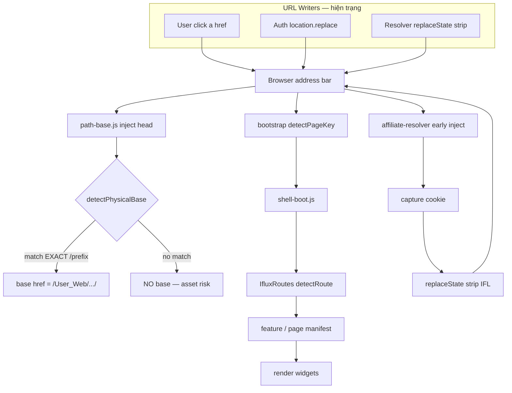

# B0+ — URL Ownership & Navigation Pipeline Audit

**Date:** 2026-07-27  
**Status:** Discovery only — **không code · không ADR**  
**Builds on:** [`16-B0-Architecture-Discovery-Audit.md`](16-B0-Architecture-Discovery-Audit.md)  
**Superseded by ADR-AFF-007 rev.3:** Guest-canonical · Resolver owns context → **Shell owns PNC · Resolver emits event only**

---

## Executive answer — Ai sở hữu URL?

### Hiện trạng (Phase A — evidence)

**Không có single URL owner.** Thanh địa chỉ là kết quả **cạnh tranh** của nhiều writer:

| Writer | Hành vi | Evidence |
|--------|---------|----------|
| **Affiliate Resolver** | `replaceState` **strip** `/IFL…/` → sạch | `affiliate-resolver.js` L80–87 |
| **Auth** | `location.replace` sau login/logout/gate | `auth.js` ~10 sites |
| **App Shell nav** | Sinh `href` sạch qua `hrefFor()` | `iflux-platform-boot.js` |
| **Widget/card JS** | Hardcode `href="/cong-dong"` … | ~60 files |
| **Feature boot** | Redirect riêng (share, account, …) | `*-feature-boot.js` |
| **Legacy redirect** | `entity-pretty-url-redirect.js` … | strip/migrate path |

→ **Đây là lý do Cách 2 chưa thể ship:** chưa có một module được khóa là **duy nhất được ghi** address bar.

---

## 1. Single URL Owner — Proposal (cho ADR)

### Quyết định đề xuất

```
┌─────────────────────────────────────────────────────────┐
│  ADDRESS BAR URL (User Context)                         │
│  SINGLE WRITER: App Shell Navigation Layer              │
│  (IfluxRoutes + Affiliate Context API — một surface)    │
└─────────────────────────────────────────────────────────┘
```

| Vai trò | Module | Được phép |
|---------|--------|-----------|
| **URL Writer (duy nhất)** | **App Shell Navigation** | `navigate()` · `hrefFor()` · `activateContext()` · `deactivateContext()` |
| **URL Reader (incoming transport)** | Affiliate Resolver | `parseAffiliatePath()` · emit attribution event — **CẤM replaceState** |
| **Session trigger (không ghi URL trực tiếp)** | Auth | Gọi `AppShell.activateAffiliateContext()` sau `establishSession()` — **không** raw `location.replace` tới path app |
| **Content Identity** | SEO / Metadata | `canonical` · `og:url` · JSON-LD — **không** đọc `location.href` làm SoT |
| **Share payload** | Share Foundation | Đọc URL từ Shell context (Cách 2) — **không** decorate nếu Shell đã prefix |

### Phản biện (Agent) — tại sao không “Auth ONLY” hoặc “Router ONLY”

| Option | Đánh giá |
|--------|----------|
| **Auth ONLY** | Auth biết session nhưng **không** sở hữu nav graph · ~60 widget hardcode bypass Auth → **fail** |
| **Router ONLY** (`IfluxRoutes` thuần) | Router không biết login lifecycle · không có hook `iflux-auth-changed` · Shell header nằm ngoài file routes → **thiếu ownership UI** |
| **Resolver ONLY** | Resolver chạy **trước** mọi script · strip hiện tại **mâu thuẫn** own-context · **fail Cách 2** |
| **App Shell ONLY (đề xuất)** | `IfluxRoutes` + `IfluxAppShellHeader` + bootstrap `navigate` contract **đã là hub thực tế** · Auth chỉ **trigger** qua API Shell → **một writer, nhiều reader** |

### Boundary Owner khóa (đồng thuận Reviewer)

```
Resolver  → Parse ONLY   (đọc transport, emit attribution)
App Shell → Own URL ONLY (ghi address bar + sinh internal links)
```

**Hành động Phase B bắt buộc:** Xóa `stripToCanonical()` khỏi Resolver · chuyển logic “visitor strip vs own-context keep” sang **App Shell** (một chỗ).

---

## 2. Navigation Pipeline Diagram

### 2.1 Pipeline hiện tại (full page navigation)



### 2.2 Route contract — ai consume path nào?

| Stage | Input path example | IFL-aware? | Hành vi với `/IFL9552M/cong-dong` |
|-------|-------------------|------------|-----------------------------------|
| **nginx** | request URI | ✅ rewrite | Serve `/User_Web/community/` — **OK incoming** |
| **affiliate-resolver** | pathname | ✅ parse | Capture · **strip → `/cong-dong`** |
| **path-base.js** | pathname | ❌ | **NO `<base>`** — relative CSS/JS **broken** |
| **bootstrap `detectPageKey()`** | pathname | ⚠️ accidental | `indexOf('/cong-dong')` → **still matches** |
| **IfluxRoutes `detectRoute()`** | pathname | ❌ | **null** — route unknown |
| **IfluxRoutes `requiresAuth()`** | pathname | ❌ | **false** — auth gate wrong |
| **shell-boot `MARKET_CORE_PAGES`** | pageKey from bootstrap | ✅ if bootstrap OK | Loads community manifest |
| **App Shell `hrefFor()`** | route key | N/A (output) | Always outputs **clean** `/cong-dong` |

### 2.3 IFL Prefix — thêm / đọc / bỏ (hiện trạng vs đề xuất)

| Operation | Hiện trạng (Phase A) | Đề xuất Cách 2 |
|-----------|----------------------|----------------|
| **CREATE (prepend)** | Share Foundation `decorateAffiliateRef` on share only | **App Shell** on login / session restore |
| **READ (parse incoming)** | Resolver + Loyalty `parsePublicIdFromPath` | Resolver **parse only** → event |
| **PERSIST (session)** | Cookie `iflux_ref_code` (incoming) | Shell context `{ ownPublicId }` in memory + optional sessionStorage |
| **CONSUME (links)** | N/A — links are clean | **`IfluxRoutes.to()`** reads context → prepend own id |
| **REMOVE (strip)** | Resolver `replaceState` (all incoming) | **App Shell only:** visitor incoming strip · logout strip · **never** Resolver write |

---

## 3. Prefix Lifecycle (contract draft)

```
┌──────────────┐     login/register      ┌─────────────────┐
│ Guest        │ ───────────────────────►│ Context ACTIVE  │
│ URL sạch     │   establishSession +    │ /IFLme/...      │
└──────────────┘   Shell.activate()      └────────┬────────┘
       ▲                                          │
       │ logout / deactivate                      │ navigate
       │                                          ▼
       │                                 ┌─────────────────┐
       └─────────────────────────────────│ Every app nav   │
                                         │ via Routes+Shell│
                                         └─────────────────┘

Visitor opens /IFLother/cong-dong:
  Resolver.parse → capture other id → Shell.navigate(clean) — NOT activate own
```

| Phase | Owner | Event |
|-------|-------|-------|
| **create** | App Shell | `establishSession` success + `user.referral_code` valid |
| **persist** | App Shell | Tab reload → restore session → re-activate before first paint |
| **restore** | App Shell | `refreshSessionFromApi` complete → if logged in + code → activate |
| **consume** | IfluxRoutes | `to(key)` prepends when context active · `{ canonical: true }` opts out |
| **remove** | App Shell | logout · invalid code · explicit deactivate |

---

## 4. `detectRoute` / `path-base` — **CRITICAL** (nâng cấp từ HIGH)

### Evidence simulation

Path: `/IFL9552M/cong-dong`

| Check | Result |
|-------|--------|
| `path-base.detectPhysicalBase()` | **null** → no `<base href>` |
| `IfluxRoutes.detectRoute()` | **null** → `requiresAuth()` false |
| `bootstrap.detectPageKey()` | **`community`** (substring match — accidental) |

**Kết luận:** Hệ thống ** không có route contract thống nhất**. Bootstrap có thể load đúng page trong khi Routes/Auth layer nghĩ path **không hợp lệ** → bug silent (gate, nav active state, return URL).

**Phase B blocker #1:** Bắt buộc **`stripPublicId(path) → canonicalPath`** tại **một** utility (đề xuất: `IfluxRoutes.normalizePath` đầu pipeline) trước `detectRoute`, `path-base`, `requiresAuth`.

---

## 5. `community-ui.shareUrl()` — Deep audit

| Field | Finding |
|-------|---------|
| **Defined** | `community-ui.js` L398–405 |
| **Exported** | `IfluxCommunityUI.shareUrl` L655 |
| **Consumers (runtime grep)** | **0 call sites** — không file nào gọi `.shareUrl(` ngoài định nghĩa |
| **Owner intent** | Pre–Share Foundation era helper — canonical article URL cho community |
| **Status** | **DEAD export** (likely legacy) |
| **Active share path** | `interaction/catalog/index.js` → `IfluxShareFoundation.buildShareUrl()` |
| **Recommendation** | Phase B: **DELETE** export (CG-020) sau confirm không có dynamic eval · không sửa behavior |

**Không phải parallel active builder** — là **dead code smell**, không phải competitor thực sự.

---

## 6. Meta fallback — **HIGH** (nâng cấp)

| Location | Code | Risk Cách 2 |
|----------|------|-------------|
| `community-post-page.js` L84 | `canonical = seo.canonical_url \|\| location.href.split('#')[0]` | **HIGH** — fallback lẫn User Context vào microdata `itemprop="mainEntityOfPage"` |
| `community-ui.js` applySeoToDocument | Uses `meta.canonical` from store | ✅ LOW |
| `seo-url.js` / static nginx article shell | Hardcoded clean canonical | ✅ LOW |
| `page-definition.js` | Explicit `seo.canonical` param | ✅ LOW |

**Phase B blocker #2:** Cấm `location.href` làm canonical fallback — bắt buộc `metadata.canonical` hoặc `IfluxSeoUrl.*` only.

---

## 7. Feature impact — prepend khi logged-in + có publicId?

| Feature / Route | pageKey | Prepend? | Lý do |
|-----------------|---------|----------|-------|
| Cộng đồng (feed) | community | ✅ | App zone |
| Bài viết | communityPost | ✅ | App zone |
| Viết bài | communityWrite | ✅ | App zone |
| Nhà của tôi | home | ✅ | App zone |
| Thị trường / Dòng tiền | market / flow | ✅ | App zone |
| Cổ phiếu / Ngành / Hệ | stock / sector / family | ✅ | App zone |
| Chủ đề / Câu chuyện | chuDe / cauChuyen | ✅ | App zone |
| Watchlist | watchlist | ✅ | auth zone |
| Tìm kiếm | search | ✅ | |
| Tin nhắn | messages | ✅ | auth |
| Thành viên / Loyalty | loyalty | ✅ | |
| Gói cước | pricing | ✅ | public app — vẫn prepend nếu logged in (share copy URL) |
| FAQ | faq | ✅ | |
| Tài khoản / Profile | account | ✅ | |
| Thanh toán | checkout | ⚠️ **Owner chốt** — payment return URL sensitivity |
| Bình luận | comments | ✅ | |
| Chia sẻ feature | share | ⚠️ redirect only — **không** destination prepend logic riêng |
| **Auth** | auth.* | ❌ **FORBIDDEN** | `/dang-nhap`, `/dang-ky`, OTP |
| **Admin** | — | ❌ out of scope | |
| **Guest** (no code) | all | ❌ | URL sạch |
| **Bot/crawler** | all | ❌ | nginx/static — Content Identity sạch |

---

## 8. Forbidden list (ADR-ready)

| Actor | CẤM |
|-------|-----|
| **Widget / card / block renderer** | Prepend publicId · raw `location.replace` tới app path |
| **Feature module** | Sinh affiliate URL · bypass `IfluxRoutes.to()` |
| **Share Foundation** | Decorate khi Shell context active (Cách 2) · đọc cookie incoming cho outgoing |
| **Resolver** | `history.replaceState` · `location` write · **mọi URL mutation** |
| **Loyalty** | Build transport URL (đã giao Foundation / Shell) |
| **SEO / Metadata** | `location.href` làm canonical · publicId trong `og:url` / JSON-LD |
| **Auth** | Direct `location.replace('/cong-dong')` — phải qua **Shell.navigate** |
| **path-base / nginx** | Strip own-context prefix (chỉ nginx rewrite incoming serve) |

---

## 9. Impact matrix (revised)

| Module | B0 | B0+ | Ghi chú |
|--------|-----|-----|---------|
| **path-base + detectRoute** | HIGH | **CRITICAL** | Foundation navigation — break assets + auth gate |
| **App Shell + IfluxRoutes** | HIGH | **CRITICAL** | Single URL writer target |
| **Auth lifecycle** | HIGH | **HIGH** | Trigger only · delegate Shell |
| **affiliate-resolver strip** | MEDIUM | **CRITICAL** | Phải remove write — boundary violation |
| **Meta location.href fallback** | awareness | **HIGH** | SEO regression |
| **community-ui.shareUrl** | MEDIUM | **LOW (dead)** | Delete candidate |
| **Widget hardcode href** | MEDIUM | **HIGH** | Phải funnel Routes hoặc Shell hrefFor |
| **Share Foundation decorate** | LOW | **LOW/NONE** | Demote Cách 2 |
| **RSS / sitemap / API** | NONE | **NONE** | |

---

## 10. ADR gate checklist (chưa viết ADR)

Owner / Reviewer chốt:

- [x] **Single URL Owner = App Shell Navigation** (Auth trigger, không write)
- [x] **Resolver = Parse ONLY** — remove strip
- [x] **`IfluxRoutes.normalizePath`** strip foreign/own publicId before detectRoute + path-base
- [x] **Canonical never from location.href** — fix `community-post-page.js`
- [x] **Delete `IfluxCommunityUI.shareUrl`** dead export
- [ ] **Checkout / payment** prepend policy → ADR-AFF-007 D7 DEFERRED
- [x] **Navigation Ownership Persistence** — ADR-AFF-007 rev.3 · AC-1..10

---

## 11. Agent verdict

| Câu hỏi | Trả lời |
|---------|---------|
| Có nên Cách 2? | **Có — kiến trúc mạnh hơn** nếu khóa single writer trước |
| Ship ngay? | **Không** — CRITICAL path-base/detectRoute + Resolver strip conflict |
| B0 đủ ADR? | **Chưa** — B0+ này bổ sung ownership + pipeline · **đủ để draft ADR-AFF-004** sau Owner review |

---

*B0+ reproduce:* grep `shareUrl`, `detectRoute`, `location.href` canonical · read `bootstrap.detectPageKey` · `path-base.detectPhysicalBase` logic trace.*
