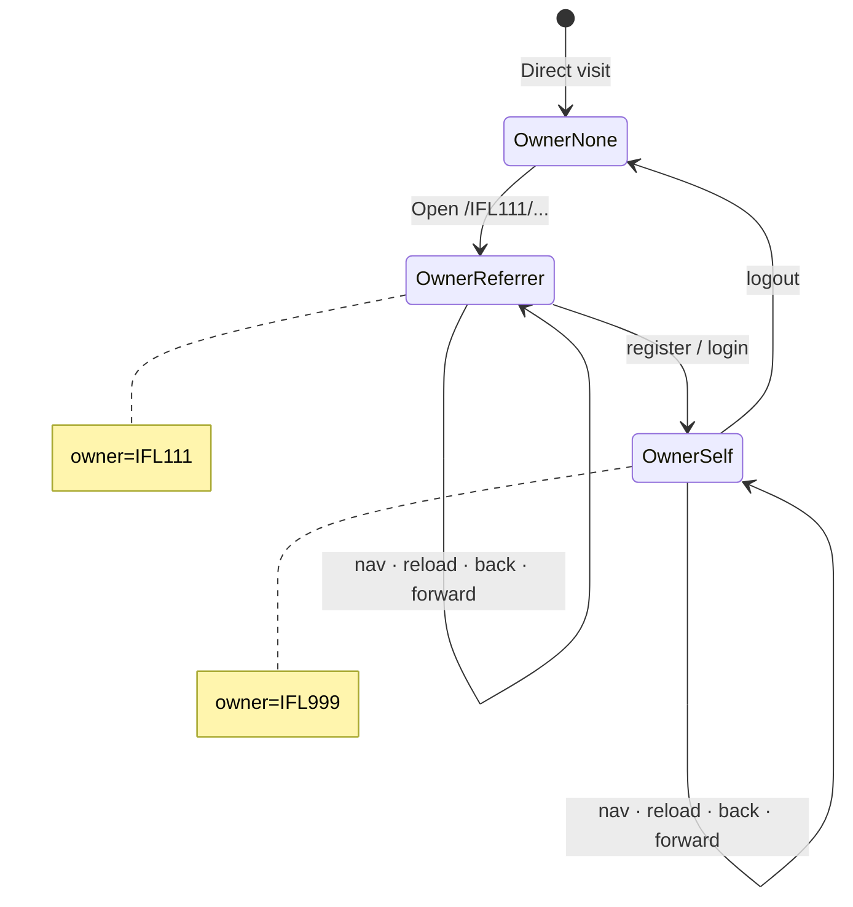
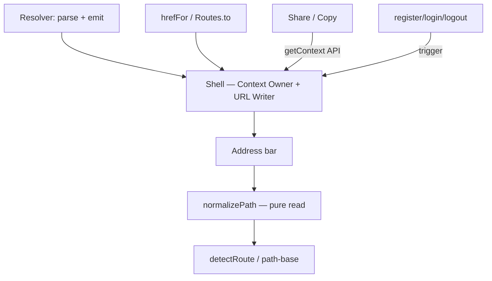

# ADR-AFF-007 — Personal Navigation Context (PNC)

**Status:** **APPROVED** — Owner 2026-07-27 (rev.4 FINAL)  
**Date:** 2026-07-27  
**Phase:** B (sau P0–P5 transport CLOSED)  
**Transition SoT:** [`19-PNC-State-Transition-Matrix.md`](19-PNC-State-Transition-Matrix.md) — append-only cho QR/campaign/deep-link  
**Rev.4.1:** Owner-centric model · persistence abstract · B2/B3 responsibility split  
**Supersedes:**
- Hướng “Cách 1 decorate-on-share only” làm mặc định runtime
- Giả định B0/B0+ §3: *“Guest luôn canonical sạch”*
- Resolver “establish / sở hữu” Navigation Context

**Does not change:** ADR-AFF-004 (Spec) — First-touch attribution business rule  

**Evidence:** [`16-B0-Architecture-Discovery-Audit.md`](16-B0-Architecture-Discovery-Audit.md) · [`17-B0-URL-Ownership-Navigation-Pipeline-Audit.md`](17-B0-URL-Ownership-Navigation-Pipeline-Audit.md)

---

## 1. Context

Phase A (P0–P5) đã khóa **Transport Layer**: incoming `/{publicId}/{path}` · legacy `?ref=` retired.

Owner pivot sang **Personal Navigation Context (PNC)** — điều hướng theo **Navigation Context Owner**.

**Triết lý cốt lõi:**

> **Navigation Ownership Persistence** — Owner không đổi cho đến khi Ownership đổi.

Ownership **chỉ** đổi tại: **Register** · **Login** · **Logout**.

Ownership **không** đổi tại: click menu · reload · back · forward · share · copy · refresh.

---

## 2. Decision summary

| # | Quyết định | Status |
|---|------------|--------|
| D1 | Capability: **Personal Navigation Context (PNC)** | **APPROVE** (Owner) |
| D2 | **Single URL Writer** = Shell · **Single URL Reader** = `normalizePath()` | **APPROVE** |
| D3 | **Single Context Owner** = Shell — create / transfer / deactivate Navigation Context | **APPROVE** (Owner rev.4) |
| D4 | Resolver = **Parse + Emit Initial Context Event** — không biết PNC · cấm URL mutation | **APPROVE** |
| D5 | Auth = **Ownership transition trigger ONLY** — không mutate context trực tiếp | **APPROVE** |
| D6 | **Navigation Ownership Persistence** | **APPROVE** |
| D7 | **Option D** — Referral Ownership Transfer | **APPROVE** |
| D8 | Logout → No Context · URL canonical sạch | **APPROVE** |
| D9 | **PNC Exclusion Zone** + **returnTo contract** | **APPROVE** (Owner rev.4) |
| D10 | **`NavigationContext` object** — owner · source · state · lifetime | **APPROVE** (Owner rev.4) |

---

## 3. Terminology

| Thuật ngữ | Ý nghĩa |
|-----------|---------|
| **Navigation Context** | Object runtime (§4) — Shell sở hữu duy nhất |
| **PNC** | Shell capability quản lý Navigation Context |
| **Navigation Ownership Persistence** | Owner không đổi cho đến ownership transition |
| **Owner** | `ownerPublicId` — **SoT Navigation Context** (`none` · referrer id · self id) |
| **User session** | Guest / Authenticated — hint only · **`state` field** · không quyết định Owner |
| **Referrer** (attribution) | publicId người giới thiệu — `referred_by` server · có thể = Owner khi guest |
| **Self** | publicId account đăng nhập — Owner sau transfer |
| **Context Lifetime** | Tồn tại đến Ownership đổi hoặc Session kết thúc (§4.3) |
| **Initial Context Event** | Resolver emit — Shell quyết định activate |
| **returnTo** | Canonical app path Shell lưu khi vào Exclusion Zone (§13) |
| **PNC Exclusion Zone** | Auth · Checkout · OAuth · Payment · Admin — §13 |

### Quy tắc vàng

> **Referrer → Guest Navigation Owner → Register/Login → Self Navigation Owner**  
> **Referrer chỉ còn trong `referred_by`.**

### Ba boundary (rev.4)

```text
Single URL Writer    = App Shell
Single URL Reader    = normalizePath()
Single Context Owner = App Shell
```

### NavigationContext = Domain Object (rev.4.2 — LOCKED)

> **NavigationContext là Domain Object, không phải UI State.**

| Rule | Detail |
|------|--------|
| **Immutable export** | `getContext()` trả bản **frozen clone** — consumer **cấm** mutate |
| **Transitions only** | Chỉ `create()` · `transfer()` · `deactivate()` (alias B1 API) |
| **Idempotent transitions** | `create(same owner)` · `transfer(same self)` · `deactivate(null)` → **no-op** (§4.3) |
| **CẤM** | `ctx.owner = …` · `ctx.state = …` · patch trực tiếp |
| **Cổng duy nhất** | Mọi thay đổi Owner → Shell lifecycle module → domain store nội bộ |

Sau này validation · event sourcing · audit · analytics — **chỉ mở rộng trong transition gate**, không rải mutation.

See also: [`19-PNC-State-Transition-Matrix.md`](19-PNC-State-Transition-Matrix.md) §1.

| Module | URL write | URL read | Context create/transfer/deactivate |
|--------|-----------|----------|-------------------------------------|
| **Shell** | ✅ | via normalizePath | ✅ |
| Resolver | ❌ | ❌ | ❌ (emit event only) |
| Auth | ❌ | ❌ | ❌ (trigger Shell API) |
| Widget / Feature | ❌ | ❌ | ❌ |
| Share | ❌ | ❌ | ❌ (read context via Shell API) |

---

## 4. `NavigationContext` object (D10)

### 4.1 Schema (contract — Phase B+ stable)

```ts
NavigationContext {
  ownerPublicId: string          // IFL111 (guest) hoặc IFL999 (auth)
  source: ContextSource          // nguồn tạo context — xem §4.2
  state: 'guest' | 'authenticated'
  createdAt: number              // epoch ms
  transferred?: {                 // có khi guest → auth
    fromPublicId: string
    at: number
    reason: 'register' | 'login'
  }
}
```

```ts
ContextSource =
  | 'incoming-path'    // /IFL111/... (Phase B default)
  | 'qr'               // reserved
  | 'campaign'         // reserved
  | 'email'            // reserved
  | 'deep-link'        // reserved
  | 'self'             // auth context sau transferOwnership
```

### 4.2 Context creation by source

| Transition | `ownerPublicId` | `source` | `state` |
|------------|-----------------|----------|---------|
| No Context → Guest (mở `/IFL111/...`) | `IFL111` | `incoming-path` | `guest` |
| Guest → Auth (register/login) | `IFL999` | `self` | `authenticated` |
| No Context → Auth (login trực tiếp, no guest) | `IFL999` | `self` | `authenticated` |
| Future: QR/campaign/email | referrer id | `qr` / `campaign` / … | `guest` |

**Initial Context Event** chỉ cung cấp input; Shell tạo object:

```js
// Resolver emit
{ type: 'iflux-incoming-referrer', publicId: 'IFL111', canonicalPath: '/cong-dong' }

// Shell create (guest, chưa auth)
NavigationContext {
  ownerPublicId: 'IFL111',
  source: 'incoming-path',
  state: 'guest',
  createdAt: Date.now()
}
```

### 4.3 Transition idempotency (LOCKED)

Mọi transition **phải an toàn khi gọi lặp** — tránh recreate context / ghi đè `createdAt` / `transferred` không cần thiết.

| API | Điều kiện | Hành vi |
|-----|-----------|---------|
| **`create({ ownerPublicId })`** | Owner hiện tại **đã** = `ownerPublicId` | **no-op** — trả frozen clone hiện có · **không** reset `createdAt` |
| **`create({ ownerPublicId })`** | Owner hiện tại **khác** `ownerPublicId` | **no-op** — lifecycle gate **không** gọi (foreign / logged-in) |
| **`transfer(selfPublicId)`** | Owner **đã** = `selfPublicId` · `state === authenticated` | **no-op** — không recreate · không cập nhật `transferred` |
| **`deactivate()`** | Context **null** | **safe no-op** |

**Ví dụ — Resolver emit hai lần (cùng IFL111):**

```text
create(IFL111) → create(IFL111)  →  Owner vẫn IFL111 · createdAt giữ nguyên
```

**Ví dụ — Session restore:**

```text
Owner = IFL999  →  transfer(IFL999)  →  no-op
```

### 4.4 Context Lifetime (requirement — persistence mechanism = implementation detail)

> Navigation Context **MUST** survive **reload · back · forward** within one browser session (same Owner unless a transition event in [`19-PNC-State-Transition-Matrix.md`](19-PNC-State-Transition-Matrix.md)).

Context **tồn tại** cho đến:

1. **Ownership transition** (register / login / logout), hoặc  
2. **Browser session kết thúc** (logout · invalid session · tab close)

**Persistence mechanism** = implementation detail — có thể thay đổi mà **không** sửa ADR:

- in-memory · sessionStorage · BroadcastChannel · cookie · IndexedDB · …

**CẤM** ràng buộc ADR vào tên storage cụ thể.

### 4.5 Transfer record

Register/login thành công:

```js
NavigationContext {
  ownerPublicId: 'IFL999',
  source: 'self',
  state: 'authenticated',
  createdAt: <preserved or new>,
  transferred: { fromPublicId: 'IFL111', at: Date.now(), reason: 'login' }
}
```

---

## 5. Owner-centric model (rev.4.1)

**SoT transitions:** [`19-PNC-State-Transition-Matrix.md`](19-PNC-State-Transition-Matrix.md)

| Owner | Typical user | Navigation meaning |
|-------|--------------|-------------------|
| **`none`** | Guest · direct visit | No prefix namespace |
| **`IFL111`** | Guest · opened referrer link | Referrer namespace |
| **`IFL999`** | Authenticated · has publicId | Self namespace |

`NavigationContext.state` (`guest` \| `authenticated`) = session hint · **`ownerPublicId` = Owner SoT.**

---

## 6. URL State Machine (by Owner)



```text
Owner none ──(incoming)──► Owner IFL111 ──(register/login)──► Owner IFL999
     ▲                              │                              │
     └──────────── logout ◄──────────┴──────────────────────────────┘
```

---

## 7. Legacy labels (Guest Context / Auth Context)

| Label (docs) | Maps to Owner | `state` hint |
|--------------|---------------|--------------|
| No Context | `none` | — |
| Guest Context | Referrer id | `guest` |
| Authenticated Context | Self id | `authenticated` |

Prefer **Owner** in new code/docs · Matrix §3 là authority.

---

## 8. B2 vs B3 responsibility (rev.4.1)

| Slice | Owns | PASS verifies |
|-------|------|---------------|
| **B2** | Lifecycle · Owner state · persist · returnTo · popstate | `getContext().ownerPublicId` |
| **B3** | URL Writer funnel · `ShellUrlWriter.decorate()` · bar matches Owner | canonical in · decorated out |

**Sau login (B2-only):** `Owner=IFL999` + bar có thể `/cong-dong` — **consistent at B2 layer** · URL sync = B3.

---

## 9. Single URL Writer · Single URL Reader · Single Context Owner

### 9.1 Single URL Writer (Shell)

Mọi ghi address bar + sinh internal link Application Zone → **Shell URL Writer** — **một** `decorate(canonical)` quyết định prepend.

**Domain invariant (B3 rev.2):**

> Caller chỉ truyền **Canonical Path**. Chỉ URL Writer được gắn/bỏ Owner prefix.

```text
Application URL = Canonical Path + NavigationContext + Zone Policy   (Matrix INV-5)

Routes.to() / hrefFor() / navigate() / replacePath()
        ↓
ShellUrlWriter.decorate(canonical)    ← single decision point
        ↓
Final URL
```

**B3 entry gate:** [`23-B3-Core-Navigation-Scope-Lock.md`](23-B3-Core-Navigation-Scope-Lock.md) rev.2 · Matrix §3 INV-4 · INV-5.

| Public API (consumer) | Private (Writer internal) |
|-----------------------|---------------------------|
| `IfluxRoutes.to()` → funnel decorate | `_decorateCanonical()` — **cấm export** |
| `IfluxRoutes.href()` / `IfluxHref.forCanonical()` → decorated href từ canonical | `isApplicationZone(path)` |
| `IfluxAppShell.hrefFor()` | |
| `Shell.navigate(canonical)` | |
| `Shell.replacePath(canonical)` | |

**Consumer identity-agnostic (B4.2 — LOCKED):**

> Consumer chỉ yêu cầu **canonical resource URL**. **Identity Href Resolver** (`IfluxHref.forCanonical` / `Routes.href`) chịu trách nhiệm biến canonical thành public navigation URL. `IfluxSeoUrl` **chỉ** tạo canonical — **không** biết Owner/context.

| CẤM (app-zone nav) |
|--------------------|
| `window.location.*` trực tiếp · raw `history.pushState` |
| `<a href>` hardcode · caller prepend `/IFLxxx/` |
| Public `prependOwnerPath()` |

### 9.2 Single URL Reader — `normalizePath()` contract

**Pure read function.** Input/output cố định:

```text
normalizePath(pathname)

INPUT:   /IFL111/cong-dong
OUTPUT:  /cong-dong

INPUT:   /cong-dong
OUTPUT:  /cong-dong

INPUT:   /IFL111/co-phieu/HPG
OUTPUT:  /co-phieu/HPG
```

**BẮT BUỘC:**

- Pure function — cùng input → cùng output
- **KHÔNG** mutate `location` / address bar
- **KHÔNG** mutate Navigation Context
- **KHÔNG** mutate `history`
- **KHÔNG** side effect

**Consumers (bắt buộc funnel):**

```text
detectRoute() · path-base.js · requiresAuth() · bootstrap pageKey
        ──► normalizePath(pathname) ──► canonical path
```

### 9.3 Single Context Owner (Shell)

**Chỉ Shell** được:

- `createContext()` / activate Guest
- `transferOwnership(selfPublicId)`
- `deactivateContext()`
- `getContext()` — module khác **read-only** qua API Shell

**CẤM:** Resolver · Auth · Widget · Feature · Share **tạo / transfer / xóa** context.

Auth gọi `Shell.transferOwnership()` — **không** ghi context object trực tiếp.

---

## 8. Resolver vs Shell

```text
Resolver                          Shell
────────                          ─────
Parse URL                         Nhận Initial Context Event
Capture attribution               createContext / transfer / deactivate
Emit event                        Persist Owner across reload (impl detail)
KHÔNG biết PNC state              getContext() API cho Share/Routes
KHÔNG mutate URL                  popstate handler (AC-11, AC-12)
```

---

## 9. Option D — luồng nghiệp vụ

### 9.1 Guest — Navigation Ownership Persistence

```
A → B mở /IFL111/cong-dong
Resolver: parse · capture · emit event
Shell: createContext { owner: IFL111, source: incoming-path, state: guest }
Persist context (lifetime requirement)
Mọi nav app zone → /IFL111/...
Register → transferOwnership(IFL999) → /IFL999/cong-dong
```

### 9.2 Login account cũ

Guest Owner=IFL111 → login IFL999 → transferOwnership → `/IFL999/...` · `referred_by` không ghi đè.

### 9.3 Authenticated mở link người khác

Owner vẫn Self · nav `/IFL999/...`.

### 9.4 Logout

deactivateContext → No Context → `/cong-dong`.

---

## 10. Share / Copy — LOCKED

> **Share KHÔNG BAO GIỜ đọc `location.href` cho URL payload.**

| Rule | Detail |
|------|--------|
| URL source | `Shell.getContext()` + canonical path từ route/metadata |
| Guest Context | `/IFL111/...` từ `ownerPublicId` |
| Auth Context | `/IFL999/...` từ `ownerPublicId` |
| No Context | Phase A decorate hoặc clean |
| **FORBIDDEN** | `location.href` · `window.location` · bar snapshot |

---

## 11. Navigation pipeline



---

## 12. PNC Exclusion Zone + returnTo contract (D9)

### 12.1 Zones (LOCKED — OUTSIDE PNC)

Auth · Checkout · Payment · OAuth callback · Admin

### 12.2 Entering Exclusion Zone

Khi context active, user navigate vào Exclusion Zone:

1. Shell lưu **`returnTo`** = canonical **Application Zone** path đang xem (vd. `/cong-dong`) — **Shell store**, không URL query tùy tiện
2. Shell navigate tới exclusion URL **sạch** (strip prefix trên bar)
3. Navigation Context **persist** trong Shell store (Owner không đổi)

**returnTo — chỉ Application Zone (LOCKED):**

| Lưu | Không lưu |
|-----|-----------|
| `/cong-dong` · `/co-phieu/HPG` · `/chu-de/...` · canonical app routes | Auth (`/dang-nhap` · `/dang-ky`) · OAuth/callback · Payment/checkout · `/logout` · Admin (`/admin` · `/Admin_Design_system`) |

`setReturnTo(path)` **reject** (no-op, trả `null`) nếu path thuộc Exclusion Zone — tránh redirect sai sau OAuth/payment.

```js
// Shell internal — ví dụ
{
  context: NavigationContext { ownerPublicId: 'IFL111', state: 'guest', ... },
  returnTo: '/cong-dong'   // canonical — không publicId
}
```

### 12.3 Returning from Auth / OAuth

```
Guest /IFL111/cong-dong
  → /dang-nhap (returnTo=/cong-dong saved)
  → OAuth Google
  → callback (exclusion URL)
  → login success
  → Shell.transferOwnership(IFL999)
  → Shell.navigate(returnTo) with Self prefix
  → /IFL999/cong-dong
```

| Step | Owner | Bar |
|------|-------|-----|
| Before auth | IFL111 (guest) | `/dang-nhap` |
| OAuth callback | IFL111 (persisted) | callback URL sạch |
| After login | IFL999 (auth) | `/IFL999/{returnTo}` |

**Contract:** `returnTo` do **Shell sở hữu** · Auth/OAuth callback **gọi Shell API** · **không** tự ghép prefix.

Payment/checkout return: cùng pattern — returnTo canonical · Shell prepend Self khi re-enter app zone.

---

## 13. Forbidden list

| Actor | CẤM |
|-------|-----|
| **Resolver** | URL mutation · context mutate |
| **Auth** | Context mutate · raw app URL write |
| **Widget / Feature** | Prepend · bypass Shell |
| **Share** | **`location.href`** · context mutate |
| **Mọi module** | Parse pathname ngoài `normalizePath()` |
| **Mọi module** | create/transfer/deactivate context ngoài Shell |
| **normalizePath** | Mutate URL · context · history |

---

## 14. Phase B slices

```
B1  Foundation
    NavigationContext object + Shell API
    normalizePath (pure contract)
    Resolver event-only
    Single Context Owner enforced
         ↓ PASS
B2  Ownership lifecycle + persist + returnTo + popstate
    Owner state ONLY — PASS getContext() · NOT URL prepend
         ↓ PASS
B3  Core Navigation funnel — ShellUrlWriter.decorate()
    canonical-only callers · isApplicationZone() · bar matches Owner
         ↓ PASS
B4  Consumer Migration wave — MR-1 · Routes/navigate only
         ↓ PASS
B5  SEO + Cleanup + Share no location.href
         ↓ PASS
B6  Edge cases
```

---

## 15. CRITICAL / HIGH blockers

| ID | Item | Slice |
|----|------|-------|
| B-CRIT-1 | normalizePath pure + wired | B1 |
| B-CRIT-2 | Single Context Owner Shell-only | B1 |
| B-CRIT-3 | returnTo Exclusion contract | B2 |
| B-CRIT-4 | Core nav funnel | B3 |
| B-HIGH-1 | Widget wave | B4 |
| B-HIGH-2 | Share never location.href | B5 |

---

## 16. Acceptance Criteria

> **Tag:** `[B2]` = Owner state · `[B3]` = URL bar / links · xem [`19-PNC-State-Transition-Matrix.md`](19-PNC-State-Transition-Matrix.md) §6

### AC-1 — Navigation Ownership Persistence `[B2]` + bar `[B3]`

```gherkin
Given  Guest Context · owner IFL111 · source incoming-path
When   Guest click in-app navigation
Then   Address bar /IFL111/{dest}
And    context.ownerPublicId = IFL111
```

### AC-2 — Session restore (Guest) `[B2]`

```gherkin
Given  Guest Context · /IFL111/co-phieu/HPG
When   F5 reload
Then   ownerPublicId = IFL111 · source unchanged
And    [B3] bar /IFL111/co-phieu/HPG
```

### AC-3 — Register transfer `[B2]` owner · `[B3]` bar

```gherkin
Given  Guest Context · IFL111 · /IFL111/cong-dong/bai-viet-x
When   Register success · publicId IFL999
Then   getContext().ownerPublicId = IFL999 · source = self
And    [B3] bar /IFL999/cong-dong/bai-viet-x
And    context.transferred.fromPublicId = IFL111
And    referred_by = IFL111 (server)
```

### AC-4 — Login account cũ

```gherkin
Given  Guest Context · IFL111 · /IFL111/cong-dong
When   Login success · publicId IFL999
Then   bar /IFL999/cong-dong
And    owner IFL999 · referred_by không ghi đè
```

### AC-5 — Session restore (Auth)

```gherkin
Given  Auth Context · IFL999 · /IFL999/co-phieu/HPG
When   F5 reload
Then   bar /IFL999/co-phieu/HPG · owner IFL999
```

### AC-6 — Auth nav + share

```gherkin
Given  Auth Context · IFL999
When   navigate · share · copy
Then   URLs /IFL999/...
And    Share payload không từ location.href
```

### AC-7 — Logout

```gherkin
Given  Auth Context · /IFL999/cong-dong
When   Logout
Then   No Context · bar /cong-dong
```

### AC-8 — Exclusion + returnTo + OAuth

```gherkin
Given  Guest Context · IFL111 · /IFL111/cong-dong
When   Navigate /dang-nhap
Then   bar /dang-nhap · Shell.returnTo = /cong-dong · context persisted
When   OAuth Google complete · login IFL999
Then   bar /IFL999/cong-dong (returnTo + Self prefix)
```

### AC-9 — Content Identity

```gherkin
When   render SEO meta
Then   canonical / og:url clean (no publicId)
```

### AC-10 — normalizePath pure

```gherkin
Given  pathname /IFL111/cong-dong
When   normalizePath(pathname)
Then   returns /cong-dong
And    location unchanged · context unchanged · history unchanged
```

### AC-11 — Browser Back sau login (Auth giữ Owner)

```gherkin
Given  Auth Context · owner IFL999 · đang /IFL999/co-phieu/HPG
And    History có entry /IFL111/cong-dong (thời guest)
When   Browser Back
Then   context.state vẫn authenticated · owner vẫn IFL999
And    bar = /IFL999/cong-dong (Self prefix — không revert Guest Owner)
And    Back KHÔNG phải ownership transition
```

### AC-12 — Browser Back sau logout

```gherkin
Given  User đã logout · No Context · bar /cong-dong
And    History có /IFL999/cong-dong (trước logout)
When   Browser Back
Then   Shell popstate: no valid session → No Context
And    bar = /cong-dong (canonical, no prefix)
And    KHÔNG tự re-activate PNC / Auth Context
```

### AC-13 — Long session login (Guest → Auth → F5 → logout → back)

```gherkin
Given  Guest /IFL111/cong-dong · đọc 2h · login IFL999 → /IFL999/cong-dong
When   F5
Then   bar /IFL999/cong-dong · owner IFL999
When   Logout
Then   bar /cong-dong · No Context
When   Browser Back
Then   AC-12 applies — no prefix · no PNC without session
```

### AC-14 — Foreign link refresh (logged-in Owner unchanged)

```gherkin
Given  Auth Context · owner IFL999
When   Direct open /IFL111/bai-viet/a (foreign referrer path)
Then   getContext().ownerPublicId = IFL999
When   F5 reload on /IFL111/bai-viet/a
Then   getContext().ownerPublicId = IFL999
And    Owner KHÔNG đổi sang IFL111
```

*Initial Context Event replay **sau** session restore · Resolver emit không override Self Owner.*

### AC-15 — Transition idempotency

```gherkin
Given  Guest Context · owner IFL111
When   create(IFL111) called again (duplicate emit)
Then   owner IFL111 · createdAt unchanged

Given  Auth Context · owner IFL999
When   transfer(IFL999)
Then   owner IFL999 · no new transferred record

Given  No Context
When   deactivate()
Then   safe no-op · getContext() = null
```

---

## 17. Relationship to existing ADRs

| ADR | Relationship |
|-----|--------------|
| ADR-AFF-004 | First-touch unchanged |
| ADR-AFF-001–006 | unchanged |

---

## 18. ADR APPROVE gate

- [x] Owner sign-off D1–D10 — **2026-07-27**
- [x] rev.4 FINAL — NavigationContext · lifetime · returnTo · AC-1..13 · Share lock · Single Context Owner
- [x] Phase B **OPEN** — bắt đầu B1

---

**Drafted by:** Cursor Agent  
**Rev.4 FINAL:** NavigationContext schema · Context Lifetime · normalizePath contract · returnTo · Single Context Owner · Back/Forward AC · Share never location.href  
**Approved by:** Owner — 2026-07-27  
**Rev.4.1 (docs):** Owner-centric · Matrix SoT · B2/B3 split · persistence abstract  
**Rev.4.2 (docs):** NavigationContext = Domain Object · transitions-only
