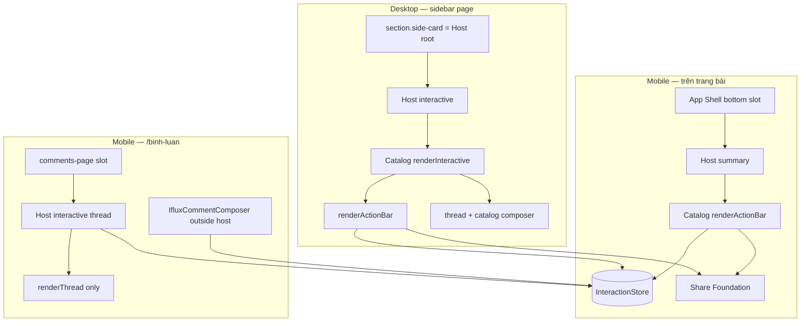

# Audit — Article Interaction: Desktop Sidebar vs Mobile Bottom

**Date:** 2026-07-27  
**Trigger:** Share copy OK mobile · fail desktop · lo ngại 2 surface không cùng SoT dữ liệu  
**Status:** **AUDIT ONLY — NO CODE**

---

## 1. Kết luận nhanh (trả lời Owner)

| Câu hỏi | Trả lời |
|---------|---------|
| Desktop Sidebar có phải App Shell sidebar? | **Không** — là **page sidebar** (`ifx-com-story-aside`) do widget bài viết render |
| 3 nút Thích / Bình luận / Chia sẻ có cùng SoT dữ liệu? | **Có** — cùng `IfluxInteractionCatalog.renderActionBar` + `IfluxInteractionStore` + cùng `target` |
| Desktop có hardcode riêng cho share/like? | **Không** ở tầng action bar — **cùng** `handleShareUrlClick` / `buildArticleShareUrl` |
| Khác nhau chỉ UI/flow? | **Gần đúng** cho 3 nút · **Không** cho khối bình luận (composer + thread path khác mobile) |
| Lo ngại 2 wrapper chưa fix? | **Đúng** — desktop vi phạm pattern đã áp dụng ở `/binh-luan` (Slice 4.1/4.2) |

**Share desktop fail không chứng minh hai SoT dữ liệu khác nhau** — cùng catalog handler. Nguyên nhân khả dĩ: clipboard/gesture, cache script, hoặc hậu quả mount Host sai chỗ (wrapper).

---

## 2. Vị trí thực tế trên UI

### Desktop (> 1023.98px)

```text
main.ifx-main--community-post
  └── widget WGT-COM-POST-PAGE (community-post-page.js)
        └── aside.ifx-com-story-aside          ← "Sidebar" Owner nói tới
              ├── side-cards (Chủ đề, Ngành, CP, Hệ sinh thái, Mục lục)
              └── section.ifx-com-side-card--comments
                    [data-ifx-ix-interactive-root]  ← Host gắn TRỰC TIẾP lên section
                    [data-ifx-ix-host] mode=interactive
```

**Không** nằm trong App Shell sidebar registry (`data-section="sidebar"`). App Shell chỉ cung cấp header + mobile tabbar.

### Mobile (≤ 1023.98px)

```text
aside.ifx-com-story-aside          → display:none (CSS)
nav#ifx-mobile-tabbar
  └── div[data-ifx-ix-article-bottom-root]   ← Host summary
        mode=summary · variant=bar
        └── renderActionBar (3 nút)
```

Bấm **Bình luận** → `openInteractiveFallback()` → navigate `/cong-dong/bai-viet/{slug}/binh-luan` (trang comments).

---

## 3. Luồng mount — cùng Page, khác Presentation (by design IO-001)

| | Desktop | Mobile (trên bài) | Mobile (sau bấm Bình luận) |
|--|---------|-------------------|---------------------------|
| File owner | `community-post-page.js` | cùng | `comments-page.js` |
| Host mode | `interactive` | `summary` | `interactive` |
| Presentation | `sidebar` | `bottom-bar` | `page` |
| Catalog fn | `renderInteractive()` | `renderSummary(variant:'bar')` | `renderInteractive(variant:'thread')` |
| Action bar | **Có** ( trong interactive ) | **Có** | **Không** (like ở header shell) |
| Thread list | Catalog inline | Không | Catalog thread only |
| Composer | Catalog basic `<textarea>` | Không | `IfluxCommentComposer` |

Code mount (`community-post-page.js`):

```javascript
// Desktop
Host.mountInteraction({
  root: sideRoot,              // = section side-card
  mode: 'interactive',
  presentation: 'sidebar',
  target: { type: 'post', id: post.id || post.slug }
});

// Mobile bottom
Host.mountInteraction({
  root: bottomRoot,
  mode: 'summary',
  variant: 'bar',
  presentation: 'bottom-bar',
  target: { type: 'post', id: post.id || post.slug },  // CÙNG target
  onOpenInteractive: openInteractiveFallback
});
```

---

## 4. SoT dữ liệu — ma trận

### 4.1 Ba nút tương tác (Thích · Bình luận · Chia sẻ)

| Layer | Desktop | Mobile bottom | Cùng SoT? |
|-------|---------|---------------|-----------|
| UI markup | `IfluxInteractionCatalog.renderActionBar` | **Cùng hàm** | ✅ |
| Permission | `IfluxInteractionPermission` | ✅ | ✅ |
| Projection (likes/comments) | `IfluxInteractionStore.refreshProjection` | ✅ | ✅ |
| Target key | `post:{id}` via `interaction-api.targetKey` | ✅ | ✅ |
| Like mutation | `IfluxInteractionStore.runMutation('like')` | ✅ | ✅ |
| Share URL | `handleShareUrlClick` → Share Foundation | ✅ | ✅ |

→ **Không có nhánh hardcode desktop cho 3 nút.** Khác biệt là **Host mode** và **hành vi nút Bình luận** (focus composer vs navigate).

### 4.2 Khối bình luận (thread + composer)

| Layer | Desktop sidebar | Mobile → trang `/binh-luan` | Cùng SoT? |
|-------|-----------------|------------------------------|-----------|
| Thread API | `InteractionStore.loadThread` | ✅ | ✅ |
| Comment write | `Store.addComment` | ✅ | ✅ |
| Composer UI | Catalog `bindComposerForm` (textarea thường) | `IfluxCommentComposer` (rich) | ❌ **UI khác** |
| Action bar + thread | Một `renderInteractive` (default) | Tách: thread variant + composer ngoài Host | ❌ **structure khác** |

→ Đúng yêu cầu Product: **cùng API/Store**, khác **presentation**. Nhưng desktop đang dùng **composer rút gọn của Catalog**, không phải `IfluxCommentComposer` — technical debt so với trang comments mobile.

### 4.3 Comment count ban đầu (minor dual read)

`renderCommentsSideCard(post)` seed `data-ifx-com-comment-count` từ **`post.stats.comments` (CommunityStore)** lúc render HTML.

Sau đó `syncCommentCountAttr` cập nhật từ **`iflux-ix-projection` (InteractionStore)**.

→ Badge action bar luôn từ Store; attribute trên section có thể lệch 1 nhịp lúc đầu.

---

## 5. Vấn đề 2 lớp wrapper (Owner đúng — chưa áp dụng fix Slice 4)

### 5.1 Pattern đúng — đã làm ở `/binh-luan` (`comments-page.js`)

```html
<section> <!-- page chrome, giữ title -->
  <h2>Bình luận</h2>
  <div data-ifx-ix-interactive-root></div>   <!-- slot rỗng, Host mount vào đây -->
</section>
<!-- composer ngoài host (mobile comments page) -->
```

Host `root.innerHTML = ...` **không** phá chrome cha.

### 5.2 Hiện trạng desktop — SAI ownership

```html
<section class="ifx-com-side-card--comments"
         data-ifx-ix-interactive-root>     <!-- Host root = chính section -->
  <h2>Bình luận</h2>                      <!-- BỊ XÓA khi Host mount -->
</section>
```

Sau `mountInteraction` → `renderInteractive`:

```html
<section ... data-ifx-ix-host>
  <div class="ifx-ix-interactive ifx-com-comments">   <!-- wrapper thứ 2 từ Catalog -->
    <div data-ifx-ix-action-bar>...</div>
    <div data-ifx-ix-thread>...</div>
    <form data-ifx-ix-composer>...</form>
  </div>
</section>
```

**Vi phạm:**

- **UI-002 / Wrapper Governance (SoT V2):** `ifx-com-side-card` (page chrome) + `ifx-com-comments` (catalog shell) — hai lớp không khai báo role tách bạch
- **Slice 4.2:** một surface = một Host slot — desktop gắn Host lên section thay vì slot trung gian
- Title `<h2>Bình luận</h2>` mất sau mount (bug UX nhỏ)

### 5.3 Mobile bottom — đúng hơn

```html
<div data-ifx-ix-article-bottom-root data-ifx-ix-host>
  <div class="ifx-ix-summary--bar">
    <!-- chỉ action bar, không nested ifx-com-comments -->
  </div>
</div>
```

---

## 6. Share — tại sao mobile OK, desktop chưa?

### 6.1 Code path — IDENTICAL cho nút Chia sẻ

Cả hai gọi `renderActionBar` → `data-ifx-ix-act="share_url"` → `handleShareUrlClick(target)` → `buildArticleShareUrl` → `copyShareUrl`.

Không có `if (desktop)` / `if (sidebar)`.

### 6.2 Khả năng cao (theo thứ tự)

| # | Nguyên nhân | Ghi chú |
|---|-------------|---------|
| 1 | **Browser cache** desktop chưa load `shareBndWP2c` | Mobile test sau hard refresh |
| 2 | **Clipboard user-gesture** — nested DOM / focus trong sidebar form | Đã thử execCommand sync — cần verify sau wrapper fix |
| 3 | **Hậu quả wrapper** — Host mount phá cấu trúc, event/focus lệch | Fix slot pattern có thể giải quyết phụ |

### 6.3 Không phải nguyên nhân

- Hai builder URL share riêng cho desktop/mobile
- CommunityStore hardcode share link trên desktop
- App Shell proxy-click (code comment **CẤM** — không thấy impl)

---

## 7. Sơ đồ ownership (as-is)



---

## 8. Khuyến nghị (chưa thi công — chờ Owner)

### P0 — Align wrapper (giống Slice 4 / comments-page)

1. `renderCommentsSideCard`: tách **slot rỗng** `div[data-ifx-ix-interactive-root]` **bên trong** section, giữ `<h2>`
2. Host mount vào slot — **không** gắn `data-ifx-ix-interactive-root` lên `section`
3. Desktop interactive: cân nhắc `variant:'thread'` + composer pattern (hoặc reuse `IfluxCommentComposer`) để khớp mobile comments SoT UI

### P1 — Share desktop verify

1. Sau P0, retest share sidebar
2. Nếu vẫn fail: hiển thị readonly input flash cho user copy (pattern profile affiliate) — chỉ khi clipboard fail

### P2 — Host pass-through

`interaction-host.js` `renderInteractive` **không** forward `onOpenInteractive` từ opts → catalog (desktop Bình luận rely fallback focus — OK nhưng nên explicit)

---

## 9. File liên quan

| File | Vai trò |
|------|---------|
| `community-post-page.js` | Mount desktop/mobile Host · sidebar HTML · wrapper bug |
| `interaction/catalog/index.js` | renderActionBar · renderInteractive · share handler |
| `interaction/interaction-host.js` | mountInteraction · mode summary/interactive |
| `comments-page.js` | Pattern đúng (slot + thread variant + composer ngoài) |
| `iflux-web-ui.js` | Mobile bottom slot `ensureArticleIxBottomSlot` |
| `community.css` L1959 | Ẩn aside mobile |

---

## 10. Status

| Item | Status |
|------|--------|
| Audit Desktop Sidebar IX | ✅ **COMPLETE** |
| Owner lo ngại dual SoT (action bar) | ❌ **Không đúng** — cùng Catalog/Store |
| Owner lo ngại wrapper | ✅ **Đúng** — desktop chưa align Slice 4 |
| Fix implementation | ⏳ **Chờ Owner GO** |

---

*B5 context: share bug surfaced during WP-2 · root fix có thể là wrapper + clipboard, không phải tách SoT share URL.*
