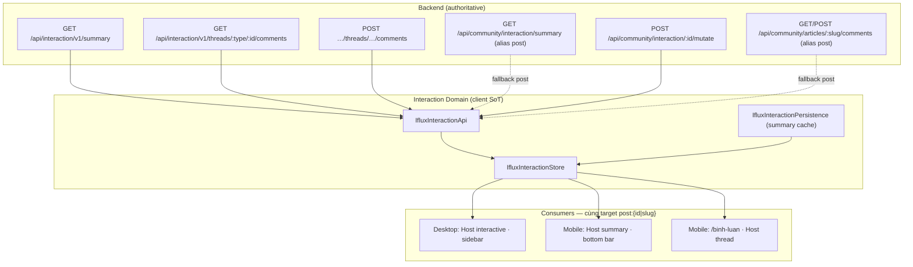

# B5 — Interaction Ownership Audit (Desktop Sidebar vs Mobile Flow)

**Date:** 2026-07-27  
**Status:** **AUDIT ONLY — NO CODE**  
**Trigger:** Share desktop fail surfaced concern — Desktop vs Mobile có hai SoT dữ liệu không?  
**Related:** [`44-B5-Article-IX-Desktop-Sidebar-Audit.md`](44-B5-Article-IX-Desktop-Sidebar-Audit.md) · [`39-B5-WP2-Share-Evidence-Report.md`](39-B5-WP2-Share-Evidence-Report.md) · IA Phase 4 Slice 4.2

---

## Executive verdict

| Câu hỏi | Verdict |
|---------|---------|
| Desktop và Mobile có **hai hệ comment data** riêng? | **KHÔNG** — cùng `IfluxInteractionStore` + `IfluxInteractionApi` + cùng `target` |
| Desktop và Mobile có **hai hệ share URL builder** riêng trên article? | **KHÔNG** — cùng `IfluxInteractionCatalog.handleShareUrlClick` |
| Desktop sidebar = App Shell sidebar? | **KHÔNG** — page sidebar (`community-post-page.js`) |
| Consumer “biết quá nhiều” về **data**? | **Một phần** — seed render từ `CommunityStore.post.stats` (dual-read nhẹ, không authoritative) |
| Consumer “biết quá nhiều” về **share canonical**? | **Có (by design WP-2)** — Catalog resolve canonical trước khi gọi Foundation decorate |
| Wrapper 2 lớp = duplicate ownership? | **Không (post-P0)** — `section` = page chrome · `ifx-com-comments` = Catalog shell (hợp lệ). Article sidebar **chưa** align Slice 4 như `/binh-luan` |

**Khuyến nghị:** Giữ Interaction Domain SoT · **migrate desktop presentation** về pattern Slice 4 (không migrate mobile về desktop inline) · xóa seed dual-read · **không** CSS/DOM patch.

---

## 1. Data SoT diagram



**Entity model (client):**

```javascript
target = { type: 'post', id: String(post.id || post.slug) }
targetKey = 'post:' + normalizedId   // interaction-api.js
```

**Projection (counts):** `{ likes, comments, shares, favorites [, views] }`  
**Thread (interactive only):** `{ comments[], total }` in store memory — API authoritative.

---

## 2. Comment count — data ownership

### 2.1 Authoritative path (runtime)

| Bước | Layer | Evidence |
|------|-------|----------|
| Fetch counts | `IfluxInteractionApi.fetchSummary` | `GET /api/interaction/v1/summary?type=post&id=` → alias `GET /api/community/interaction/summary` |
| Store | `IfluxInteractionStore.refreshProjection` | RC-API-07: mutation success → refresh → không UI++ |
| Badge UI | `IfluxInteractionCatalog.updateSummaryCounts` | `[data-ifx-ix-likes]` · `[data-ifx-ix-comments]` |

### 2.2 Desktop sidebar

```text
mountInteractionHosts (community-post-page.js)
  → Host.mountInteraction({ mode:'interactive', target })
    → store.refreshProjection(target)          // API
    → catalog.renderInteractive → renderActionBar(projection from store)
```

Comment count trên nút **Bình luận** = `store.getProjection(target).comments` sau refresh.

### 2.3 Mobile bottom bar (trên trang bài)

```text
Host.mountInteraction({ mode:'summary', variant:'bar', target })   // CÙNG target
  → store.refreshProjection(target)
  → catalog.renderSummary → renderActionBar(projection)
```

### 2.4 Mobile `/binh-luan`

```text
comments-page.js → mountHost({ variant:'thread', target })
  → store.refreshProjection(target)
  → Không renderActionBar trên trang này (like ở shell header)
  → Thread count đồng bộ qua projection event
```

### 2.5 Dual-read nhẹ (vi phạm nhỏ — không phải SoT thứ hai)

| Vị trí | Nguồn seed | Authoritative? |
|--------|------------|----------------|
| `renderCommentsSideCard` | `post.stats.comments` (CommunityStore) | **Không** — chỉ seed HTML attr `data-ifx-com-comment-count` lúc render page |
| `comments-page` shell likes seed | `post.stats.likes` | **Không** — seed trước `refreshProjection` |

Sau mount, `iflux-ix-projection` + `refreshProjection` ghi đè bằng InteractionStore. **Không** có API/store comment riêng cho desktop vs mobile.

---

## 3. Interaction action ownership

| Action | Desktop source | Mobile source (article) | Mobile `/binh-luan` | Same SoT? |
|--------|----------------|-------------------------|---------------------|-----------|
| **Like** | `catalog.renderActionBar` → `store.runMutation('like')` | **Cùng** `renderActionBar` (bottom bar) | Shell header → `store.runMutation` (`comments-page.js`) | **YES** — cùng Store + `POST /api/community/interaction/:id/mutate` |
| **Share** | `catalog.handleShareUrlClick(target)` | **Cùng** handler (bottom bar) | **Không** có nút Share trên trang comments | **YES** (article surfaces) |
| **Comment (count)** | `renderActionBar` badge ← projection | **Cùng** badge | Projection refresh (không action bar) | **YES** |
| **Comment (write)** | `catalog.bindComposerForm` → `store.addComment` | Navigate → `/binh-luan` | `IfluxCommentComposer` → `store.addComment` | **YES** — cùng `postComment` API |
| **Comment (read thread)** | Host `loadThread` → `catalog.renderThread` | Navigate (không inline thread) | Host `variant:'thread'` → `renderThread` | **YES** — cùng `fetchThread` |

**Permission:** `IfluxInteractionPermission.resolve` — cùng matrix IP-001 cho mọi consumer.

**Presentation khác (hợp lệ IO-001):**

| | Desktop | Mobile article | Mobile `/binh-luan` |
|--|---------|----------------|---------------------|
| Nút Bình luận | Focus composer inline | Navigate `openInteractiveFallback()` | N/A (đã ở trang thread) |
| Composer UI | Catalog `<textarea>` | — | `IfluxCommentComposer` |
| Thread UI | Inline trong sidebar | — | `variant:'thread'` |

→ **UI khác · data cùng Domain** — đúng mô hình Owner mô tả, trừ composer UI chưa thống nhất (presentation debt).

---

## 4. Share flow comparison

### 4.1 Article Share (Desktop bottom/sidebar & Mobile bottom) — **CÙNG consumer**

```text
renderActionBar
  → click [data-ifx-ix-act="share_url"]
    → handleShareUrlClick(target)                    // catalog/index.js
      → buildArticleShareUrl(target, ShareFoundation)
          → resolveCommunityCanonical(target)        // CONSUMER chọn canonical
          → IfluxInsightShareStore.buildShareUrl({
               entityType: 'community_post',
               canonicalUrl: canonical,
               affiliate: true
             })
      → copyShareUrl(url)                            // clipboard (desktop fix)
```

**Không phải** Insight Widget Share (`share-action.js` → `resolveOwningPageCanonical` → modal).

### 4.2 So sánh Desktop vs Mobile (article)

| Layer | Desktop sidebar | Mobile bottom |
|-------|-----------------|---------------|
| Button markup | `catalog.renderActionBar` | **Cùng hàm** |
| Click handler | `handleShareUrlClick` | **Cùng** |
| Canonical resolve | `resolveCommunityCanonical` | **Cùng** |
| Foundation | `share-action-store.buildShareUrl` | **Cùng** |
| Copy mechanism | `copyShareUrl` (execCommand sync) | **Cùng** |

**Share bug root cause (đã xác nhận):** Không phải hai SoT URL — cùng handler. Desktop fail do **clipboard / user-gesture / tab module cache**; ẩn danh PASS chứng minh.

### 4.3 Pattern “consumer biết quá nhiều” (Share Boundary WP-2)

| Consumer | Biết gì | Đúng contract? |
|----------|---------|----------------|
| Insight `share-action.js` | Owning page URL (`location.pathname`) | R4 widget/page owner |
| Article `catalog/index.js` | `post.metadata.canonical` · `postCanonical` · route | **Consumer owner** cung cấp `canonicalUrl` — Foundation chỉ decorate |

→ Article share **cố ý** để Catalog biết post entity — không vi phạm R2 (Foundation không biết Article). Vi phạm tiềm ẩn: Catalog + CommunityStore coupling khi resolve canonical.

---

## 5. Desktop sidebar ownership audit

### 5.1 Vị trí UI (clarification)

```text
Desktop "Sidebar" ≠ App Shell sidebar registry
  = aside.ifx-com-story-aside (widget WGT-COM-POST-PAGE)
    └── section.ifx-com-side-card--comments
          ├── h2 (page chrome — post-P0)
          └── div[data-ifx-ix-interactive-root] (Host slot)
                └── div.ifx-com-comments (Catalog)
```

### 5.2 File / function ownership

| Concern | Owner file | Function |
|---------|------------|----------|
| HTML sidebar chrome | `community-post-page.js` | `renderCommentsSideCard` · `renderSidebar` |
| Host mount | `community-post-page.js` | `mountInteractionHosts` → `doMountInteractive` |
| Host lifecycle | `interaction-host.js` | `mountInteraction` |
| Action bar + thread + composer markup | `interaction/catalog/index.js` | `renderInteractive` (default) |
| Data fetch | `interaction-store.js` + `interaction-api.js` | `refreshProjection` · `loadThread` · `addComment` |
| Hardcode share/like URL? | **Không** | Catalog + Foundation |
| Duplicate render stack? | **Không** (post Slice 4.2) | Không `comment-composer` legacy · không stock-comments-ui trên article |

### 5.3 Boot chain (article page)

```text
Pipeline B nginx → backend renderArticleSpaHtml(post.html)
  → bootstrap.js?v=b5ixSlot20260727
    → community-post.manifest.js
      → widgets/community-post-page/index.js
        → interaction/boot.js → catalog + host
        → community-post-page.js
```

---

## 6. Wrapper audit

### 6.1 Phân loại (post-P0 fix)

```text
section.ifx-com-side-card--comments     → Page chrome owner (community-post-page)     ✅ hợp lệ
div[data-ifx-ix-interactive-root]       → Host mount slot (Interaction Host)          ✅ hợp lệ
div.ifx-ix-interactive.ifx-com-comments   → Catalog interactive shell (RC-IU-01)      ✅ hợp lệ
  ├── action bar
  ├── thread list
  └── composer form
```

**Không phải:** section bọc wrapper bọc lại **comment container c�ng song song** (dual stack Slice 4.2 đã cấm — article không còn `[data-ifx-com-comments]` legacy thứ hai).

### 6.2 Gap so với `/binh-luan` (Slice 4 — chưa áp article sidebar)

| Surface | Pattern | Status |
|---------|---------|--------|
| `/binh-luan` post | Page chrome + Host `variant:'thread'` + composer **ngoài** Host | **PASS** Slice 4.2 |
| Article desktop sidebar | Page chrome + Host default `renderInteractive` (all-in-one shell) | **Chưa align** Slice 4 |

→ Hai lớp `section` + `ifx-com-comments` là **contract Catalog hiện tại**, không phải duplicate data. Gap là **presentation ownership** chưa migrate article desktop về pattern đã khóa ở comments page.

### 6.3 Pre-P0 violation (đã sửa)

Host root gắn trực tiếp lên `section` → xóa `<h2>` → sai ownership. P0 tách slot — **không** gộp wrapper bằng CSS.

---

## 7. Desktop consumer path (summary)

```text
community-post-page.js
  render() → renderSidebar() → renderCommentsSideCard()
  mountInteractionHosts()
    if width > 1023.98:
      ensureForInteractive()
      Host.mountInteraction(sideRoot, interactive, sidebar)
        → catalog.renderInteractive (full shell)
        → API refreshProjection + loadThread
```

**Target:** `{ type:'post', id: post.id || post.slug }`

---

## 8. Mobile consumer path (summary)

```text
Article page (width ≤ 1023.98):
  mountInteractionHosts()
    Host.mountInteraction(bottomRoot, summary, bar)
      → catalog.renderSummary(variant:'bar')
      → renderActionBar (Like · Bình luận · Chia sẻ)
      → onOpenInteractive → openInteractiveFallback()
           → navigate /cong-dong/bai-viet/{slug}/binh-luan

/binh-luan:
  comments-page.js
    mountHost(variant:'thread')
    IfluxCommentComposer (ngoài Host)
    → cùng Store/API/target
```

---

## 9. Ownership violation list

| ID | Severity | Violation | Evidence | Authoritative fix (không patch CSS) |
|----|----------|-----------|----------|-------------------------------------|
| **IX-OWN-01** | LOW | Seed comment count từ `CommunityStore.post.stats` lúc render HTML | `renderCommentsSideCard` L187 | Bỏ seed; chỉ hiện badge sau `refreshProjection` |
| **IX-OWN-02** | LOW | Seed likes shell `/binh-luan` từ `post.stats.likes` | `comments-page.js` L316 | Chờ projection trước khi paint header |
| **IX-OWN-03** | MED | Article desktop chưa Slice 4 — composer UI Catalog vs `IfluxCommentComposer` mobile | `renderInteractive` vs `comments-page` | Migrate desktop presentation theo Slice 4 Owner checklist |
| **IX-OWN-04** | INFO | Catalog resolve share canonical đọc CommunityStore metadata | `resolveCommunityCanonical` | Giữ WP-2 contract; đảm bảo metadata SoT đúng (B5-WP1) |
| **IX-OWN-05** | INFO | `legacy-bridge.js` force `community.css?v=ixUiOwn` — duplicate CSS load | Network 2× community.css | Thống nhất một cache key owner |

**Không phát hiện:**

- Desktop/Mobile comment API riêng
- Hardcode like/share handler riêng desktop
- App Shell proxy-click interaction
- Dual `[data-ifx-com-comments]` stack trên article (post 4.2)

---

## 10. Recommendations

### 10.1 Giữ nguyên (PASS)

- **Interaction Domain SoT:** `IfluxInteractionStore` + `IfluxInteractionApi` + `target post:{id}`
- **Mobile flow:** bottom bar → `/binh-luan` — đúng IO-001
- **Article share handler:** một Catalog consumer — không tách desktop/mobile URL builder

### 10.2 Migrate (đúng kiến trúc — chờ Owner GO)

| Priority | Action | Rationale |
|----------|--------|-----------|
| **P1** | Article desktop sidebar → Slice 4 pattern (`variant:'thread'` + composer ngoài Host + action bar ownership rõ) | Align với `/binh-luan` PASS · giảm presentation debt · không đổi data SoT |
| **P2** | Xóa IX-OWN-01 · IX-OWN-02 seed dual-read | Consumer không đọc CommunityStore cho counts authoritative |
| **P3** | Thống nhất `community.css` cache key (IX-OWN-05) | Load path hygiene |

### 10.3 Không làm

| Cấm | Lý do |
|-----|-------|
| CSS/DOM patch gộp wrapper | Vi phạm ownership — che symptom |
| Migrate mobile về desktop inline composer | Ngược IO-001 mobile flow |
| Tách Share handler desktop/mobile | Không có evidence cần thiết — cùng bug class clipboard |
| Nhét Insight Share vào article sidebar | Consumer khác product intent |

---

## 11. Relation to Share / Affiliate B5

| Track | Issue class | Pattern |
|-------|-------------|---------|
| B5 WP-2 Share | Widget Insight vs Article — **consumer chọn canonical** | Foundation decorate only |
| B5 Interaction | Desktop vs Mobile — **cùng Domain, khác presentation** | Consumer UI theo device |

Share bug **không** chứng minh Interaction data dual SoT. Interaction audit **không** block WP-2 close — mở track **Slice 4 article sidebar** riêng.

---

## 12. Status

| Item | Status |
|------|--------|
| Interaction Data SoT audit | ✅ **COMPLETE** |
| Desktop ≠ Mobile data silo | ❌ **Not confirmed** |
| Presentation gap (Slice 4 article) | ✅ **Confirmed** |
| Code changes | **0** |
| Owner decision | Chờ GO P1 Slice 4 article sidebar |

---

*B5 Interaction Ownership Audit — Domain SoT một · Consumer hai presentation · Fix đúng = migrate presentation, không patch wrapper.*
