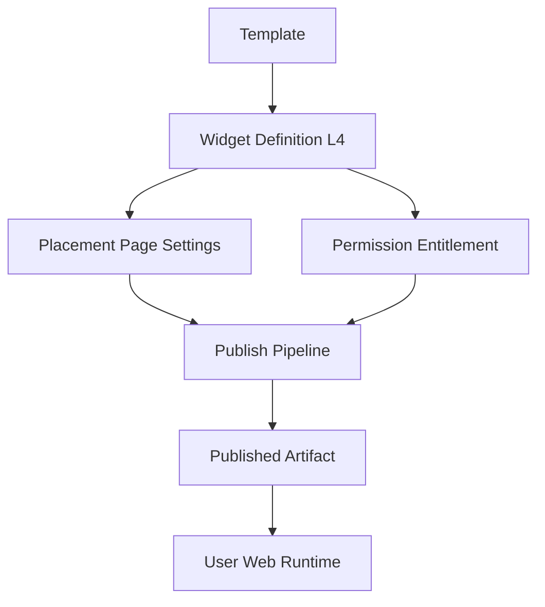
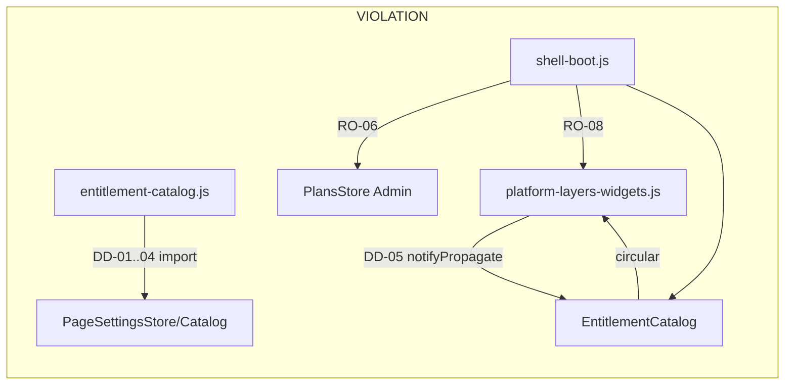
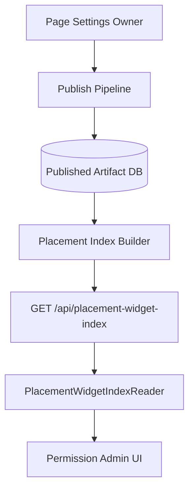

# ABH E0 — Dependency Graph (Before)

**Phase:** E0 Baseline  
**Ngày:** 2026-07-27

---

## Allowed reference flow (SoT — unchanged)



---

## Implementation coupling (Before — to remove)



---

## Clean boundaries (Before — keep)

| Edge | Verdict |
|------|---------|
| Placement → Template impl | ✅ 0 imports |
| Template → Placement | ✅ 0 imports |
| Placement → L4 widgetId | ✅ `page-settings-catalog.js` |
| L4 → Template templateRef | ✅ optional TemplatesCatalog |
| Permission → L4 widget list | ✅ reference (refactor to Reader in E1/E3) |

---

## Target: PlacementWidgetIndex (Gate 2)



Permission **does not** import PageSettingsStore.

---

## Evidence commands

```bash
rg "PageSettingsCatalog|PageSettingsStore" Admin_Design_system/app/subscription/
rg "EntitlementCatalog" Admin_Design_system/app/system/platform-layers-widgets.js
rg "PlansStore|PlatformLayersWidgets|EntitlementCatalog" User_Web/iflux-web-ui/runtime/shell-boot.js
```
