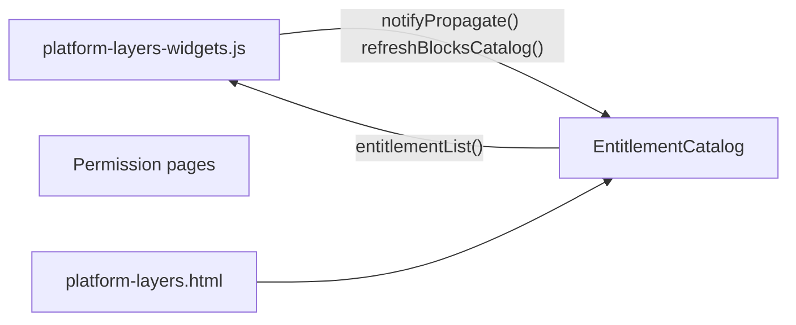
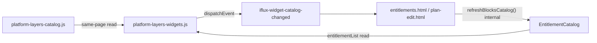

# ABH — Reviewer Evidence Package (E3) + SoT Gap Analysis

**Ngày:** 2026-07-27  
**Phase:** E3 — chưa đóng (thiếu evidence / một số điểm chưa đạt Reviewer gate)  
**E4:** **KHÔNG mở** cho đến khi E3 PASS đủ 5 điểm Reviewer

---

## 1. SoT liên quan — đã có gì?

SoT Owner yêu cầu tránh “thêm rác / dual flow” **đã tồn tại**:

| SoT | Rule | Nội dung trùng Reviewer |
|-----|------|-------------------------|
| **[`docs/SoT — Engineering Change Governance.md`](../SoT%20%E2%80%94%20Engineering%20Change%20Governance.md)** v1.1.1 | **CG-002** | No Duplicate Responsibility — cấm Old+New cùng chạy |
| | **CG-020** | Migration phải kết thúc bằng cleanup — không `old + new` vĩnh viễn |
| | **CG-021** | Deletion Is Part Of Completion — migrate mà chưa xóa → **FAIL** |
| | **CG-012** | File mới phải justify + plan xóa cũ |
| | **§13** | Review Evidence Package (grep, deleted files, migration evidence) |
| **[`.cursor/rules/engineering-change-governance.mdc`](../../.cursor/rules/engineering-change-governance.mdc)** | alwaysApply | Cấm hide+new, migrate không xóa, implement trước Impact Analysis |
| **User rule (cao hơn V2)** | Comment/xóa code cũ | Code cũ phải comment hết hoặc xóa — không để chạy song song |

**ABH plan hiện có:** AB-07 (Reader read-only) — **chưa** có gate Reviewer mới:

- Legacy Flow Elimination  
- Dual Path Audit  
- No Parallel Implementation  
- Introduce **+** Eliminate (hai vế bắt buộc)

### Verdict SoT: **Đủ về nguyên tắc, chưa đủ về enforcement**

ECG **đã nói** điều Reviewer muốn (CG-002, CG-020/021), nhưng:

1. ABH plan **không map** từng phase → CG-021 “Removed:” checklist  
2. **Không có** template Dual Path Audit bắt buộc mỗi phase exit  
3. **Không có** grep gate cụ thể (`hydrate=0`, `PageSettingsCatalog in entitlements=0`)  
4. Agent **vi phạm ECG** thực tế: thêm Reader + giữ fallback `PlatformLayersWidgets` song song; comment legacy thay vì xóa (CG-021)

**Khuyến nghị bổ sung:** thêm **`ABH-08 Legacy Flow Elimination`** vào plan — mirror CG-020/021 + Dual Path table + grep evidence **bắt buộc mỗi phase exit** (chi tiết §6).

---

## 2. Reviewer Point A — `grep refreshBlocksCatalog`

### Phạm vi: **L4 → Permission direct call** (coupling cần = 0)

```bash
rg "refreshBlocksCatalog" Admin_Design_system --glob "*.{js,html}"
```

| File | Loại | Active call L4→Permission? |
|------|------|----------------------------|
| `platform-layers-widgets.js:1892-1893` | **Trong block comment** `/* Legacy — ABH E3 removed */` | **Không** (dead text — nên **xóa hẳn** theo CG-021) |
| `entitlements.html:68-69, 73-74` | Permission boot + **event listener** | Không phải L4→Permission — Permission nội bộ |
| `plan-edit.html:221-222, 225-226` | Permission boot + listener |同上 |
| `entitlement-catalog.js:778` | **Definition** API | N/A |

**Kết luận A (coupling L4→Permission):** ✅ **Direct call đã biến mất** — runtime path là event.

**Lưu ý Reviewer:** grep thô **≠ 0 dòng** vì còn comment + Permission subscribe gọi `refreshBlocksCatalog()` — đó là **đúng thiết kế** (Permission refresh catalog của chính mình sau event), không phải coupling ngược.

**Vi phạm ECG:** block comment legacy trong `platform-layers-widgets.js` — nên **delete**, không để grep nhiễu.

---

## 3. Reviewer Point B — `grep iflux-widget-catalog-changed`

| Vai trò | File | Số |
|---------|------|-----|
| **dispatch** | `platform-layers-widgets.js` (`notifyPropagate`) | **1** |
| **subscribe** | `entitlements.html` | **1** |
| **subscribe** | `plan-edit.html` | **1** |
| Docs only | `03-Event-Catalog.md`, plan | — |

**Tổng runtime:** dispatch **1**, listener **2** ✅ (không phải 6)

### Payload vs E0 contract

**E0 freeze** (`03-Event-Catalog.md`):

```typescript
{ source: 'layer4', action: 'save'|'delete'|'bulk', widgetIds?: string[], at: ISO }
```

**Thực tế dispatch** (`platform-layers-widgets.js`):

```javascript
{ source: 'layer4', action: 'save', at: new Date().toISOString() }
```

| Field | Contract | Runtime | Verdict |
|-------|----------|---------|---------|
| `source` | `'layer4'` | `'layer4'` | ✅ |
| `action` | save/delete/bulk | luôn `'save'` | ⚠️ chưa đủ (delete path chưa gửi `'delete'`) |
| `widgetIds` | optional | **thiếu** | ⚠️ |
| `at` | ISO | có | ✅ |
| `Object.freeze(detail)` | implied | **không** | ⚠️ minor |

**Kết luận B:** Event coupling ✅; payload **partial freeze** — cần harden trước đóng E3.

---

## 4. Reviewer Point 3 — `buildDisplayBlocks()` đọc gì?

**File:** `platform-layers-catalog.js`

```javascript
function l4wlib() { return global.PlatformLayersWidgets; }
// buildL4BlockEntries → P.entitlementList()
```

| Câu hỏi Reviewer | Trả lời thật |
|------------------|--------------|
| Import Store/ module file? | **Không** import ES — global runtime |
| Đọc qua `WidgetRegistryReader`? | **Không** — đọc thẳng `PlatformLayersWidgets.entitlementList()` |
| Coupling cross-WGS? | **Không** — `platform-layers-catalog.js` là UI **cùng trang L4** (`platform-layers.html`), Owner = L4 |

**Phân loại:**

- **Cross-WGS (Permission → L4):** phải qua Reader — `entitlement-matrix-ui.js` dùng `WidgetRegistryReader` ✅ (nhưng Reader vẫn delegate vào `PlatformLayersWidgets` — facade mỏng)
- **Same-WGS (L4 page → L4 module):** đọc `PlatformLayersWidgets` **hợp lệ** — không vi phạm boundary WGS

Nếu Reviewer muốn **mọi** read đều qua Reader kể cả same page → cần load `widget-registry-reader.js` trên `platform-layers.html` và refactor `buildL4BlockEntries` — **tùy chọn consistency**, không phải fix coupling.

**Điểm yếu thật:** `entitlement-matrix-ui.js` vẫn có **fallback song song**:

```javascript
if (WidgetRegistryReader) … else PlatformLayersWidgets.entitlementList()
```

→ **Dual path** (Reviewer lo nhất) — vi phạm ABH-08 / CG-002.

---

## 5. Dependency Graph E3 — Before / After

### Before (coupling)



### After (hiện tại)



**Đã gỡ:** L4 → `EntitlementCatalog.refresh()` trực tiếp ✅  
**Còn (allowed reference):** Permission → L4 read qua catalog/reader ⚠️ (facade chưa exclusive)  
**Còn (same-owner):** L4 catalog UI → L4 widgets module ✅

---

## 6. Dual Path Audit — E1 / E2 / E3 (Reviewer gate)

| Phase | Old flow | Status | New flow | Status | Evidence |
|-------|----------|--------|----------|--------|----------|
| **E2** | Permission → `PageSettingsStore` / `listEnabledPlacementWidgets` | **Removed** ✅ | `GET /placement-widget-index` + Reader | **Active** ✅ | `rg PageSettingsCatalog app/subscription/` → **0** (chỉ comment) |
| **E2** | `hydratePlacementFromPublished()` | **Removed** ✅ | `PlacementWidgetIndexReader.fetch()` | **Active** ✅ | không còn trong `entitlements.html` |
| **E1** | Matrix "Tất cả" → `PlatformLayersWidgets.entitlementList` | **Still exists** ❌ fallback | `WidgetRegistryReader` | **Active** khi load reader | dual path trong `entitlement-matrix-ui.js:58-72` |
| **E3** | L4 → `refreshBlocksCatalog()` | **Removed** ✅ (active) | L4 → Event → Permission refresh | **Active** ✅ | grep active L4 call = 0 |
| **E3** | `platform-layers.html` load `entitlement-catalog.js` | **Removed** ✅ | L4-native labels in catalog | **Active** ✅ | script tag gone |
| **E3** | Comment block legacy notifyPropagate | **Shadow** ❌ | — | — | CG-021: nên xóa comment |

### No Parallel Implementation — hiện trạng

| Responsibility | Parallel? | Ghi chú |
|----------------|-----------|---------|
| Enabled widget list (Permission) | **Không** | Chỉ index API |
| All widget list (Permission matrix) | **Có** | Reader + fallback L4 direct |
| L4 → Permission sync | **Không** | Chỉ event (refresh nội bộ Permission OK) |

---

## 7. E3 Verdict (Reviewer 5 điểm)

| # | Yêu cầu | Verdict |
|---|---------|---------|
| 1 | grep L4 direct `refreshBlocksCatalog` = 0 active | ✅ PASS (có comment dead → cleanup) |
| 2 | Event dispatch/listener count | ✅ PASS (1 / 2) |
| 3 | `buildDisplayBlocks` qua read contract | ⚠️ **PARTIAL** — same-WGS OK; chưa dùng Reader; dual path ở matrix fallback |
| 4 | Dependency graph updated | ✅ PASS (this doc) |
| 5 | Payload freeze E0 | ⚠️ **PARTIAL** — thiếu widgetIds, action delete, chưa freeze |

**E3 tổng:** **PASS kiến trúc / PARTIAL evidence & cleanup** — **chưa đóng phase**.

---

## 8. Việc cần làm trước approve E4 (không code E4)

1. **Xóa** block comment legacy `notifyPropagate` trong `platform-layers-widgets.js` (CG-021)  
2. **Xóa fallback** `PlatformLayersWidgets.entitlementList` trong `entitlement-matrix-ui.js` — Reader bắt buộc trên entitlements page  
3. **Harden event payload** — `action` theo save/delete, optional `widgetIds`, `Object.freeze(detail)`  
4. **Cập nhật ABH plan** với **ABH-08 Legacy Flow Elimination** (§9)  
5. **Re-grep** + Owner sign-off → đóng E3

---

## 9. Đề xuất ABH-08 (bổ sung SoT ABH)

Mỗi phase exit **bắt buộc** hai vế:

```text
Introduce: [flow mới + verify runtime]
Eliminate:  [grep = 0 + file/script removed list]
```

Template **Dual Path Audit** (bắt buộc trong exit doc):

| Flow | Status | Evidence |
|------|--------|----------|
| Old | Removed / Deprecated | `rg … → 0` |
| New | Active | curl / UI / count |

**Cấm additive-only refactor** — thiếu cột Eliminate → phase **FAIL** (mirror CG-021).

### E4 Runtime Reader Checklist (Reviewer — freeze sớm)

Mọi Runtime Reader (`shared/runtime-read/*` trên User Web):

- [ ] Stateless  
- [ ] Read-only GET  
- [ ] `rg localStorage` in file → 0  
- [ ] `rg hydrate|publishRuntime|saveMatrix` in file → 0  
- [ ] `rg PlansStore|PageSettingsStore|EntitlementCatalog` import/load → 0  
- [ ] **Eliminate:** `rg PlansStore.hydrate User_Web` → 0 sau E4  

---

## 10. Trả lời Owner: “Sợ thêm luồng mới, code cũ còn đó”

**Lo đó là đúng** — và ECG **đã cấm** (CG-002, CG-020), nhưng **execution ABH chưa enforce đủ**:

| Đã làm đúng (Eliminate) | Chưa đủ (Additive sin) |
|-------------------------|-------------------------|
| E2: gỡ PageSettings khỏi entitlements | E1: Reader + fallback L4 song song |
| E3: gỡ L4 direct refresh | Comment legacy thay vì xóa |
| E3: gỡ entitlement-catalog trên L4 page | 2 reader files có thể gộp (CG-012) |

**Không mở E4** cho đến khi E3 evidence PASS + ABH-08 gắn vào mọi phase exit.

---

*Package này là deliverable Reviewer — chưa implement fix cleanup.*
