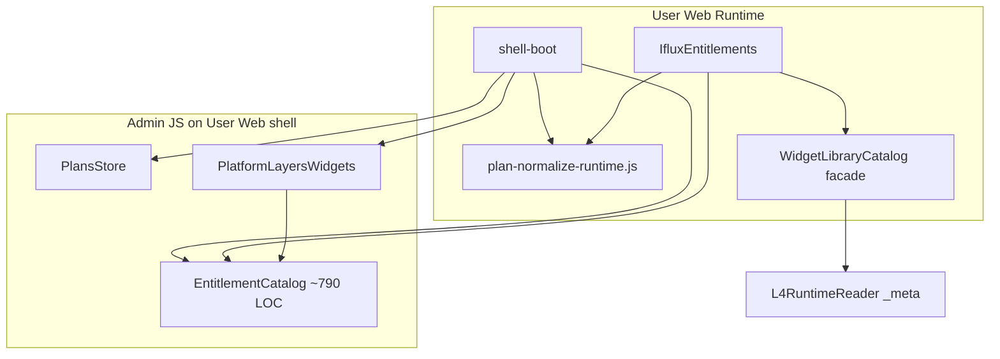

# Exit — Dependency Graph Before / After (ABH E6)

**Ngày:** 2026-07-27  
**Baseline:** [`PhaseD0-WGS-Dependency-Runtime-Audit.md`](../admin-rbac/PhaseD0-WGS-Dependency-Runtime-Audit.md)  
**Evidence:** [`E6-Evidence-Report.md`](E6-Evidence-Report.md)

---

## 1. Before (E0 — vi phạm boundary)



**Cạnh bị cấm (đã gỡ):**

| Edge | Vi phạm |
|------|---------|
| Runtime shell → `EntitlementCatalog` | Admin WGS load trên User Web |
| Runtime → `normalizePlan()` client | Runtime interpret business rules |
| Runtime → `PlansStore` | Admin store on shell |
| L4 facade → `WIDGET_SPECS` snapshot | Second cache / compatibility forever |

---

## 2. After (E6 — target đạt)

```mermaid
flowchart TB
  subgraph Admin
    PM[Permission / Entitlements UI]
    L4[Widget Definition L4]
    PL[Placement / PageSettings]
    PUB[Publish Pipeline]
  end

  subgraph Backend
    NORM[plan-normalize-publish.js]
    FILE[plans-runtime.json artifact]
    API[GET /api/plans/runtime]
  end

  subgraph RuntimeAfter["User Web Runtime"]
    SB[shell-boot]
    PRR[PlansRuntimeReader]
    L4R[L4RuntimeReader]
    IE[IfluxEntitlements]
    BG[IfluxBlockGate]
  end

  PM -->|PUT overrides| PUB
  PUB --> NORM
  NORM --> FILE
  FILE --> API
  SB --> PRR
  SB --> L4R
  PRR -->|GET plans[]| API
  L4R -->|lazy GET /api/widgets/:id| L4
  IE --> PRR
  IE --> L4R
  BG --> IE
  BG --> L4R
```

**Không còn cạnh:**

- Runtime → Admin `app/subscription/*.js`
- Runtime → client `normalizePlan` / `resolveBlockEnabled`
- Runtime → `WidgetLibraryCatalog` global
- Permission → PageSettingsStore direct (E2)

---

## 3. Delta summary

| Metric | Before E4 | After E6 |
|--------|-----------|----------|
| Admin subscription JS on shell | 3 modules | **0** |
| Runtime normalize interpreter | 1 file (~411 LOC) | **0 active** |
| Compatibility facade globals | `WidgetLibraryCatalog` | **undefined** |
| Plans data path | merge BASE + overrides + client normalize | **consume `plans[]` artifact** |
| Rule provenance | Admin + Runtime (dual) | **Publish pipeline only** |

---

## 4. Reproduce — grep edges

```bash
# Admin on User Web shell (must → 0 active)
rg "EntitlementCatalog|PlansStore|PlatformLayersWidgets" User_Web/iflux-web-ui/runtime/shell-boot.js
# → comment block only

# Runtime interpreter (must → 0)
rg "function normalizePlan\(" User_Web/ --glob "*.js"

# Facade (must → 0 active)
rg "WidgetLibraryCatalog" User_Web/iflux-web-ui --glob "*.js"
# → shell comment / disabled plan-normalize only
```
