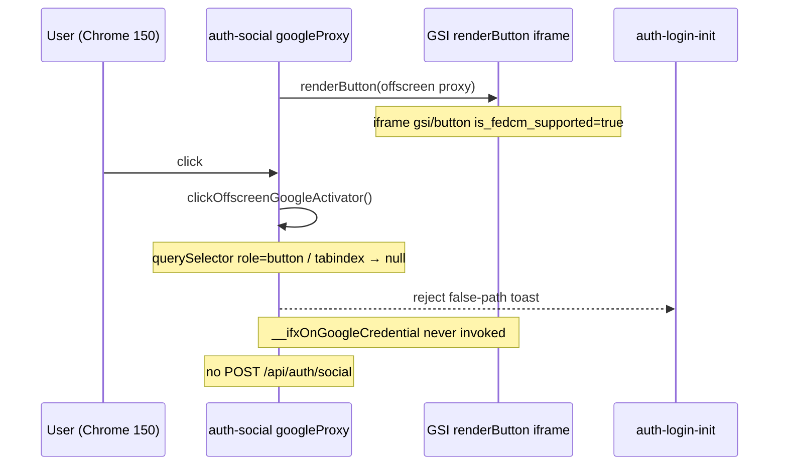

# Social OAuth — Chrome Fail Localization Audit

**Date:** 2026-07-29 (rev 4 — language precision · Failure Point ≠ Root Cause)  
**Type:** Evidence-only · không sửa code · không đề xuất fix / workaround  
**Scope:** Failure localization Chrome Desktop trên **Production Login implementation**  
**Related:** [`13-Phase-05-Step4-Verification-Audit.md`](13-Phase-05-Step4-Verification-Audit.md) §4.7.2  
**Implementation mapping (Priority 1 — LOCKED):** [`16-Google-Login-Implementation-Mapping-Audit.md`](16-Google-Login-Implementation-Mapping-Audit.md)

> **Audit này phân tích:** Production `/User_Web/iflux-web-ui/auth-social.js?v=googleProxy20260728` (md5 `8b16bbe7…`) — `renderButton` + `clickOffscreenGoogleActivator`.  
> **Không phải:** local `social-auth/google-provider.js` (`getProof` → `prompt`) — file đó **404 / không boot** trên Production login.

**Artifacts:**
- `.tmp/phase5-task3/impl-mapping/` ← mapping Priority 1
- `.tmp/phase5-task3/chrome-selector-proof/`
- `.tmp/phase5-task3/chrome-lifecycle/`

---

## Glossary (bắt buộc)

| Term | Meaning |
|------|---------|
| **Failure Point (measured)** | Chỗ runtime dừng — đã khóa bằng đo |
| **Proven fact** | Quan sát tại thời điểm probe |
| **Hypothesis / Observed gap** | Diễn giải chưa đủ evidence để gọi Root Cause |
| **Root Cause** | **Chưa tuyên bố** trong audit này |

### Measured failure point (ngôn ngữ khóa — rev 4)

> `clickOffscreenGoogleActivator()` returned **`false`**  
> because the current selector did not find a clickable element in the accessible light DOM.  
>  
> The **reason why** the selector did not match (FedCM · GIS version · Chrome behavior · timing · lifecycle · …) **has not yet been established.**

Chuỗi Failure Point (locked):

```text
renderButton SUCCESS → iframe có mặt → user click
  → clickOffscreenGoogleActivator
  → querySelector(...) → null
  → return false → toast iFlux
  → không callback · không id_token · không POST /api/auth/social
```

`querySelector → null → return false` = **evidence**.  
`selector incompatible with Chrome 150 markup` = **hypothesis** — không dùng làm Root Cause.

---

## A. Selector Null Proof (rev 3) — chỉ chứng minh, không suy đoán RC

**Probe:** Google Chrome **150.0.7871.125** headed · `https://iflux.vn/dang-nhap` · Production `auth-social.js?v=googleProxy20260728`  
**Artifact:** `chrome-selector-proof/selector-null-proof.json` · `proxy-innerHTML-FULL.html` · `proxy-outerHTML-FULL.html`

### A.1 Selector code đang tìm gì (exact)

Từ Production `clickOffscreenGoogleActivator`:

```js
var btn = proxy.querySelector('[role="button"]') || proxy.querySelector('div[tabindex]');
```

| # | Selector | Scope |
|---|----------|-------|
| A | `[role="button"]` | **chỉ** light DOM dưới `#ifx-google-auth-proxy` |
| B | `div[tabindex]` | **chỉ** light DOM dưới cùng proxy (fallback) |

Không có: `iframe`, shadow pierce, `contentDocument`, `click()` trực tiếp lên iframe.

### A.2 Expected vs Actual

| Step | Expected (để clickOffscreen = true) | Actual (Chrome 150 đo) |
|------|-------------------------------------|-------------------------|
| proxy `#ifx-google-auth-proxy` exists | ✅ | ✅ |
| iframe exists under proxy | (có thể) | ✅ |
| `[role="button"]` in proxy light DOM | ✅ (cần cho selector A) | ❌ `null` |
| `div[tabindex]` in proxy light DOM | ✅ (fallback B) | ❌ `null` |
| Combined `A \|\| B` | HTMLElement | **NULL** |
| `proxy.firstElementChild` | — | `DIV.S9gUrf-YoZ4jf` (không phải IFRAME trực tiếp) |
| iframe `src` | GIS button URL | `https://accounts.google.com/gsi/button?type=icon&theme=outline&size=medium&shape=circle&is_fedcm_supported=true&client_id=642927266497-…` |
| iframe `contentDocument` accessible from `https://iflux.vn` | ? | ❌ `false` |
| iframe `contentWindow.location.href` readable | ? | ❌ Blocked: *“Blocked a frame with origin `https://iflux.vn` from accessing a cross-origin frame.”* |
| `clickOffscreenGoogleActivator()` return | `true` | **`false`** |

### A.3 Toàn bộ light DOM dưới proxy (inventory)

TreeWalker mọi Element trong light DOM (không vào cross-origin iframe document):

| depth | tag | role | tabindex | class |
|------:|-----|------|----------|-------|
| 0 | DIV | null | null | (proxy) |
| 1 | DIV | null | null | `S9gUrf-YoZ4jf` |
| 2 | DIV | null | null | (empty wrapper) |
| 2 | IFRAME | null | null | `L5Fo6c-PQbLGe` |

**Không có** node nào với `role="button"`.  
**Không có** `DIV` nào với attribute `tabindex`.

Shadow roots dưới proxy: **không phát hiện** (`shadowHosts = []`).

### A.4 `proxy.innerHTML` FULL (không cắt)

File: `chrome-selector-proof/proxy-innerHTML-FULL.html` (637 chars — đây là **toàn bộ** innerHTML; không còn phần bị cắt):

```html
<div class="S9gUrf-YoZ4jf" style="position: relative;"><div></div><iframe src="https://accounts.google.com/gsi/button?type=icon&amp;theme=outline&amp;size=medium&amp;shape=circle&amp;is_fedcm_supported=true&amp;client_id=642927266497-o04c7abj4rbj1lobf906342ivhaoecse.apps.googleusercontent.com&amp;iframe_id=gsi_710878_742741&amp;cas=XcQ3lFDl0mctx0leeRswAu%2BJQAz2BvR%2BEua6E1dbCwI" class="L5Fo6c-PQbLGe" allow="identity-credentials-get" id="gsi_710878_742741" title="Nút Đăng nhập bằng Google" style="display: block; position: relative; top: 0px; left: 0px; height: 44px; width: 64px; border: 0px; margin: -6px -16px;"></iframe></div>
```

Ghi chú quan sát (fact, không RC): iframe có `title="Nút Đăng nhập bằng Google"` và `allow="identity-credentials-get"` — control nằm ở iframe; light DOM không có button element.

### A.5 `querySelector → null` — facts vs non-claims

**Proven at observation time (Chrome 150 snapshot):**

1. Code only runs `proxy.querySelector('[role="button"]') || proxy.querySelector('div[tabindex]')` on light DOM.
2. At the moment of measurement, light DOM inventory had **no** matching nodes for A or B.
3. An iframe under proxy existed; its document was **not** readable from `https://iflux.vn` (cross-origin blocked — measured error).
4. Therefore, for that call, `(A || B)` evaluated to **`null`**, and `clickOffscreenGoogleActivator` returned **`false`**.

**Measured failure point wording (canonical):**

> Returned `false` because the current selector did not find a clickable element in the accessible light DOM.

**Not established (do not call Root Cause):**

| Open | Why still open |
|------|----------------|
| “Chrome 150 markup incompatible with selector” as causal RC | Names a product/platform cause; not proven vs alternatives |
| FedCM / GIS version / Chrome behavior as the cause | Flag `is_fedcm_supported=true` is observation only |
| Timing / race / late inject of `role=button` | Snapshot proves absence **at query time**; does not prove a later tick could never add A/B |
| Lifecycle / init order | Not isolated |
| Safari DOM differs from Chrome | **Not dumped yet** — required next audit |

Selector-null proof giải thích **cơ học của lần gọi trả null** (không có node trong phạm vi query).  
Nó **không** tự nâng thành Root Cause “selector không tương thích Chrome 150”.

### A.6 Ranh giới ngôn ngữ

| Được viết | Không được viết |
|-----------|-----------------|
| Failure point: `querySelector → null → return false` | Root Cause: selector incompatible / FedCM |
| Fact: light DOM snapshot không có A/B | “Đã chứng minh Google đổi DOM” |
| Fact: iframe cross-origin không inspect được từ parent | Product RC đã khóa |
| Observed Compatibility Gap (hypothesis) | RC-M2 / Root Cause Candidate đã confirmed |

---

## 0. Corrections (stacked)

| Claim | Status |
|-------|--------|
| Task 3: Social = BLOCKED / INSUFFICIENT | **INVALID** — retracted |
| Backend OAuth / callback / session không hoạt động | **INVALID** — Safari PASS + DB user Google |
| Google SDK không load | **INVALID** |
| **RC-A primary:** “DOM button không tồn tại / renderButton fail” | **INVALID as primary framing** — `renderButton` **đã chạy**; iframe GIS **có mặt** |
| **RC primary:** “module lifecycle sau 1 login trong cùng profile” | **WEAK / not primary** — Guest / Profile mới / Incognito cũng FAIL (Owner) |
| Audit chỉ dừng ở “có thể FedCM” không đo return value | **Superseded** — đã đo trên Chrome 150 |

---

## 0.1 Evidence matrix (Owner + probe)

### Owner-verified

| Environment | Result |
|-------------|--------|
| Chrome Desktop (profile hiện tại) | **FAIL** |
| Chrome Desktop (Guest Profile) | **FAIL** |
| Chrome Desktop (Profile mới) | **FAIL** |
| Chrome Desktop (Incognito) | **FAIL** |
| Safari Desktop (cùng máy) | **PASS** |
| Mobile (Safari / WebView) | **PASS** |
| Chrome — lần đăng ký Google đầu (lịch sử) | **PASS** (user `gm.icosoft@gmail.com` tạo thành công) |

**Hệ quả logic (không suy diễn RC cuối):**

- Loại gần hết: cookie / localStorage / sessionStorage / extension của **một** Chrome profile.
- Loại backend / clientId config sai (Safari + Mobile PASS + DB).
- **Không** đủ để kết luận “state sau lần login đầu trong cùng profile” là RC chính (profile sạch cũng FAIL).
- Hướng còn lại: **Chrome Desktop × integration GIS của `googleProxy20260728`**.

### Probe machine (2026-07-29)

| Runtime | Version | Result on `/dang-nhap` Google click |
|---------|---------|--------------------------------------|
| Google Chrome (headed) | **150.0.7871.125** / UA Chrome/150 | Toast iFlux + `clickOffscreen` **false** |
| Google Chrome (headless) | HeadlessChrome/150 | cùng |

---

## 1. Bốn câu hỏi đo (bắt buộc) — đã trả lời bằng probe Chrome 150

Artifact: `chrome-lifecycle-summary.json` · `chrome150_headed`.

### Q1. `google.accounts.id.renderButton()` có chạy thành công trên Chrome không?

**Có — thành công về mặt GIS DOM.**

Evidence:

- `#ifx-google-auth-proxy` tồn tại sau boot.
- Bên trong có wrapper + **iframe** `https://accounts.google.com/gsi/button?...&is_fedcm_supported=true&client_id=642927266497-…`
- `childCount = 1` (cây GIS), HTML snippet ghi trong artifact.

=> **Không** được mô tả là “renderButton fail” hay “button không render”.

### Q2. `clickOffscreenGoogleActivator()` trả về `true` hay `false`?

**`false` (đo được, lặp lại: trước click · sau click · sau reload).**

Lý do kỹ thuật trong hàm Production:

```text
proxy.querySelector('[role="button"]') || proxy.querySelector('div[tabindex]')
→ null trên Chrome 150
```

Trong khi proxy **đã** chứa iframe GIS (không có `[role="button"]` / `div[tabindex]` ở light DOM parent).

Toast quan sát khớp 100%:

> Không mở được cửa sổ Google. Thử trình duyệt khác hoặc cho phép đăng nhập bên thứ ba.

### Q3. Nếu `true`, `__ifxOnGoogleCredential` có được gọi không?

**Không áp dụng nhánh `true` trên Chrome 150 probe.**  
Trên thực tế đo:

| Event | Observed |
|-------|----------|
| `credentialCallbackSets` | set `function` rồi ngay sau set `null` (clear khi reject) |
| `credentialCallbackInvokes` | **[]** — **không bao giờ gọi** |
| `POST /api/auth/social` authenticate | không xảy ra trong probe click |

=> Fail **dừng trước** credential callback và trước backend.

### Q4. Nếu callback không gọi — GIS “moment” / lỗi gì?

Trên path Production **không** gọi `google.accounts.id.prompt()` — không có `notification` / `getNotDisplayedReason`.

Probe hooks:

| API | Calls on Chrome 150 login click path |
|-----|--------------------------------------|
| `prompt` | **0** |
| `cancel` | **0** |
| `disableAutoSelect` | **0** |
| `oauth2.*` | **0** |

Console GIS “accounts list empty / Error retrieving token” **không** phải điều kiện reject của toast này trên Chrome 150 headed probe (toast đến từ `clickOffscreen === false`).

---

## 2. Lifecycle audit (auth-social googleProxy) — đo + static

### 2.1 Static — module singletons (Production `auth-social.js?v=googleProxy20260728`)

| Symbol | Scope | Reset on logout / reload? |
|--------|-------|---------------------------|
| `googleInitialized` | module | **Không** trong page; **có** reset khi full navigation reload (script re-exec) |
| `googleActivatorReady` | module | như trên |
| `__ifxOnGoogleCredential` | `window` | set/clear mỗi lần `startGoogleLoginFromUserGesture` |
| credential timer (120s) | closure | clear khi reject/success |
| `disableAutoSelect` / `cancel` | — | **không được gọi** trong source |

### 2.2 Runtime hooks — có gọi sau login/logout không?

Trên Chrome 150 probe (click ×2 + reload + click):

- `disableAutoSelect`: **0**
- `cancel`: **0**
- `prompt`: **0**
- `initialize` / `renderButton`: iframe có mặt sau reload ⇒ GIS activator được tạo lại ở mức DOM (không phải “refresh mà không renderButton”)

### 2.3 Kết luận lifecycle (giới hạn evidence)

| Hypothesis | Verdict |
|------------|---------|
| Singleton chặn re-init sau reload | **Không support** — sau reload vẫn có iframe GIS |
| Callback/timer “kẹt” sau login đầu (mọi Chrome profile) | **Không support** — Guest/new/incognito FAIL |
| “Không render” | **Không support** — `renderButton` + iframe có mặt |
| Measured: `clickOffscreen` → `false` vì `querySelector` → `null` | **Proven failure point** |
| “Selector incompatible with Chrome 150 markup” as RC | **Hypothesis only** — không nâng |

---

## 3. Runtime Call Flow (Production — unchanged path)

```text
initPage
  → ensureOffscreenGoogleActivator
      → google.accounts.id.initialize({ use_fedcm_for_prompt: true, … })
      → google.accounts.id.renderButton(#ifx-google-auth-proxy)   ← SUCCESS (iframe present)
      → googleActivatorReady = true

#btn-google click
  → startGoogleLoginFromUserGesture
      → set __ifxOnGoogleCredential + timer
      → clickOffscreenGoogleActivator()
           query [role=button] | div[tabindex] on light DOM
           ├─ measured: null → return false → toast   ← FAILURE POINT
           └─ Safari PASS (Owner) — DOM Safari chưa dump
```

---

## 4. Sequence (measured Chrome 150)



---

## 5. Failure Point · Observed Gap · (no Root Cause)

### 5.1 Measured failure point (proven)

```text
querySelector(...) → null → return false → toast
```

Canonical statement:

> `clickOffscreenGoogleActivator()` returned `false` because the current selector did not find a clickable element in the accessible light DOM.  
> The reason why the selector did not match has **not** yet been established.

### 5.2 Observed Compatibility Gap (hypothesis — not Root Cause)

> Chrome Desktop currently presents a DOM shape under `#ifx-google-auth-proxy` that, at observation time, did not satisfy the selector assumptions used by `clickOffscreenGoogleActivator()` (no `[role=button]` / `div[tabindex]` in accessible light DOM; GIS control appears as a cross-origin iframe).  
>  
> Whether this is caused by FedCM, GIS version, Chrome behavior, timing, lifecycle, or another factor **has not yet been established.**

Không dùng nhãn `RC-M2` / `Root Cause Candidate confirmed`.

### 5.3 Ruled out

| Item | Status |
|------|--------|
| Backend OAuth | Ruled out (Safari/Mobile PASS + DB) |
| GIS script không load | Ruled out |
| `renderButton` fail | Ruled out (iframe present) |

---

## 6. Open audit (reviewer gate — đúng một việc còn lại)

**Safari Desktop DOM snapshot** — cùng probe như Chrome:

- `proxy.innerHTML` FULL
- inventory light DOM (`role=button`, `div[tabindex]`, iframe)
- iframe cross-origin access check

Nếu Safari có `role=button` (hoặc clickable light-DOM) còn Chrome chỉ có iframe → hypothesis “DOM shape khác nhau giữa browser” **mạnh hơn**, vẫn chưa tự động = Root Cause cho đến khi tách timing/FedCM/…).

**Chưa có artifact Safari trong repo.**

---

## 7. Disposition

| Item | Result |
|------|--------|
| Failure point | **Proven:** `querySelector → null → false` |
| Why selector “incompatible with Chrome 150” | **Not established** (hypothesis / observed gap only) |
| FedCM / timing / lifecycle as cause | **Not established** |
| Product Root Cause | **Not declared** |
| Next required evidence | **Safari DOM snapshot** (§6) |
| Artifacts | `.tmp/phase5-task3/chrome-selector-proof/` |

*Rev 4 · language precision · no code changes · 2026-07-29.*
