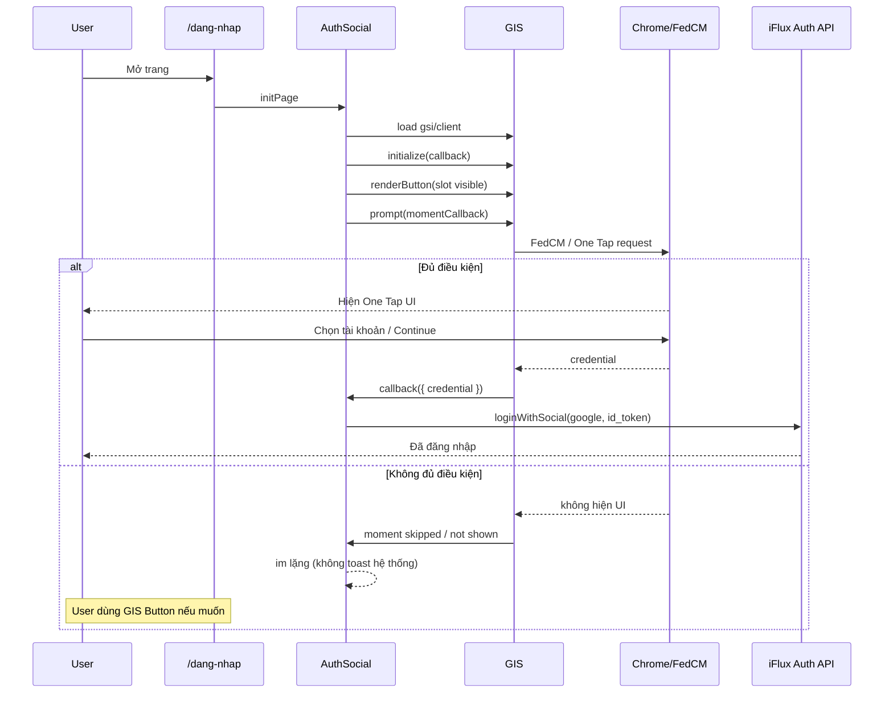
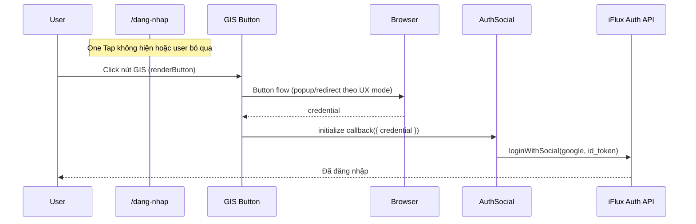
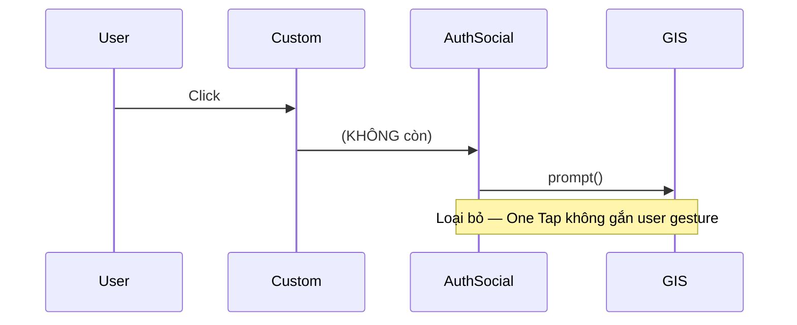

# Thiết kế — Google Sign-In (One Tap + Button) theo khuyến nghị Google

**Date:** 2026-07-30  
**Type:** Architecture design · **KHÓA Owner** · sẵn sàng implement  
**Căn cứ:** Google Sign in with Google features · evidence Production (docs 18–25) · Owner UX  
**Capability change:** Thay thế cơ chế khởi tạo Google Sign-In để tuân thủ GIS Architecture (không phải “fix toast/callback”).

### Khóa phát hiện audit (quan trọng nhất)

Production **trước đổi** không phải Button flow thật:

```text
Custom icon → JS click proxy → (activator OK | prompt() + FedCM)
```

Google mong muốn:

```text
Page load → prompt() One Tap + renderButton() Button thật
User → Google Button → Google xử lý
```

Mọi triệu chứng quanh `prompt`/FedCM/skip/cooldown bắt nguồn từ **Button flow giả**. Chỉ sửa `isSkippedMoment`/toast **không** đổi kiến trúc.

### Khóa UX Owner (2026-07-30)

1. **Hiển thị Button Google do GIS `renderButton` trực tiếp** (khuyến nghị Google · ít rủi ro).  
2. **Không** dùng icon custom iFlux làm nút kích hoạt Google (cấm proxy JS).  
3. Apple / Facebook / Zalo: **giữ tạm**; tương lai cùng pattern “provider SDK button thật” — ngoài phạm vi Google v1.  
4. One Tap **tự hiện** khi vào trang đăng nhập (nếu đủ điều kiện browser).

---

## 1. Kiến trúc đăng nhập cuối cùng

### 1.1 Nguyên tắc

| Nguyên tắc | Nguồn |
|------------|--------|
| **One Tap** và **Sign in with Google Button** là **hai flow riêng**, dùng **song song** | Google features |
| One Tap hiện **tự động** (page load / window event), **không** gắn user gesture làm trigger chính | Google warning One Tap |
| Button flow **chỉ** sau user gesture trên **nút do GIS `renderButton` tạo** | Google Button + “no API to programmatically initiate button flow” |
| Custom icon DS **không** được dùng để gọi `prompt()` / proxy click | Owner khóa + Google “own button not supported” |
| Skip / đóng / cooldown / opt-out / no session → **không** coi là lỗi hệ thống (toast kiểu “không mở được cửa sổ”) | Evidence toast fingerprint + Google cooldown/opt-out |

### 1.2 Thành phần trên `/dang-nhap`

```text
┌─────────────────────────────────────────────────────────┐
│  Page: /dang-nhap                                        │
│                                                          │
│  [ GIS One Tap ]     ← browser-mediated UI (nếu đủ ĐK) │
│       ↑ prompt() lúc page ready                          │
│                                                          │
│  [ Email/Phone panels … ]                                │
│                                                          │
│  Social row:                                             │
│    [ GIS Sign in with Google Button ]  ← renderButton    │
│    [ Apple ] [ Facebook ] [ Zalo ]     ← giữ như hiện tại│
│                                                          │
│  (Không: #btn-google custom → prompt())                  │
│  (Không: offscreen proxy + fake click làm primary)       │
└─────────────────────────────────────────────────────────┘
```

### 1.3 Ownership kỹ thuật (logic)

| Capability | Owner runtime | API GIS |
|------------|---------------|---------|
| Khởi tạo | Auth social module (hiện `auth-social` / tương đương) | `google.accounts.id.initialize` |
| One Tap | Cùng module, **chỉ** sau init, lúc page load | `google.accounts.id.prompt` |
| Button | Cùng module | `google.accounts.id.renderButton` vào slot **nhìn thấy** |
| Credential → session iFlux | `IfluxAuth.loginWithSocial` (giữ) | callback `initialize` |

### 1.4 Cấu hình khởi tạo (hướng thiết kế)

```text
initialize({
  client_id,
  callback → id_token → loginWithSocial('google', …),
  auto_select: false          // Automatic sign-in: tắt trừ khi Owner mở sau
  cancel_on_tap_outside: …    // theo UX Owner
  use_fedcm_for_prompt: true  // One Tap qua FedCM trên Chrome
  use_fedcm_for_button: true  // Button qua FedCM khi browser hỗ trợ
})
```

Automatic sign-in: **không** bật trong thiết kế v1 (Owner chưa yêu cầu; Google: chỉ trên One Tap).

---

## 2. Sequence diagram

### 2.1 Happy path — One Tap



### 2.2 Happy path — Google Button



### 2.3 Cấm trong kiến trúc đích



---

## 3. State machine

```mermaid
stateDiagram-v2
  [*] --> PageLoading

  PageLoading --> GisReady: initialize + renderButton OK
  PageLoading --> GisUnavailable: SDK/config fail
  GisUnavailable --> [*]: toast cấu hình/hệ thống (có)

  GisReady --> OneTapAttempting: prompt() on page ready

  OneTapAttempting --> OneTapVisible: browser hiện UI
  OneTapAttempting --> OneTapSilentSkip: skip / no session / opt-out / cooldown / FedCM blocked
  OneTapAttempting --> Authenticated: credential callback

  OneTapVisible --> Authenticated: user hoàn tất One Tap
  OneTapVisible --> OneTapSilentSkip: user đóng / dismiss không credential
  OneTapVisible --> FedCmSuppressed: browser suppress sau đóng (cooldown)

  OneTapSilentSkip --> IdleAwaitButton: im lặng, giữ nút GIS
  FedCmSuppressed --> IdleAwaitButton: im lặng; One Tap có thể không hiện lại tạm thời

  IdleAwaitButton --> ButtonInProgress: user click GIS Button
  ButtonInProgress --> Authenticated: credential
  ButtonInProgress --> IdleAwaitButton: user hủy Button flow (không toast One Tap)

  Authenticated --> [*]
```



### Ý nghĩa trạng thái

| State | Ý nghĩa UX |
|-------|------------|
| `OneTapAttempting` | Đã gọi `prompt()` lúc load |
| `OneTapVisible` | User thấy One Tap |
| `OneTapSilentSkip` | Không hiện / bỏ qua — **không lỗi** |
| `FedCmSuppressed` | Chrome đã suppress FedCM tạm/vĩnh viễn cho site — One Tap có thể chết; Button vẫn là cửa thoát |
| `IdleAwaitButton` | Trang bình thường + nút GIS sẵn sàng |
| `ButtonInProgress` | User đang trong Button flow |
| `Authenticated` | Có id_token, đang/đã `loginWithSocial` |

---

## 4. Khi nào dùng One Tap

| Điều kiện | Hành động |
|-----------|-----------|
| User vào `/dang-nhap` (và trang auth tương đương Owner chỉ định) | Sau `initialize` (+ ideally sau `renderButton` slot sẵn) → **một lần** `prompt()` |
| Có Google session + không opt-out + FedCM/One Tap cho phép | Browser hiện One Tap |
| Guest / không session / opt-out / cooldown / FedCM disabled | Không hiện — **ở yên**, không toast |
| User đã authenticated | Không gọi lại One Tap |

**Không dùng One Tap khi:** user click icon/nút tùy biến; retry sau skip bằng cách gọi lại `prompt()` từ gesture (tránh đúng warning Google).

---

## 5. Khi nào dùng Google Button

| Điều kiện | Hành động |
|-----------|-----------|
| Luôn có trên trang đăng nhập (fallback) | `renderButton` vào slot **visible** |
| One Tap không hiện hoặc user không dùng One Tap | User **click nút GIS** → Button flow |
| Sau cooldown / FedCM disabled One Tap | Vẫn dựa vào Button (và hướng dẫn site settings nếu cần, copy UX — không gắn `prompt()` lại) |

**Không dùng:** programmatic “giả click” nút ẩn làm **primary** trên Chrome nếu không đảm bảo activator FedCM (evidence: không overlay → fail). Thiết kế đích: **nút GIS nhìn thấy**, gesture thật.

---

## 6. Có còn `google.accounts.id.prompt()` sau user click không?

### **Không.**

| Thời điểm | `prompt()` |
|-----------|------------|
| Page load / page ready (sau init) | **Có** — One Tap |
| User click GIS Button | **Không** — Button do GIS xử lý |
| User click custom icon | **Không còn** path này trong kiến trúc đích |
| Fallback “bấm icon → prompt()” (Production hiện tại) | **Loại bỏ** |

---

## 7. Xử lý trạng thái (skip, dismiss, cooldown, …)

| Trạng thái | Nguồn tín hiệu (điển hình) | Xử lý kiến trúc đích |
|------------|----------------------------|----------------------|
| **Skip** (`isSkippedMoment`) | Moment callback One Tap | **Im lặng.** Không `reject` toast hệ thống. Giữ `IdleAwaitButton`. |
| **Dismiss** (`isDismissedMoment`) | Moment callback; lý do có thể `credential_returned` / cancel API | Nếu đã có credential → flow success qua `initialize` callback. Nếu dismiss không credential → im lặng / không toast One Tap. |
| **Display / not displayed** (FedCM) | Google: display moment APIs không còn đáng tin dưới FedCM | Không phụ thuộc display moment để quyết lỗi. |
| **Cooldown** sau đóng One Tap | Browser / GIS suppress | Không ép `prompt()` lại bằng click. User dùng **Button**. (Tuỳ chọn sau: copy nhẹ “có thể bật lại đăng nhập bên thứ ba trong cài đặt site” — không phải toast lỗi đỏ.) |
| **Opt-out** One Tap / third-party sign-in | Google global opt-out / Chrome settings | One Tap không hiện → im lặng; **Button** là đường chính. |
| **No Google session** (Guest, nhiều Incognito) | Empty accounts / không UI | Im lặng với One Tap; Button vẫn cho phép đăng nhập Google (account chooser trong Button flow). |
| **FedCM disabled** (temp/permanent) | Console Chrome | Không map thành “app hỏng.” One Tap nghỉ; **Button** (+ message hướng dẫn settings chỉ khi user chủ động cần One Tap — không chặn Button). |
| **NetworkError retrieving token** sau FedCM get fail | Hệ quả browser/FedCM | Không toast “không mở được cửa sổ” từ skip. Chỉ surface lỗi nếu Button/credential path fail có lỗi nghiệp vụ thật. |
| **SDK / client_id / config thiếu** | Init fail | **Có** toast/lỗi hệ thống cấu hình (khác hẳn skip). |
| **Backend `loginWithSocial` fail** | API | Toast/lỗi API — đúng tầng auth. |

### Quy tắc một dòng

```text
One Tap moment skip/dismiss-without-credential/cooldown/opt-out/no-session/FedCM-disabled
  → KHÔNG phải lỗi đăng nhập hệ thống
  → UI: im lặng + Google Button sẵn sàng

Lỗi cấu hình GIS hoặc lỗi API sau khi đã có credential
  → Mới là lỗi hệ thống / nghiệp vụ
```

---

## 8. Chứng minh solution tuân theo tài liệu Google

| Yêu cầu / câu Google | Thiết kế đáp ứng |
|----------------------|------------------|
| One Tap và Button là hai tính năng riêng, dùng cùng hệ GIS | Hai nhánh: `prompt` (load) + `renderButton` (visible) |
| “One Tap UI should be displayed automatically… instead of being triggered by a user gesture” | `prompt()` **chỉ** page ready; **không** sau click |
| Warning: gesture + opt-out/cooldown/no session → broken UX (bấm mà không thấy UI) | Loại `prompt()`-on-click; skip = im lặng |
| “Button flow must be triggered by a user gesture” | Chỉ click nút GIS |
| “Doesn't provide an API to programmatically initiate the button flow” / “Using your own button is not supported” | Không custom icon → `prompt`/fake initiate; dùng nút `renderButton` |
| User có thể opt-out third-party / One Tap không hiện | Fallback Button; không ép One Tap |
| Cooldown / đóng One Tap suppress tạm | Không coi là crash app; Button vẫn dùng được |
| FedCM: browser kiểm soát UI One Tap | Chấp nhận `OneTapSilentSkip` / `FedCmSuppressed`; không tự invent overlay click làm One Tap |

### Khớp evidence đã thu thập (không đào lại)

| Evidence | Thiết kế xử lý |
|----------|----------------|
| Production: load không `prompt`; click → `prompt` hoặc offscreen | Đảo: load `prompt`; click chỉ Button GIS |
| Đóng UI → skip → toast ngay | Bỏ map skip→toast lỗi |
| Lần sau: FedCM disabled + NetworkError | Kỳ vọng browser; không One Tap-on-click; Button là lối ra |
| Guest / Chromium: không UI + lỗi | One Tap silent skip; không báo hỏng hệ thống |
| Profile: UI hiện được khi đủ ĐK | Giữ One Tap auto đúng chỗ Google khuyến nghị |

---

## 9. Tóm tắt quyết định kiến trúc

```text
One Tap     = tự hiện lúc vào trang (prompt @ load) · skip = im lặng
Google Button = nút GIS visible · gesture thật · đường chính khi One Tap không dùng được
prompt() sau user click = KHÔNG
Custom icon → prompt / offscreen primary = KHÔNG (trong kiến trúc đích)
```

**Implement:** Owner đã khóa UX (GIS Button thật + One Tap load + cấm proxy). Engineering Change: Impact Analysis → Modify Production `auth-social` + `login`/`register` UI → deploy.

### Impact Analysis (tối thiểu)

```
Feature: Google Sign-In (One Tap + Button GIS)
Current owner: User_Web auth-social.js (googleProxy) + auth/login|register + auth-*-init
Files: auth-social.js, auth-login-init.js, auth-register-init.js, auth-*-boot.js (cache bust), login.html, register.html
Functions: ensureOffscreen* / clickOffscreen* / startGoogleLoginFromUserGesture (LOẠI primary) → renderVisibleGisButton + promptOneTapOnLoad + initialize callback
Consumers: /dang-nhap, /dang-ky (và route tương đương)
Storage-API: không đổi loginWithSocial /auth/social
Decision: Migrate capability orchestration (Reuse finishSocialLogin) | Delete proxy path primary
```
