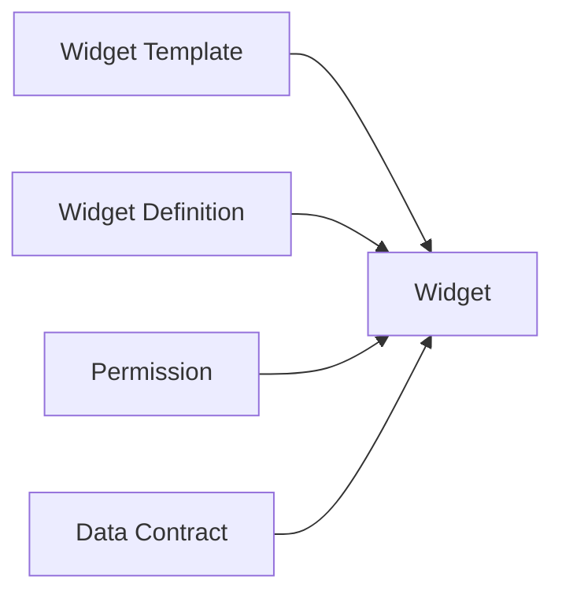

# SoT — iFlux Product Architecture

> **ĐÃ THAY THẾ** — SoT đang áp dụng: [`SoT — iFlux Product Architecture (V2).md`](./SoT%20%E2%80%94%20iFlux%20Product%20Architecture%20(V2).md).  
> File này (V1) chỉ giữ để tham chiếu lịch sử. Mọi xung đột → tuân theo **V2**.

# SoT — iFlux Product Architecture (V1 — lưu trữ)

Đây là kiến trúc dùng để định nghĩa cấu trúc của toàn bộ sản phẩm iFlux\.

Nó là nguồn sự thật \(Source of Truth\) cho:

- Product Architecture
- Product Design
- UI Architecture
- Design System boundary
- Technical Architecture

Mọi tài liệu phía dưới đều phải tuân theo kiến trúc này\.
Nếu có xung đột, tài liệu cấp dưới phải sửa theo tài liệu này\.

---
# **Macro Architecture — Entity-centric (Knowledge Graph)**

iFlux tổ chức theo **Entity-centric Architecture**, KHÔNG phải Page-centric\.

Nguyên tắc cốt lõi:
- Mỗi **Entity** tồn tại **một lần duy nhất** với **một URL top-level** duy nhất\.
- **Page chỉ là điểm truy cập (entry point)** tới Entity 
— Page KHÔNG "sở hữu" Entity\.
- Thị trường, Cộng đồng, Nhà, Search, AI, Alert, Notification, Insight Widget, Report… đều có thể mở tới cùng một Entity mà URL **không đổi**\.
- Quan hệ giữa các Entity là **Relationship** (không có cha–con), tạo thành **Knowledge Graph**\.

```Plain Text
                      Câu chuyện (Chủ đề đã trưởng thành)
                            │
  (sector) Ngành ─────  Platform ───── Cổ phiếu (Stock)
                            │
                      Hệ sinh thái (Ecosystem)
```

Hệ thống chia làm **ba tầng**:

## Experience Layer

Các Page trải nghiệm dành cho người dùng (entry points)\.

```Plain Text
/nha-cua-toi       Nhà của tôi
/thi-truong        Thị trường
/dong-tien         Dòng tiền
/cong-dong         Cộng đồng
/...               Và các trang tùy biến khác: Hỏi đáp, Gói cước...
```

## Knowledge Layer

Các Entity dữ liệu dùng chung — **URL top-level**

```Plain Text
Cổ phiếu (Stocks)           /co-phieu           /co-phieu/:ticker
Ngành (Sectors)             /nganh              /nganh/:slug
Hệ sinh thái (Ecosystems)   /he-sinh-thai       /he-sinh-thai/:slug
Câu chuyện (Story)          /cau-chuyen         /cau-chuyen/:slug     
```

> Bốn Entity của Knowledge Layer có vai trò ngang nhau về mặt kiến trúc. Quan hệ giữa chúng là Relationship, không phải quan hệ cha–con.
> Trong bốn Entity, Stock là Atomic Entity của nền tảng. Topic, Sector và Ecosystem đều có thể biểu diễn thông qua tập hợp các Stock liên quan.


**Vòng đời hình thành Câu chuyện (Story)**

```Plain Text
                 Bài viết (Post)
                        │
          gắn một hoặc nhiều Tag Chủ đề 
                        │
                        ▼
              Tag Chủ đề (metadata)
                        │
          nhiều bài viết cùng tham chiếu
                        │
        đạt điều kiện trưởng thành của hệ thống
                        │
                        ▼
          Entity Câu chuyện (Knowledge Layer)
                        │
      có URL riêng · dữ liệu riêng · Insight riêng
                        │
                        ▼
      được toàn bộ nền tảng cùng sử dụng
```

> Chủ đề ban đầu chỉ tồn tại dưới dạng Tag gắn với Bài viết.
> Khi một Chủ đề đạt đủ điều kiện trưởng thành (theo quy tắc của hệ thống), nó được nâng cấp thành Câu chuyện Entity trong **Knowledge Layer**.
> Từ thời điểm đó, Câu chuyện sẽ xuất hiện ở trạng thái Mới hình thành, có URL riêng, dữ liệu riêng, quan hệ với các Entity khác và có thể được truy cập từ mọi Experience (Thị trường, Cộng đồng, AI, Search, Alert, Report...), không còn phụ thuộc vào Community.
**Toàn bộ hành trình hình thành nên 1 Câu chuyện Entity đã được mô tả đầy đủ trong**: `Topic_Engine.md`

**Quy ước slug:**  
Slug sử dụng tiếng Việt không dấu
- Ngành (Sector) (`/nganh/ngan-hang`); 
- Hệ sinh thái - hay còn goi là họ cổ phiếu (Ecosystem) = code (`/ho-co-phieu/vin`); 
- Cổ phiếu (Stock) = ticker (`/co-phieu/SSI`); 
- Câu chuyện = slug (`/cau-chuyen/dau-tu-cong`)\.

> **Knowledge Layer** là lớp lưu trữ và quản lý các Entity dùng chung của toàn bộ nền tảng. Các Entity tồn tại độc lập với Experience Layer và được mọi trải nghiệm cùng tham chiếu thông qua Canonical URL.

## Platform Layer

**Hạ tầng tài khoản & tiện ích dùng xuyên suốt mọi trải nghiệm**

```Plain Text
/account   /messages   /search   /watchlist   /alerts   /share
/pricing   /auth/login   /  (root redirect)   /settings …
```

## Hệ quả bắt buộc

- Mỗi Entity chỉ có một Canonical URL duy nhất.
- Community chỉ sở hữu Bài viết, không sở hữu Thực thể Entity.
- Bài viết có thể tham chiếu tới nhiều Entity.
- Topic chỉ trở thành Entity sau khi đạt điều kiện trưởng thành.
- Mọi Experience đều truy cập cùng một Entity thông qua Canonical URL.
- Sitemap phải phản ánh đúng ba tầng kiến trúc.

> Admin ▸ Hệ thống ▸ Cài đặt Trang ▸ Sitemap hiển thị đúng ba tầng này\.

---

# Cấu trúc phân rã cấp giao diện

```Plain Text
Page
└── App Shell
    └── Section
        └── Widget Catalog
            └── Widget
                └── Component
                    ├── Card
                    ├── Block
                    └── Item
                        └── Atom
```

**Trong đó, Widget Composition: **



**Đây là cấu trúc phân cấp chính thức của giao diện iFlux.**
Mọi màn hình, Widget và thành phần giao diện đều phải tuân theo cấu trúc này. Mọi thay đổi về cấp hoặc bổ sung tầng mới đều phải được cập nhật vào SoT trước khi triển khai.
---

# Vai trò của từng tầng

## Page
Page là một màn hình nghiệp vụ hoàn chỉnh, đóng vai trò là điểm truy cập (Entry Point) của người dùng.

Ví dụ:

- Nhà của tôi
- Thị trường
- Dòng tiền
- Cộng đồng
- Chương trình thành viên
- Hỏi đáp
- ...

Một Page gồm hai phần:

- Khung giao diện (App Shell → Section)
- Nội dung hiển thị (Widget)

Page không sở hữu dữ liệu nghiệp vụ.
---

## App Shell

App Shell

App Shell là khung giao diện dùng chung của một Page.

Bao gồm:

- Header
- Sidebar
- Navigation
- Footer
- Bottom Navigation
- Main Content
- Các vùng bố cục khác

App Shell chỉ chịu trách nhiệm tổ chức bố cục và điều hướng.
Không chứa nội dung nghiệp vụ.

---

## Section

Section là các vùng bố cục bên trong App Shell.

Ví dụ:

- Hero
- Main Content Area
- Sidebar Area
- Footer Area

Section chỉ dùng để chia bố cục.

Không đại diện cho nội dung nghiệp vụ.
---

## Widget Catalog

Widget Catalog là thư viện quản lý toàn bộ Widget của hệ thống.
Mỗi Widget là một đơn vị nội dung (Content Unit) độc lập, có thể được sử dụng trên nhiều Page khác nhau.
Widget không thuộc về bất kỳ Page nào.

## Widget

Widget là đơn vị nội dung (Content Unit) độc lập và là **content unit quan trọng nhất của toàn bộ hệ thống của iFlux**

Một Widget được hình thành từ bốn nhóm tham chiếu:

- Quyền sử dụng (Permission): Gói đăng ký > Phân quyền sử dụng
- Giao diện hiển thị (Widget Template): Giao diện > Mẫu giao diện
- Dữ liệu hiển thị (Data Definition): Kiến trúc 4 tầng > Tầng 4
- Vị trí hiển thị (Layout / Placement): Giao diện > Cài đặt trang


> Widget có thể được sử dụng trên nhiều Page, nhiều Section và nhiều Experience khác nhau.
> Widget không chứa giao diện, không xử lý business logic và không phụ thuộc vào Page.

**Năng lực chuẩn của Widget**

Mọi Widget trong iFlux đều phải hỗ trợ các năng lực sau.

**1. Responsive Layout**

Widget hỗ trợ hiển thị trên nhiều kích thước màn hình và nhiều bố cục khác nhau.

Chuẩn nội bộ sử dụng Grid Span (12 cột).

Ví dụ:

Span 3
Span 4
Span 6
Span 12

Các tỷ lệ như 1/4, 1/3, 1/2... chỉ là cách diễn giải trong giao diện và không được sử dụng làm chuẩn lưu trữ hoặc xử lý nội bộ.

**2. Movable**

Widget có thể được di chuyển giữa các vị trí hiển thị theo quy tắc của Layout.

**3. Resizable**

Widget có thể thay đổi kích thước trong giới hạn do Widget Template và Layout quy định.

**4. Dùng chung**

Mọi Widget đều là **Shared Widget** và được quản lý tập trung trong Widget Catalog.

Admin có thể cấu hình một Widget xuất hiện trên bất kỳ Page nào thông qua **Cài đặt Trang**.

Riêng tại trang: **Nhà của tôi**, cấu hình của Admin chỉ đóng vai trò là bố cục mặc định. User có thể tự thay đổi vị trí và bố cục Widget theo nhu cầu của mình, độc lập với cấu hình mặc định của hệ thống.

**5. Export Insight**

Mọi Widget đều có khả năng xuất nội dung thành Insight.

Insight không phải là Widget.

Insight là một kết quả (Artifact) được tạo ra từ một hoặc nhiều Widget để phục vụ chia sẻ, báo cáo, lưu trữ hoặc phân phối.

```Plain Text 
  Widget
    │
    ▼
 Export
    │
    ▼
 Insight View
```
Insight View có thể được xuất dưới nhiều hình thức:

- HTML
- PNG
- PDF
- Link
- Community Post
- AI Summary
- Các định dạng khác trong tương lai

**Trong đó HTML là định dạng căn bản của Insight View**
 
```Plain Text
HTML (Canonical)
    ├── Print → PDF
    ├── Screenshot → PNG
    ├── Share → Link
    ├── Publish → Community Post
    └── AI Summary
```

**Tài liệu: `SoT — Widget Definition.md` đã đặc tả đầy đủ ý nghĩa và tầm quan trọng của Widget trong hệ thống của iFlux**

## Component

Component là đơn vị giao diện có thể tái sử dụng (Reusable UI).
Component chịu trách nhiệm hiển thị dữ liệu theo đúng Widget Template.

Ví dụ:

- Card
- Block

Component không chịu trách nhiệm:

- Quyền sử dụng (Permission)
- Nguồn dữ liệu (Data Source)
- Business Logic
- Formula
- Layout / Placement
- Điều hướng nghiệp vụ

Component chỉ nhận ViewModel và render giao diện.

## Item

Item là thành phần cấu thành Component.

Ví dụ:

- Button
- Badge
- Label
- Row
- Avatar
- Tag

> Một Item có thể được nhiều Component cùng sử dụng.
> Item không chứa business logic.

## Atom

Atom là đơn vị giao diện nhỏ nhất của Design System.

Ví dụ:

- Text
- Icon
- Input
- Divider
- Checkbox

> Atom chỉ chịu trách nhiệm hiển thị và tương tác cơ bản.
> Atom không tiếp tục được phân rã trong Design System.

---

# Boundary với Design System

Đây là ranh giới chính thức giữa Product Architecture và Design System.

## Product Architecture sở hữu

- Page
- App Shell
- Section
- Page Composition
- Widget (Content Unit)

## Design System sở hữu

- Component
  - Card
  - Block
  - Item
  - Atom
- Design Tokens
- Foundations

## Design System KHÔNG sở hữu

- Page
- App Shell
- Section
- Page Composition
- Widget
- Widget Definition
- Widget Template
- Business Logic
- Data Contract

Component chỉ là các phần tử giao diện có thể tái sử dụng.

Widget là đơn vị nội dung (Content Unit) của Product Architecture, có thể sử dụng một hoặc nhiều Component của Design System để hiển thị.

Đây là ranh giới bắt buộc phải giữ.

# Boundary với Technical Architecture

**Widget là một Content Unit của Product Architecture.**

Việc mô tả cấu hình, hành vi và metadata của Widget thuộc về Widget Definition (declarative layer), không phải Widget Runtime. Widget Runtime chỉ chịu trách nhiệm phối hợp các thành phần của hệ thống để hiển thị nội dung theo Widget Definition.

Các trách nhiệm phải được tách biệt rõ ràng:

- **Widget Definition** chịu trách nhiệm mô tả Widget (metadata, configuration, contract và khả năng của Widget).
- **Widget Runtime** chịu trách nhiệm khởi tạo Widget, điều phối vòng đời và kết nối các engine cần thiết để thực thi Widget.
- **Design System** chịu trách nhiệm render giao diện thông qua các Component.
- **Data Provider** chịu trách nhiệm cung cấp dữ liệu theo Data Contract.
- **Layout Engine** chịu trách nhiệm xác định vị trí, kích thước và bố cục của Widget trên Page.
- **Permission Engine** chịu trách nhiệm kiểm tra quyền truy cập và khả năng sử dụng Widget.
- **Insight Engine** chịu trách nhiệm xuất bản Widget dưới dạng Insight khi được yêu cầu.
- **Business Services** chịu trách nhiệm thực hiện toàn bộ business logic và các quy tắc nghiệp vụ.

Widget không được trực tiếp thực hiện:

- Render UI.
- Truy xuất dữ liệu.
- Kiểm tra phân quyền.
- Quyết định bố cục.
- Chứa Business Logic.
- Thực hiện xuất bản Insight.

Việc tách ranh giới này nhằm bảo đảm mỗi thành phần chỉ có một trách nhiệm duy nhất (Single Responsibility) và giúp hệ thống mở rộng từ vài chục lên hàng trăm hoặc hàng nghìn Widget mà không làm tăng mức độ phụ thuộc giữa các lớp kiến trúc.

---

# **Runtime Blueprint — Kiến trúc tải & vòng đời tài nguyên của Page**

> Nghiệm thu từ **Pilot trang Cộng đồng** (2026‑07). Đây là **chuẩn chung cho MỌI Page** (Nhà của tôi, Thị trường, Dòng tiền, Cộng đồng…), KHÔNG mô tả riêng một trang.
>
> Tài liệu phân biệt rõ **Target** (kiến trúc đích) và **Current** (hiện trạng đã đạt tới đâu). Khi mở một Page mới chỉ cần yêu cầu: **"Áp dụng Runtime Blueprint"** — không tự nghĩ lại kiến trúc.

## 1. Thứ tự tải tài nguyên (Loading Order) — Target

```Plain Text
App Shell                       
    ↓
Header
    ↓
Page Structure
    ├──────────────┐
    │              │
    ▼              ▼
Widget Slots   Page Feature
    ↓
Widget Artifact
    ↓
Widget Runtime
    ├── Resource Loader
    ├── Permission Engine
    ├── Data Provider
    └── Store Hydration
            ↓
        Template
            ↓
    Design System (Component)
            ↓
          Render
```

Trách nhiệm & Owner từng tầng:

| Tầng | Trách nhiệm | Owner |
|---|---|---|
| App Shell | Khung layout + boot nền tảng (router, auth, entitlements, header UI) | App Shell |
| Header | Topnav, tìm kiếm, menu user, đồng bộ trạng thái | App Shell |
| Page Structure | Khai báo tiêu đề, mô tả, Section và Widget Slot | Page |
| Page Feature | Nội dung đặc thù của Page (feed, section...) | Page |
| Widget Slot | Widget nào xuất hiện, vị trí, span, cấu hình | Admin ▸ Cài đặt trang |
| Widget Artifact | Định nghĩa đã Publish của Widget (metadata, resources, contracts) | Widget Definition |
| Widget Runtime | Khởi tạo Widget và điều phối vòng đời thực thi | Runtime |
| Resource Loader | Nạp JS/CSS của Widget | Runtime |
| Permission Engine | Kiểm tra quyền truy cập Widget | Runtime |
| Data Provider | Cung cấp dữ liệu theo Data Contract | Core Layer |
| Store Hydration | Đồng bộ dữ liệu vào Store | Runtime |
| Template | Ánh xạ ViewModel sang giao diện | Template |
| Render | Render UI thông qua Design System Components | Design System |

## 2. Resource Ownership — mỗi tài nguyên MỘT owner duy nhất

| Resource            | Owner (Target)        | KHÔNG được quyết bởi | Hiện trạng             |
| ------------------- | --------------------- | -------------------- | ---------------------- |
| Header              | App Shell             | Page                 | ✅ Đạt                  |
| Widget Slot         | Admin ▸ Cài đặt trang | Page / Composite     | 🔴 Partial Consumption |
| Widget JS           | Widget Artifact       | Page                 | ✅ Đạt                  |
| Widget CSS          | Widget Artifact       | Page                 | ✅ Đạt                  |
| Widget Data         | Data Provider         | Store / Widget       | 🔴 Store còn tự fetch  |
| Page Feature JS/CSS | Page                  | Widget               | ✅ Đạt                  |
| Template            | Template              | Business Services    | ✅ Đạt                  |

Mục tiêu: mỗi dòng chỉ có **một** owner. Cột cuối cho biết Community đã khớp Target tới đâu.

## 3. Cấu trúc CSS sau tối ưu

| Nhóm | Mục đích | Chính sách tải | Owner |
|---|---|---|---|
| Foundation | Design Tokens, reset, typography, spacing, color, radius, shadow, motion, z-index, utilities | **Luôn tải** | Design System |
| Design System | Component, Card, Block, Item, Atom, icon, widget-shell, layout primitives | **Luôn tải** | Design System |
| App Shell | Header, Navigation, User Hub, Layout Shell, Overlay, Global UI | **Luôn tải** | App Shell |
| Page Feature CSS | CSS phục vụ nội dung đặc thù của từng Page (Feed, Hero Banner, Landing, Marketing Section...) | **Theo Page** | Page |
| Widget CSS | CSS riêng của từng Widget, chỉ phục vụ Widget đó | **Lazy theo Widget Artifact** | Widget Artifact |
| Theme / Brand (tuỳ chọn) | Theme, Brand Override, White-label | Theo Theme | Theme System |

**Nguyên tắc**

- Foundation và Design System luôn được tải trước mọi Page.
- App Shell chỉ chứa CSS phục vụ giao diện dùng chung của toàn hệ thống.
- CSS của Page chỉ phục vụ nội dung đặc thù của chính Page đó.
- CSS của Widget phải đi cùng Widget Artifact; Page không được preload hoặc hardcode CSS của Widget.
- Widget không được phụ thuộc vào CSS của một Widget khác.
- Component của Design System không được chứa style phụ thuộc nghiệp vụ.

## 4. Cấu trúc JavaScript sau tối ưu

| Nhóm | Mục đích | Chính sách tải | Owner |
|---|---|---|---|
| Platform | Boot nền tảng, API Client, Authentication, Configuration | **Preload** (App Shell boot) | App Shell |
| App Shell | Router, Navigation, Entitlements, User Hub, Global State, Shared Services | **Preload** (song song 1 tầng) | App Shell |
| Runtime | Page Runtime, Widget Runtime, Resource Loader, Module Loader, Lifecycle Manager | **Runtime** | Runtime |
| Page Feature | Logic đặc thù của từng Page (Feed, Landing, SEO, Taxonomy, Marketing...) | **Theo Page** | Page |
| Widget Artifact | Metadata, Resource Contract, Data Contract, Runtime Configuration | **Resolve khi Widget được mount** | Widget Definition |
| Widget Module | Logic thực thi của từng Widget | **Lazy khi Widget Runtime khởi tạo Widget** | Widget Artifact |

### Nguyên tắc

- Platform và App Shell chỉ được tải một lần trong vòng đời ứng dụng.
- Runtime chịu trách nhiệm điều phối việc khởi tạo Widget; không chứa business logic của Widget.
- Mỗi Widget chỉ được nạp khi có Widget Slot tương ứng trên Page.
- Widget Module luôn được nạp thông qua Widget Artifact; Page không được import trực tiếp Module của Widget.
- Widget không được tự ý nạp tài nguyên ngoài Widget Artifact.
- Widget không được tự fetch dữ liệu; mọi dữ liệu phải đi qua Data Provider theo Data Contract.
- Widget Module phải độc lập, không phụ thuộc trực tiếp vào Module của Widget khác.

## 5. Dependency Graph

```Plain Text
                        App Shell
                             │
                             ▼
                       Page Runtime
        ┌──────────────┼──────────────┐
        ▼              ▼              ▼
 Page Structure   Page Feature   Page Composition
                                        │
                                        ▼
                                   Widget Slots
                                        │
                                        ▼
                                 Widget Artifact
                                        │
                                        ▼
                                 Widget Runtime
          ┌──────────────┼──────────────┬──────────────┐
          ▼              ▼              ▼              ▼
 Resource Loader  Permission     Data Provider       Store
                    Engine
                                        │
                                        ▼
                                   Template
                                        │
                                        ▼
                              Design System
                               (Components)
                                        │
                                        ▼
                                     Render
```
## 6. Loading Rules (BẮT BUỘC)

1. **Script cùng tầng phải được tải song song.** Chỉ ràng buộc **thứ tự thực thi** khi tồn tại phụ thuộc; không tuần tự hóa việc tải các script độc lập.
2. **CSS phải được tải bằng `<link>` song song.** Không sử dụng chuỗi `@import` nối tiếp gây waterfall và chặn render.
3. **JS/CSS của Widget phải được khai báo trong Widget Artifact.** Page không được hardcode hoặc preload trực tiếp tài nguyên của Widget.
4. **Page chỉ sở hữu Page Feature.** Mọi tài nguyên của Widget phải thuộc Widget Artifact; không được đặt CSS hoặc JavaScript của Widget ở tầng Page.
5. **Widget Module phải được tải theo cơ chế lazy.** Widget Runtime chỉ nạp Module khi Widget được khởi tạo hoặc mount; không preload cùng Page Feature nếu chưa cần.
6. **Widget không được tự ý nạp tài nguyên ngoài Widget Artifact.** Mọi JS, CSS và Data Contract phải được khai báo trước và được Runtime điều phối.
7. **Chỉ tải tuần tự khi tồn tại phụ thuộc thực sự.** Không sử dụng các cơ chế như `loadScriptsSequential()` cho các nhóm script độc lập.
8. **Mỗi tài nguyên chỉ có một Owner duy nhất.** Page, Runtime, Widget Artifact và Design System không được cùng sở hữu hoặc cùng quyết định một tài nguyên.

## 7. Widget Runtime Lifecycle — Vòng đời một Widget (từ Admin → màn hình)

Chương này mô tả **luồng thực thi** của một Widget, từ khi được cấu hình trong Admin đến khi hiển thị trên màn hình.

```Plain Text
  Admin                     cấu hình Widget cho Page
    ↓  
Page Settings               (Slot: id + position + span + config)
    ↓
Page Runtime                (đọc Page Settings)
    ↓
Resolve Widget Slots        (enabled / permission / visibility)
    ↓
Load Widget Artifact        (metadata + resources + contracts)
    ↓
Initialize Widget Runtime
    ├── Resource Loader
    ├── Permission Engine
    └── Data Provider
            ↓
       Data Provider
            ↓
       Store Hydration
            ↓
         Template
            ↓
   Design System Components
            ↓
          Render
```
**Trách nhiệm từng bước**
- **Admin / Page Settings** (Cài đặt trang) — nguồn sự thật về Widget nào xuất hiện trên Page, vị trí, span và cấu hình Runtime.
- **Page Runtime** — đọc Page Settings, dựng Page Structure và khởi tạo Widget; không quyết định tài nguyên hay dữ liệu của Widget.
- **Widget Artifact** — kết quả Publish từ Widget Definition; khai báo metadata, tài nguyên và các contract cần thiết để Runtime thực thi Widget.
- **Widget Runtime** — điều phối vòng đời của Widget, bao gồm nạp tài nguyên, kiểm tra quyền và khởi tạo Widget.
- **Resource Loader** — nạp JavaScript và CSS của Widget theo Widget Artifact.
- **Permission Engine** (Phân quyền sử dụng) — kiểm tra quyền truy cập và khả năng sử dụng Widget.
- **Data Provider** — cung cấp dữ liệu theo Data Contract; là thành phần duy nhất được phép truy cập nguồn dữ liệu.
- **Store** — chỉ hydrate dữ liệu do Data Provider cung cấp; không tự truy xuất dữ liệu.
- **Template** (Mẫu giao diện) — ánh xạ dữ liệu sang giao diện; không chứa business logic.
- **Design System** — render giao diện thông qua các Component dùng chung.

## 8. Runtime Rules

## 8. Runtime Rules

Các nguyên tắc sau là bắt buộc đối với mọi Page và Widget.

- Không hardcode JS/CSS của Widget ở tầng Page.
- Không preload Widget không xuất hiện trên Page.
- Không đặt CSS của Widget trong CSS của Page.
- Không tải tuần tự các tài nguyên độc lập.
- Không để Widget tự truy xuất dữ liệu.
- Không để Store tự fetch dữ liệu.
- Không để nhiều tầng cùng sở hữu một tài nguyên.

## 9. Gap Register

Gap Register ghi nhận các điểm **chưa đạt Target Architecture** nhưng được phép tồn tại trong giai đoạn chuyển tiếp. Đây không phải lỗi thiết kế của SoT mà là trạng thái triển khai cần tiếp tục hoàn thiện.

### 9.1 Trạng thái tổng quan

| Capability | Target | Hiện trạng | Trạng thái |
|---|---|---|---|
| Widget Artifact | Widget JS/CSS được khai báo trong Artifact | Đã áp dụng | ✅ |
| Widget Runtime | Runtime khởi tạo Widget theo Artifact | Đã áp dụng | ✅ |
| Page Feature Ownership | Page chỉ sở hữu Page Feature | Đã áp dụng | ✅ |
| Store | Hydrate-only | Một số Store còn tự fetch | 🔴 |
| Data Provider | Điểm duy nhất truy xuất dữ liệu | Chưa áp dụng hoàn toàn | 🔴 |
| Widget Slot | Đọc hoàn toàn từ Page Settings | Một số Page còn hardcode Slot | 🔴 |
| Runtime Bridge | Legacy bridge đã loại bỏ | Còn tồn tại để tương thích | 🟡 |

---

### 9.2 Full Consumption vs Partial Consumption

Một Page chỉ được coi là **Full Consumption** khi Widget Runtime sử dụng **toàn bộ** thông tin do Page Settings cung cấp.

```
Page Settings
        │
        ▼
Page Runtime
        │
        ▼
Widget Slot
(id + section + position + span +
 enabled + permission + config)
        │
        ▼
Widget Runtime
```

Nếu Runtime chỉ sử dụng **một phần** dữ liệu (ví dụ chỉ đọc `id` và `span` nhưng bỏ qua `permission`, `config`, `position`...), thì được gọi là **Partial Consumption**.

---

### 9.3 Tiêu chí đánh giá

| Mức | Điều kiện |
|---|---|
| **Full Consumption** | Runtime sử dụng đầy đủ metadata của Widget Slot. Không còn giá trị bị hardcode trong Page. |
| **Partial Consumption** | Runtime chỉ sử dụng một phần metadata; phần còn lại vẫn bị ghi đè hoặc hardcode. |

---

### 9.4 Hiện trạng

Endpoint:

```
/api/page-composition/:pageKey
```

trả về đầy đủ metadata của mỗi Widget Slot:

```
id
title
section
position
span
enabled
locked
userCanOverride
config
lazyModule
css
```

| Page | Mức tiêu thụ | Ghi chú |
|---|---|---|
| Slot Pages | Full Consumption | Runtime sử dụng đầy đủ metadata |
| Community Composite | Partial Consumption | Mới sử dụng `id` và `span`; các thuộc tính khác còn bị hardcode |

---

### 9.5 Hệ quả của Partial Consumption

Khi Runtime không sử dụng đầy đủ metadata từ Page Settings, các cấu hình của Admin có thể bị mất hiệu lực.

Ví dụ:

```
Admin
    │
config.source = "story-status"
    │
    ▼
Page Settings
    │
    ▼
Community Composite
    │
hardcode SLOTS
    │
    ▼
config.source = "chu-de"
```

Kết quả là cấu hình do Admin thiết lập bị ghi đè bởi giá trị hardcode trong Composite.

Đây là biểu hiện của **Partial Consumption**, không phải lỗi của Page Settings hay Widget Runtime.

---

### 9.6 Lộ trình hoàn thiện

Để đạt Target Architecture:

- Widget Slot phải được dựng hoàn toàn từ Page Settings.
- Runtime phải tiêu thụ đầy đủ metadata của Widget Slot.
- Store chỉ hydrate dữ liệu.
- Data Provider trở thành điểm duy nhất truy xuất dữ liệu.
- Legacy Bridge được loại bỏ sau khi toàn bộ Widget chuyển sang Widget Runtime.

## 10. Blueprint áp dụng cho Page mới — Checklist nghiệm thu

Khi triển khai hoặc tối ưu một Page mới, phải chứng minh:

1. **Page chỉ sở hữu Page Structure và Page Feature.** Header thuộc App Shell; Widget Slot được lấy từ Page Settings, không hardcode trong Page.
2. **Mọi Widget phải được khởi tạo theo chuỗi:** `Page Settings → Widget Artifact → Widget Runtime`. Page không được import trực tiếp JS/CSS hoặc Module của Widget.
3. **Các tài nguyên độc lập phải được tải song song.** Chỉ tải tuần tự khi tồn tại phụ thuộc thực sự.
4. **Widget Module phải được tải theo cơ chế lazy.** Không preload Widget không xuất hiện trên Page.
5. **Không được đặt CSS hoặc JavaScript của Widget ở tầng Page.** Mọi tài nguyên của Widget phải thuộc Widget Artifact.
6. **App Shell chỉ khởi tạo một lần** và được dùng chung cho toàn bộ Page.
7. **Có bằng chứng Network và Runtime Lifecycle** (request, waterfall, tải tài nguyên, khởi tạo Widget) chứng minh việc triển khai tuân thủ Runtime Blueprint; không nghiệm thu chỉ bằng mô tả hoặc cảm quan.
8. Mỗi tài nguyên (Layout, Resource, Permission, Data) chỉ có **một Owner duy nhất**; không được tồn tại nhiều tầng cùng quyết định một tài nguyên.

Một Page chỉ được coi là đạt Blueprint khi **đồng thời**:
- tuân thủ Runtime Blueprint;
- giảm tải tài nguyên không cần thiết;
- và duy trì đúng Ownership của từng thành phần theo SoT.

## 11. Nghiệm thu theo Phase

Việc nghiệm thu Runtime Blueprint phải thực hiện theo từng Phase. Không được ghi nhận chung chung là **PASS Runtime Blueprint** khi mới hoàn thành một phần kiến trúc.

### Chuỗi nghiệm thu

```text
Ownership
(Page Settings
        ↓
 Widget Artifact
        ↓
 Widget Runtime
        ↓
 Template
        ↓
 DOM)
    ↓
Nơi hiển thị
(Page / Section / Widget Slot)
    ↓
Hình thức hiển thị
(Template / Design System)
    ↓
Nguồn dữ liệu
(Data Provider / Core Layer)
```

### Các Phase nghiệm thu

| Nhãn nghiệm thu | Phạm vi | Gate chính |
|---|---|---|
| **PASS Runtime Blueprint – Phase A** | Resource Loading | Không còn hardcode Widget JS/CSS; Widget Module lazy; tài nguyên độc lập tải song song; Ownership đúng tầng |
| **PASS Runtime Blueprint – Phase B** | Runtime Ownership | Widget Slot → Widget Artifact → Widget Runtime → DOM khớp; Full Consumption; không còn ghi đè cấu hình Admin |
| **PASS Runtime Blueprint – Phase C** | Resource Hygiene | Không còn duplicate, orphan, dead resource hoặc tài nguyên không sử dụng |
| **PASS Runtime Blueprint – Target** | Target Architecture | Runtime, Data Provider, Store và Widget Runtime tuân thủ đầy đủ SoT; mọi Gap Register đã được đóng |

---

# Widget Governance — 4 Source of Truth

Áp dụng cho toàn bộ Widget trong hệ thống iFlux.

Widget không sở hữu toàn bộ quyết định liên quan đến vòng đời của chính nó.

Mỗi Widget được điều khiển bởi 4 nhóm quyết định độc lập:

- Quyền sử dụng.
- Vị trí hiển thị.
- Hình thức trình bày (Giao diện)
- Dữ liệu hiển thị.

Mỗi nhóm quyết định chỉ có một Owner duy nhất.

## Ranh giới Widget trong hệ thống

Một Widget trong hệ thống không phải là một UI component đơn lẻ.

Widget đi qua lifecycle:

```Plain Text
Admin
 │
 ▼
Widget Definition
(Khai báo Widget)
 │
 │ Publish
 │
 ▼
Widget Artifact
(Bản đóng gói chạy Runtime)
 │
 ▼
Widget Runtime
(Khởi tạo và điều phối Widget)
 │
 ├───────────────┐
 ▼               ▼
Template     Data Provider
 │               │
 ▼               ▼
Design System   ViewModel
Component        │
 │               │
 └───────┬───────┘
         ▼
       Render
```

Trong đó
| Layer             | Trách nhiệm                                        |
| ----------------- | -------------------------------------------------- |
| Widget Definition | Khai báo Widget, metadata, configuration, contract |
| Widget Artifact   | Runtime package được publish, immutable contract   |
| Widget Runtime    | Khởi tạo, điều phối lifecycle và thực thi Widget   |
| Template          | Quy định cách trình bày                            |
| Design System     | Render UI thông qua Component                      |

## 2. Widget Artifact Boundary

### Widget Definition

**Widget Definition là nguồn tạo ra Widget.**

Chịu trách nhiệm:

- Identity.
- Metadata.
- Configuration schema.
- Data contract declaration.
- Template reference.
- Resource declaration.


```Plain Text
WGT-MKT-006

Definition:
    name
    description
    category
    configSchema
    dataContract
    templateReference
```
> Definition không trực tiếp chạy runtime.

### Widget Artifact

Sau Publish:

```Plain Text
Widget Definition
        │
        ▼
      Publish
        │
        ▼
Widget Artifact
```

**Artifact là runtime contract mà Runtime consume.** 
Bao gồm:

```Plain Text
Widget Artifact

├── Identity
│
├── Metadata
│
├── Runtime Entry
│
├── Resource Requirement
│      ├── JS Module
│      ├── CSS
│      └── Dependencies
│
├── Data Contract
│
├── Template Reference
│
└── Configuration Schema
```
**Artifact không sở hữu Governance**
Artifact chỉ mô tả contract, chứ Artifact KHÔNG quyết định:

| Concern         | Owner             |
| --------------- | ----------------- |
| Permission      | Permission Engine |
| Layout          | Layout Runtime    |
| Template Design | Template System   |
| Data Source     | Core/Data Layer   |
| Business Rule   | Business Logic    |

## 3. Four Sources of Truth
Mỗi Widget chịu sự điều khiển đồng thời bởi đúng 4 SoT sau

                        Widget Governance

        ┌────────────────┬────────────────┬────────────────┐
        │                │                │                │
        ▼                ▼                ▼                ▼

    Permission      Layout            Template            Data

    Ai được        Hiển thị          Hiển thị          Hiển thị
    sử dụng         ở đâu          như thế nào        dữ liệu gì


    Engine        Composition        Template         Core Layer
 (Phân quyền        (Cài đặt           (Mẫu           (Tầng 4 - 
   sử dụng)          Trang)          giao diện)     Kiến trúc 4 tầng)

**Nguyên tắc:**

- Mỗi SoT chỉ có một owner.
- Không có owner thứ hai.
- Runtime chỉ thực thi SoT.
- Widget không tự quyết Governance.

### WGS-01 — WGS-01 — Permission Source of Truth (Phân quyền sử dụng)

**Owner:** 
- Admin định nghĩa Policy Owner (plans / tier / block matrix)
- Permission Engine đưa ra quyết định (IfluxEntitlements)

**Flow**

Admin Policy
     │
     ▼
IfluxEntitlements
     │
     ▼
Widget Runtime
     │
     ▼
Render / Gate

**Trách nhiệm**

Permission quyết định:

- User có quyền xem Widget hay không.
- Widget có cần gate hay không.
- Điều kiện entitlement.

**Cấm kị**

Widget / Page / Composite không được:

```Plain Text
if(user.tier === "elite")
```
hoặc

```Plain Text
isPremium()
```

Không được:

- Tự đọc tier.
- Tự tạo permission rule.
- Fail-open khi Permission Engine lỗi.

Runtime chỉ được hỏi:

```Plain Text
canAccessWidget(widgetId)
```

### WGS-02 — Layout Source of Truth (Cài đặt trang)
**Ownership**
Có 2 lớp:

```Plain Text
Configuration Owner

Admin
 │
 ▼
Page Composition


Execution Owner

Layout Runtime
 │
 ▼
Widget Slot
```

**Trách nhiệm**

Layout chịu trách nhiệm:

- Widget nào xuất hiện.
- Section.
- Position.
- Order.
- Span.
- Visibility.

**Flow**

```Plain Text
Admin
 │
 ▼
Page Composition
 │
 ▼
Layout Runtime
 │
 ▼
Widget Slot
 │
 ▼
Render
```

**Cấm kị**

Không được:

- Composite hardcode Slot.
- Page tự quyết span.
- Widget tự thay đổi vị trí.
- Manifest chứa layout runtime.

Không hợp lệ:
```Plain Text
.widget {
    width:50%;
}
```

Hợp lệ:
```Plain Text
Widget Slot
    span:6
```

**Layout Scope**
Có 2 loại layout
| Scope           | Owner                  | Ví dụ                  |
| --------------- | ---------------------- | ---------------------- |
| Runtime Layout  | Admin + Layout Runtime | Slot, span, position   |
| Internal Layout | Page Feature / Widget  | Header, chart, toolbar |

**Internal Layout**
- Được phép.
- Phải tự scope.
- Không được redefine primitive chung.

### WGS-03 — Template Source of Truth (Mẫu giao diện)

**Ownership**
```Plain Text
Widget Artifact
      │
      ▼
Template Contract
      │
      ▼
Template Registry
      │
      ▼
Renderer
      │
      ▼
Design System Component
```
**Trách nhiệm**

Template quyết định:

- Display mode.
- Variant.
- Composition pattern.
- Card style.

**Cấm kị**

Widget không được:
```Plain Text
if(type==="premium")
    renderPremium()
else
    renderDefault()
```

Widget không:

- Tự chọn template.
- Tự đổi variant.
- Override renderer.

### WGS-04 — Data Source of Truth (Kiến trúc 4 tầng > Tầng 4)
**Ownership**
Target Architecture

```Plain Text
Widget Artifact
      │
      ▼
Data Contract
      │
      ▼
Data Provider
      │
      ▼
Store Hydration
      │
      ▼
ViewModel
      │
      ▼
Widget Runtime
      │
      ▼
Render
```
**Trách nhiệm**

Data Layer chịu trách nhiệm:

- Data Source.
- API.
- Business Logic.
- Transformation.
- ViewModel.

**Cấm kị**

Widget không được:

```Plain Text
fetch("/api/stocks")
```

hoặc:

```Plain Text
axios.get(...)
```

Widget không biết:

- API endpoint.
- Database.
- Provider.
- Business calculation.

Widget chỉ nhận: ViewModel


## 4. Architectural Invariants (các quy tắc bất biến)

1. Widget không biết Permission.
2. Widget không biết Runtime Layout.
3. Widget không quyết định Template.
4. Widget không biết Data Source.
5. Widget không chứa Business Logic.
6. Widget chỉ render ViewModel.
7. Composite không sở hữu Governance của Widget.
8. Widget Artifact chỉ chứa Runtime Contract, không tạo Governance.
9. Runtime chỉ thực thi SoT, không tạo SoT.
10. Mỗi Governance Concern chỉ có một owner duy nhất.
11. Widget Definition là nguồn tạo Artifact, không phải Runtime Object.

## 5. Approved Architectural Exceptions (Các ngoại lệ được chấp nhận)
| Exception                    | Phạm vi                            | Owner           | Lý do                  |
| ---------------------------- | ---------------------------------- | --------------- | ---------------------- |
| User Dashboard Layout        | Widget Tùy chỉnh trong Nhà của tôi | User Preference | Cá nhân hóa Dashboard  |

Điều kiện:

- Không thay đổi Runtime Layout ownership.
- Không override Governance Contract.
- Không redefine Design System primitive.
- CSS phải tự scope.

## 6. Governance Baseline

Widget Governance là Source of Truth của toàn bộ Widget trong hệ thống.

Mọi thay đổi đối với Widget Definition, Widget Artifact hoặc Widget Runtime đều phải đảm bảo:

- Không tạo thêm Owner cho 4 Source of Truth.
- Không làm thay đổi ranh giới trách nhiệm giữa các Source of Truth.
- Không đưa quyết định thuộc Governance vào Widget, Page hoặc Runtime.

Nếu phát hiện vi phạm, phải khôi phục quyền quyết định về đúng Owner trước khi

```Plain Text
                 Widget Definition
                         │
                  Publish Artifact
                         │
                         ▼
                 Widget Artifact
                         │
         ┌───────────────┼────────────────┐
         ▼               ▼                ▼
 Permission        Layout Runtime     Data Contract
    Rule            Composition         Requirement
         └───────────────┼────────────────┘
                         ▼
                  Widget Runtime
                         │
                  Template Render
                         │
                         ▼
                Design System Components
                         │
                         ▼
                       Render
```

> Việc tuân thủ Widget Governance không được đánh giá bằng cảm tính.
> Mọi thay đổi phải được kiểm chứng bằng quy trình Audit và Evidence Report tương ứng.
> Các báo cáo kiểm chứng, Baseline, Gap Register, Remediation và lịch sử Audit được quản lý như các tài liệu độc lập, không thuộc Source of Truth này.

## 7. Governance Compliance
Một Widget chỉ được phép tham gia Runtime khi đáp ứng đầy đủ 4 Source of Truth.
Trước khi Publish thành Widget Artifact, Widget Definition phải chứng minh:
| Source of Truth | Kiểm tra                                                 |
| --------------- | -------------------------------------------------------- |
| Permission      | Không có rule phân quyền bên trong Widget                |
| Layout          | Không chứa layout runtime (position, span, order...)     |
| Template        | Không tự chọn hoặc override Template                     |
| Data            | Không truy cập trực tiếp Data Source hoặc Business Logic |

Nếu bất kỳ điều kiện nào không đạt:
```Plain Text
Widget Definition
        │
        ▼
 Governance Validation
        │
        ├── PASS → Publish Widget Artifact
        │
        └── FAIL → Không được Publish
```
Governance được kiểm tra **ở thời điểm Publish**, không phải khi Runtime đang chạy.

## 8. Relationship với Runtime Blueprint
Widget Governance và Runtime Blueprint mô tả **hai góc nhìn khác nhau** của cùng một Widget Lifecycle.

**Widget Lifecycle**
```Plain Text
        Widget Definition
                │
                ▼
        Governance Boundary
                │
        (Ai quyết định?)
                │
                ▼
        Widget Artifact
                │
                ▼
        Runtime Blueprint
                │
        (Thực thi như thế nào?)
                │
                ▼
        Widget Runtime
                │
                ▼
              Render
```
