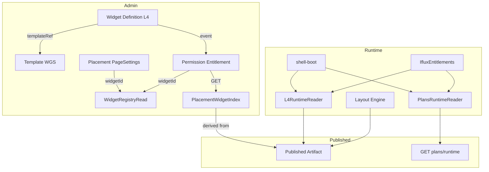

# Architecture Boundary Hardening (WGS Boundary Compliance)

**Status:** **E6 PASS — Final Exit Evidence submitted · awaiting Reviewer COMPLETE sign**  
**Type:** Architecture Refactor — **No Product Behavior Change**  
**Ngày lập plan:** 2026-07-27  
**Reviewer approval:** 2026-07-27 (Gate 1–3 PASS)  
**Baseline audit:** [`docs/admin-rbac/PhaseD0-WGS-Dependency-Runtime-Audit.md`](admin-rbac/PhaseD0-WGS-Dependency-Runtime-Audit.md)  
**SoT:** Owner spec §1–§8 (reference ✅ / coupling ❌)

### Owner / Reviewer gates (locked)

| Gate | Decision |
|------|----------|
| **Gate 1** | Plan E0–E6 **PASS** |
| **Gate 2** | `GET /api/placement-widget-index` — backend aggregate từ **Published Artifact** (không client snapshot) |
| **Gate 3** | Read Adapter layer → **`shared/runtime-read/`** (không `shared/read-models/`) |
| **AB-07** | Shared Read Model cực nhỏ — chỉ Read/Projection/Index/Lookup; cấm Save/Publish/Hydrate/Notify/Sync/Merge |
| **ABH-09** | Reader/Facade **whitelist** frozen — API mới cần consumer + Owner (v1.1) |
| **ABH-10** | Compatibility Layer phải có **Target removal** — không Forever |
| **ABH-11** | Net Complexity table mỗi phase — không chỉ LOC |
| **ABH-12** | **Rule Provenance + traceability** — ONE place · trace Runtime → Admin (E6 exit) |
| **ABH-TD-E5-001** | **BLOCK** E6 + ABH COMPLETE — **ONE Rule Provenance** (Generated Artifact preferred) |

---

## 0. Tóm tắt cho Owner

Task này **tách track** khỏi Phase D0 RBAC và **tách track** khỏi Wave 3 (remove dev key).  
Mục tiêu: **giữ nguyên hành vi sản phẩm**, chỉ sửa **ranh giới code** — reference qua contract, không import implementation chéo WGS, Runtime không reuse Admin Store.

**Thứ tự đề xuất:** E0 → E1 → E2 → E3 → E4 → E5 → E6 (exit).

| Phase | Tên | Mục tiêu |
|-------|-----|----------|
| **E0** | Baseline & Contracts | Ma trận + contract trước khi sửa code |
| **E1** | Shared Read Model | Widget Registry read-only contract |
| **E2** | WS-1 Permission ↔ Placement | Gỡ coupling Admin |
| **E3** | WS-3 L4 ↔ Permission | Event-driven, phá vòng tròn |
| **E4** | WS-4/5 Runtime Adapters | PlansRuntimeReader, L4RuntimeReader |
| **E5** | Runtime Entitlement stack | Tách EntitlementCatalog Admin khỏi shell |
| **E6** | Exit & Regression | Deliverables §8 + deploy verify |

**Out of scope (task này):**

- Wave 3 remove dev key / canPerm / view-gate hard block  
- Thay đổi Publish Pipeline, SoT flow, Owner WGS  
- `auth.js` client tier grant (RO-01–05) — **behavior change** nếu chuyển server-only → track riêng khi Owner mở  

---

## 1. Alignment — Reference vs Coupling

| | Giữ nguyên (✅) | Loại bỏ (❌) |
|---|----------------|--------------|
| **Reference** | `widgetId`, `templateRef`, Published Artifact, GET runtime | — |
| **Coupling** | — | import Store/Service nội bộ WGS khác, gọi `refresh*()`, hydrate Admin Store trên Runtime |

Audit đã xác nhận **Placement ↔ Template sạch**. Vi phạm tập trung:

```text
Permission → PageSettingsStore/Catalog     (DD-01..04)
L4 → EntitlementCatalog.refresh*           (DD-05..08)
L4 ↔ Permission circular                   (shell-boot load cả hai)
Runtime → PlansStore.hydrate + localStorage (RO-06..07)
Runtime → PlatformLayersWidgets migrate     (RO-08..09)
```

---

## 2. Workstream map (Spec → Code)

### WS-1 Cross-WGS Coupling (Admin)

| ID | File hiện tại | Hành động |
|----|---------------|-----------|
| DD-01 | `entitlements.html` | Bỏ script Placement; thay filter "enabled" bằng **read contract** (§2.1) |
| DD-02 | `entitlement-matrix-ui.js` | Bỏ `PageSettingsCatalog.listEnabledPlacementWidgets()` → `PlacementWidgetIndex.list()` |
| DD-03 | `entitlement-catalog.js:391` | Bỏ fallback `PageSettingsCatalog.allWidgetIds()` → `WidgetRegistryRead.widgetIds()` |
| DD-04 | `iflux-block-gate.js:21` | Bỏ fallback Placement → chỉ Widget Registry / L4 reader |

**Giữ:** `entitlement-catalog.js → PlatformLayersWidgets.entitlementList()` **chỉ cho đến E3** — sau E3 chuyển sang `WidgetRegistryRead` (Permission không gọi L4 implementation).

### WS-2 Shared Read Models

Tạo **một contract read-only**, không business logic:

**File mới:** `shared/runtime-read/widget-registry-reader.js`

```javascript
// Contract surface (frozen)
WidgetRegistryRead.list()       // [{ widgetId, title, category, capability, templateRef }]
WidgetRegistryRead.get(id)
WidgetRegistryRead.widgetIds()
WidgetRegistryRead.isKnown(id)
```

**Nguồn dữ liệu (theo context, không coupling):**

| Context | Nguồn | Ghi chú |
|---------|-------|---------|
| Admin L4 page | `PlatformLayersWidgets` (Owner) — adapter bọc, không export Store | Admin-only loader |
| Admin Permission matrix | `WidgetRegistryRead` hydrate từ GET snapshot hoặc L4 adapter | Không PageSettings |
| User Web Runtime | GET published L4 snapshot hoặc `/api/...` read-only | Không Admin module |

**Placement widget index (read contract cho filter "enabled"):**

**Client reader:** `shared/runtime-read/placement-widget-index-reader.js`

```javascript
PlacementWidgetIndexReader.listEnabledWidgetIds()  // GET only → Promise<string[]>
PlacementWidgetIndexReader.byPage(pageKey)         // GET only → Promise<string[]>
```

**Backend (Gate 2 — locked):**

```text
Page Settings → Publish Pipeline → Published Artifact (DB: page_published_versions)
        │
        ▼
Placement Index Builder (server-side projection)
        │
        ▼
GET /api/placement-widget-index
        │
        ▼
PlacementWidgetIndexReader (Admin Permission UI)
```

Permission **không** biết PageSettingsStore / Placement DB schema — chỉ consume index projection.

**Evidence SoT đã có:** `widget-publish.service.js` → `getPagePublishedForRuntime()`; contract `page-published.contract.js` (`placements[]`, `widgetRefs[]`). Index builder derive từ đó — không client snapshot.

### WS-3 Event-driven Sync

| Before | After |
|--------|-------|
| `platform-layers-widgets.js` → `EntitlementCatalog.refreshBlocksCatalog()` | `document.dispatchEvent(new CustomEvent('iflux-widget-catalog-changed', { detail }))` |
| `entitlement-catalog.js` load trong `platform-layers.html` | Admin entitlement page **subscribe** event; L4 page **không** load entitlement-catalog |

**Subscriber (Admin only):**

- `entitlements.html` / `entitlement-catalog.js` (khi mounted)
- **Không** subscribe trên User Web shell

### WS-4 Runtime Ownership

| Admin module (Runtime đang load) | Runtime adapter (thay thế) |
|----------------------------------|----------------------------|
| `plans-store.js` | `shared/runtime-read/plans-runtime-reader.js` |
| `platform-layers-widgets.js` (full) | `shared/runtime-read/l4-runtime-reader.js` |
| `entitlement-catalog.js` (Admin) | mở rộng `iflux-entitlements.js` + readers (không load Admin catalog trên shell) |

**PlansRuntimeReader — hành vi bắt buộc:**

```text
✅ GET /api/plans/runtime → memory cache (_plansCache)
✅ getPlan(tier), listTiers() — same output shape PlansStore.getPlan today
❌ localStorage read/write
❌ hydrate merge write
❌ saveMatrixOverrides / publishRuntime / PATCH admin
```

**L4RuntimeReader — hành vi bắt buộc:**

```text
✅ GET published L4 snapshot (route TBD: reuse existing public read nếu có)
✅ resolveWidgetCopy(widgetId), entitlementMeta(widgetId) — read facades
❌ migrateStoreOnce
❌ save / notifyPropagate
```

**shell-boot.js thay đổi:**

```text
- PlatformLayersWidgets (Admin)
- PlansStore (Admin)
- EntitlementCatalog (Admin)
+ PlansRuntimeReader
+ L4RuntimeReader
+ (optional) EntitlementRuntimeReader — hoặc IfluxEntitlements đọc trực tiếp PlansRuntimeReader
```

**Quy tắc sửa code (Owner SoT):** comment/block code cũ trong shell-boot — không để Admin module vô tình boot.

### WS-5 Runtime Adapter Separation

Cùng E4 — mỗi adapter:

1. File riêng dưới `User_Web/iflux-web-ui/readers/`
2. Chỉ export read API mirror consumer hiện tại (`IfluxEntitlements`, `auth.js`, `widget-registry.js`)
3. Unit contract test: output `getPlan('premium')` before === after (snapshot)

---

## 3. Phase chi tiết — Agent sẽ làm gì

### Phase E0 — Baseline & Contracts (1–2 ngày, không đổi behavior)

**Deliverables:**

- [ ] `docs/Architecture-Boundary-Hardening/00-Ownership-Matrix.md`
- [ ] `docs/Architecture-Boundary-Hardening/01-Dependency-Graph-Before.md` (mermaid)
- [ ] `docs/Architecture-Boundary-Hardening/02-Shared-Read-Contracts.md` (API surface frozen)
- [ ] `docs/Architecture-Boundary-Hardening/03-Event-Catalog.md` (`iflux-widget-catalog-changed` payload schema)
- [ ] Regression baseline script checklist (manual + curl probes)

**Actions:**

1. Grep toàn repo: `PageSettingsCatalog|PageSettingsStore|EntitlementCatalog|PlatformLayersWidgets|PlansStore` cross-boundary
2. Chụp dependency graph Before
3. Owner sign-off contract surface trước E1

**Gate E0 → E1:** Owner approve contract API (`WidgetRegistryRead`, `PlacementWidgetIndex`, event payload)

---

### Phase E1 — Shared Read Model (WS-2)

**Files tạo:**

| File | Owner load |
|------|------------|
| `shared/read-models/widget-registry-read.js` | Admin + Runtime (copy hoặc symlink deploy) |
| `shared/read-models/placement-widget-index.js` | Admin Permission UI only |

**Files sửa (minimal, backward compat):**

- `widget-library-catalog.js` — shim trỏ `WidgetRegistryRead.installFromL4()` thay vì expose `PlatformLayersWidgets` trực tiếp cho Permission consumers (facade only, same output)

**Acceptance E1:**

- [ ] `WidgetRegistryRead.list()` trả cùng số widget + ids như hiện tại trên entitlements page
- [ ] Không file mới import `PageSettingsStore`
- [ ] Dependency graph: Permission chưa gọi Placement (có thể vẫn gọi L4 qua adapter — E3 xử lý)

---

### Phase E2 — Permission ↔ Placement decouple (WS-1)

**E2a — Admin HTML/JS**

| File | Change |
|------|--------|
| `entitlements.html` | Remove `page-settings-catalog.js`, `page-settings-store.js`, `widget-publish-client.js`, inline `hydratePlacementFromPublished` |
| `entitlement-matrix-ui.js` | Filter "enabled" → `PlacementWidgetIndex.listEnabledWidgetIds()` |
| `entitlement-catalog.js` | Remove `PageSettingsCatalog` fallback |

**E2b — Backend read contract (nếu cần giữ filter "enabled" không đổi UI)**

| File | Change |
|------|--------|
| `backend/src/modules/.../placement-widget-index.routes.js` (new) | GET aggregate widgetIds từ published pages |
| Wire in `app.js` | Public read hoặc admin JWT read — **không** write |

**Acceptance E2:**

- [ ] `rg PageSettingsCatalog app/subscription/` → 0 (Permission WGS)
- [ ] Entitlements matrix UI: cùng số dòng widget, cùng filter enabled/disabled vs baseline screenshot
- [ ] Publish / Placement Admin không đổi

---

### Phase E3 — L4 ↔ Permission event-driven (WS-3)

| File | Change |
|------|--------|
| `platform-layers-widgets.js` | `notifyPropagate()` → dispatch `iflux-widget-catalog-changed`; **comment** block gọi `EntitlementCatalog` |
| `platform-layers.html` | Remove `<script entitlement-catalog.js>` nếu chỉ dùng label — dùng L4 native label |
| `platform-layers-catalog.js`, `platform-layers-page.js` | Replace `EntitlementCatalog.getBlockLabel` → local L4 label map |
| `entitlement-catalog.js` | Replace `PlatformLayersWidgets.entitlementList()` → `WidgetRegistryRead.list()` |
| `entitlements.html` | `addEventListener('iflux-widget-catalog-changed', refreshBlocksCatalog)` |

**Acceptance E3:**

- [ ] `rg EntitlementCatalog platform-layers-widgets.js` → 0 direct calls
- [ ] `rg PlatformLayersWidgets entitlement-catalog.js` → 0 (chỉ WidgetRegistryRead)
- [ ] User Web shell **không** load `entitlement-catalog.js` (E4/E5)
- [ ] Save widget L4 → matrix entitlement refresh (manual test Admin)

---

### Phase E4 — Runtime Adapters (WS-4, WS-5)

**Files tạo:**

```
User_Web/iflux-web-ui/readers/plans-runtime-reader.js
User_Web/iflux-web-ui/readers/l4-runtime-reader.js
```

**Files sửa:**

| File | Change |
|------|--------|
| `runtime/shell-boot.js` | Swap Admin scripts → readers; comment old `ensureParallel` entries |
| `iflux-entitlements.js` | Read from `PlansRuntimeReader` (fallback giữ shape cũ nếu reader chưa ready) |
| `auth.js` | `PlansStore.getPlan` → `PlansRuntimeReader.getPlan` |
| `iflux-guest-shell.js` | `PlansStore.hydrate()` → `PlansRuntimeReader.load()` (Promise, no localStorage) |
| `widget-registry.js` | `PlatformLayersWidgets` → `L4RuntimeReader` |
| `iflux-block-gate.js` | L4 reader only |
| `checkout-feature-boot.js` | Same hydrate swap |

**Verify PlansStore boot path (Owner question):**

| Hành vi cũ (Admin PlansStore on shell) | Hành vi mới (PlansRuntimeReader) |
|----------------------------------------|----------------------------------|
| `hydrate()` → GET + **write localStorage** | `load()` → GET → **memory only** |
| `getPlan()` → read localStorage | `getPlan()` → read memory cache |
| expose `saveMatrixOverrides` on window | **không expose** |

**Acceptance E4:**

- [x] `rg PlansStore User_Web/` → 0 active (trừ comment/docs) — Evidence: `E4-Evidence-Report.md`
- [x] `rg platform-layers-widgets User_Web/` → 0 active
- [x] Boot `/home`: không ghi `iflux-admin-plans-v1`, `iflux_l4_widgets_v2` mới
- [x] Console: không bulk 404 L4 boot (lazy fetch fix)
- [ ] **E4 FULL:** 0 Admin `app/subscription/*.js` on shell → **deferred E5** (EntitlementCatalog vẫn load)
- [ ] Evidence Report bắt buộc trước đóng phase — **PARTIAL PASS** (xem `E4-Evidence-Report.md`)

**Bài học E4:** Không đóng phase khi còn lỗi runtime thuộc scope (console 404) hoặc thiếu Eliminate vế (Admin catalog on shell).

---

### Phase E5 — Runtime Entitlement stack cleanup

Tách phụ thuộc `EntitlementCatalog` (Admin) khỏi User Web:

| File | Change |
|------|--------|
| `shell-boot.js` | Remove `EntitlementCatalog` script |
| `iflux-entitlements.js` | Inline hoặc reader: BLOCKS list từ plans runtime payload + L4 reader metadata |
| `iflux-block-gate.js` | Không phụ thuộc Admin catalog |

**Lưu ý:** `EntitlementCatalog.normalizePlan` logic — extract pure function vào `shared/read-models/plan-normalize.js` (no store).

**Acceptance E5:** (chi tiết đầy đủ — [`E5-Acceptance-Criteria.md`](Architecture-Boundary-Hardening/E5-Acceptance-Criteria.md))

- [x] **Eliminate (ABH-08):** 0 active load Admin `app/subscription/*.js`
- [x] **Introduce:** IfluxPlanNormalize + readers — không Admin shell load
- [x] **Evidence:** `E5-Evidence-Report.md`, `E5-ECG-Compliance-Audit.md`, `E5-Semantic-Ownership-Audit.md`

**Owner verdict (2026-07-27):** **PASS WITH ARCHITECTURAL CONDITION** — không FAIL · không full PASS.

**Architecture Incomplete** (ownership nợ, không “debt nhỏ”): [`ABH-TD-E5-001`](Architecture-Boundary-Hardening/ABH-TD-E5-001-Single-Rule-Provenance.md) **must close before ABH track complete.**

---

### Phase E6 — Exit & Regression (§8 Deliverables)

**BLOCK:** E6 **không được đóng** · ABH track **không complete** cho đến khi:

- [x] [`ABH-TD-E5-001`](Architecture-Boundary-Hardening/ABH-TD-E5-001-Single-Rule-Provenance.md) closed — **ONE Rule Provenance** (Generated Artifact)
- [x] [`ABH-12`](Architecture-Boundary-Hardening/ABH-12-Rule-Provenance-Gate.md) — `E6-Rule-Provenance-Report.md` + traceability
- [x] ABH-TD-E4-001 · ABH-10 facade sunset

**Documents (bắt buộc):**

| # | Deliverable | Path |
|---|-------------|------|
| 1 | Ownership Matrix | `docs/Architecture-Boundary-Hardening/Exit-Ownership-Matrix.md` |
| 2 | Dependency Graph Before/After | `docs/Architecture-Boundary-Hardening/Exit-Dependency-Graph.md` |
| 3 | Runtime Ownership Matrix | `docs/Architecture-Boundary-Hardening/Exit-Runtime-Ownership.md` |
| 4 | Shared Read Models Catalog | `docs/Architecture-Boundary-Hardening/Exit-Shared-Read-Models.md` |
| 5 | Cross-WGS Coupling Report | `docs/Architecture-Boundary-Hardening/Exit-Coupling-Report.md` |
| 6 | Regression Report | `docs/Architecture-Boundary-Hardening/Exit-Regression-Report.md` |
| 7 | Security Regression Report | `docs/Architecture-Boundary-Hardening/Exit-Security-Regression.md` |

**Regression checklist (behavior unchanged):**

| Area | Probe |
|------|-------|
| Permission matrix | Admin save tier blocks → User Web `hasBlock` |
| Placement | PagePublished layout home/market unchanged |
| Publish | Draft → publish → GET `/api/pages/:key` same slots |
| Runtime tier | Guest / free / premium page access unchanged |
| L4 Admin | Create/edit widget → catalog updated via event |
| API security | No new anonymous write routes |

**Deploy:** Production → purge Cloudflare → hard refresh verify `iflux.vn/home` + Admin entitlements.

---

## 4. Dependency graph — Target (After)



**Không còn cạnh:**

- PM → PL Store
- L4 → PM.refresh()
- Runtime → PlansStore / PlatformLayersWidgets Admin

---

## 5. Rủi ro & mitigations

| Rủi ro | Mitigation |
|--------|------------|
| Filter "enabled widgets" matrix đổi nếu thiếu PlacementWidgetIndex | E2b backend GET trước khi gỡ PageSettings scripts |
| `getPlan()` output lệch sau PlansRuntimeReader | Snapshot test 4 tiers × blocks trước/sau |
| L4 metadata thiếu trên Runtime nếu bỏ full module | L4RuntimeReader expose cùng facade `resolveWidgetCopy`, `entitlementMeta` |
| Event refresh race trên Admin | Debounce 300ms trong subscriber |
| Behavior change vô tình | Mỗi phase có gate; không gộp E2+E4 một PR |

---

## 6. Quan hệ với các track khác

```text
Phase D0 RBAC          → CLOSED (không quay lại)
Wave 3 dev key         → SAU task này (hoặc song song E0 only)
Architecture Boundary  → TASK NÀY (E0–E6)
Client tier auth.js    → OUT OF SCOPE (behavior change)
Phase E WGS (audit)    → CHÍNH LÀ TASK NÀY
```

**Gates:** ✅ Approved 2026-07-27 — execute E0→E6.

---

## 7. AB-07 — Shared Read Model Rules (Reviewer)

Mọi module trong `shared/runtime-read/`:

| Allowed | Forbidden |
|---------|-----------|
| Read, Projection, Index, Lookup | Save, Publish, Hydrate, Notify, Sync, Merge, Mutation |
| immutable return values | localStorage |
| stateless functions | event mutate |
| GET HTTP only | dependency WGS Store/Service implementation |

**Anti-pattern:** `WidgetRegistryReader` không được tiến hóa thành God Module (thêm `getPlacement()`, `saveWidget()`, …).

---

## 10. ABH-08 — Legacy Flow Elimination (Reviewer gate)

Mỗi phase exit **bắt buộc** hai vế:

```text
Introduce: [flow mới + verify runtime]
Eliminate:  [grep = 0 active + file/script removed list]
```

Template **Dual Path Audit** (trong exit doc mỗi phase):

| Flow | Status | Evidence |
|------|--------|----------|
| Old | Removed | `rg … → 0` active calls |
| New | Active | curl / UI / count |

**Cấm additive-only refactor** — thiếu cột Eliminate → phase **FAIL** (mirror CG-021).

---

## 11. ABH-09 — Reader & Facade Freeze (whitelist-first)

**Doc:** [`ABH-09-Reader-Facade-Freeze-Gate.md`](Architecture-Boundary-Hardening/ABH-09-Reader-Facade-Freeze-Gate.md) **v1.1 — APPROVED**

- **Whitelist là chính** — blacklist bổ sung
- **Không** dùng max method count làm KPI — cấm mega-method God Reader
- API mới → ≥2 consumer + Owner (CG-030)

## 12. ABH-10 — Compatibility Layer Sunset

**Doc:** [`ABH-10-Compatibility-Layer-Sunset.md`](Architecture-Boundary-Hardening/ABH-10-Compatibility-Layer-Sunset.md)

`WidgetLibraryCatalog` Runtime = Compatibility Layer · **Target removal E6** — không Permanent Architecture.

## 13. ABH-11 — Net Complexity

**Doc:** [`ABH-11-Net-Complexity-And-Consumer-Justification.md`](Architecture-Boundary-Hardening/ABH-11-Net-Complexity-And-Consumer-Justification.md)

Mỗi phase exit: globals · edges · Network · Admin modules loaded — không chỉ Removed/Added LOC.

**E5:** **PASS WITH ARCHITECTURAL CONDITION** (Owner 2026-07-27).

## 14. ABH-12 — Rule Provenance Gate

**Doc:** [`ABH-12-Rule-Provenance-Gate.md`](Architecture-Boundary-Hardening/ABH-12-Rule-Provenance-Gate.md)

- **ONE Rule Provenance** — mọi entitlement rule một nguồn; Runtime **consume**, không **interpret**
- **Provenance must be traceable** — trace ngược Runtime → Publish → Permission → Admin
- **ABH COMPLETE** chỉ khi đủ **5 điều kiện** (§1 ABH-12)

## 15. ABH-TD-E5-001 — Architectural Condition (from E5)

**Doc:** [`ABH-TD-E5-001-Single-Rule-Provenance.md`](Architecture-Boundary-Hardening/ABH-TD-E5-001-Single-Rule-Provenance.md)

**Acceptance:** exactly **ONE Rule Provenance** of entitlement rules — **must close before E6 / ABH COMPLETE**.

**Solution priority (Owner):** Generated Artifact ⭐⭐⭐⭐⭐ → Server-side normalize ⭐⭐⭐⭐ → Shared pure core ⭐⭐ (fallback only).

---

## 8. Definition of Done — ABH COMPLETE (Owner 2026-07-27)

Chỉ ký **Architecture Boundary Hardening COMPLETE** khi **đồng thời**:

- [x] **(1)** Không còn Admin module trên Runtime shell (E4/E5)
- [x] **(2)** Không còn compatibility layer — ABH-10 facade sunset
- [x] **(3)** Không còn second cache — ABH-TD-E4-001
- [x] **(4)** **ONE Rule Provenance** entitlement — ABH-TD-E5-001
- [x] **(5)** Trace được mọi rule Runtime → Publish → Permission → Admin — ABH-12

Plus:

- [x] Flow SoT giữ nguyên: Template → L4 → Placement & Permission → Publish → Runtime  
- [x] Mỗi WGS đúng Owner; reference qua `widgetId` / `templateRef` / Published Artifact  
- [x] Không import Store/Service implementation chéo WGS  
- [x] Runtime chỉ dùng Runtime Reader + Published Artifact  
- [x] Không circular L4 ↔ Permission  
- [x] UI / business / permission / placement / publish / runtime behavior unchanged (regression report PASS)  
- [x] 7 exit deliverables §8 committed trong `docs/Architecture-Boundary-Hardening/`  
- [x] `shared/runtime-read/*` pass AB-07 lint checklist (immutable, no localStorage, no mutate)

---

## 9. Effort ước lượng

| Phase | Effort | Risk |
|-------|--------|------|
| E0 | S | Low |
| E1 | M | Low |
| E2 | M | Medium (enabled filter) |
| E3 | M | Medium (event wiring) |
| E4 | L | High (shell-boot, nhiều consumer) |
| E5 | M | Medium |
| E6 | M | Low |

**Tổng:** ~2–3 sprint nếu làm tuần tự có gate; E4 là critical path.

---

*Plan này là cam kết implementation — chưa thay đổi code. Execute khi Owner approve §6 gates.*
