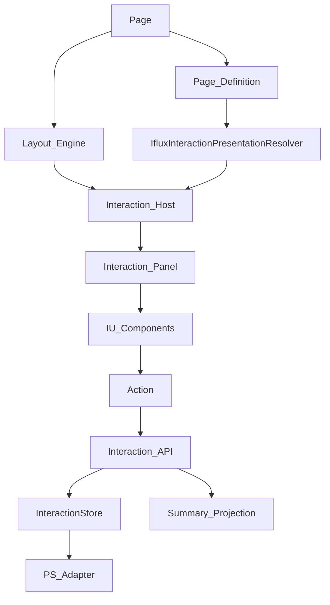

# SoT — Interaction Ownership (IO-001)

**Mã:** IO-001  
**Feature:** Interaction (Task 6 / IA-1.0)  
**Tầng:** Ownership / Architecture  
**Trạng thái:** **KHÓA vai trò + Resolver neo** (Owner 2026-07-24 Q4) — Phase 1 Architecture Draft PASS  
**Ngày:** 2026-07-24  
**Baseline:** `docs/runtime-opt/ia-1.0/Phase0-Inventory.md`  
**Persistence:** Follow **PS-1.0** (LOCKED)  
**Presentation matrix product:** IU-001 §7.1 (KHÓA) — Resolver **đọc** matrix, không copy luật vào IU/IA/Runtime

> Presentation Resolver **chỉ sống trong IO-001**.  
> IU / IA / IA-002 / IR **tham chiếu** — **cấm** định nghĩa lại logic chọn host.

---

## 0. Mục đích

Một chuỗi Owner duy nhất từ Page → Host → Component → Action → Store/API → Summary.  
Cấm spaghetti: UI tự fetch, tự LS, tự chọn sidebar/sheet/page.

---

## IO-001 — Ownership chain (bắt buộc)

```text
Page
  → chỉ khai báo nhu cầu Interaction + mode (summary | interactive)
  → KHÔNG chọn sidebar / sheet / page trong Component code

Page Definition
  → metadata / hints presentation preference (nếu có)

Layout Engine
  → mount Interaction Host vào slot Layout

Presentation Resolver     ← quyết định presentation mode (Owner duy nhất)
  → neo: IfluxInteractionPresentationResolver
  → input: Page Definition + viewport/breakpoint + Product rules (§7.1 từ IU)
  → output: inline | sidebar | bottom-bar | bottom-sheet | page
  → CẤM đặt if (mobile) trong CommentComposer / Widget / Feed card

Interaction Host
  → gọi mountInteraction(...) — caller hợp lệ DUY NHẤT từ Layout path

Interaction Panel
  → mount Catalog components (ActionBar, List, Composer…)

Component (IU Catalog)
  → emit Action (không fetch / không localStorage trực tiếp)

Action → API → InteractionStore → Persistence Adapter (PS-1.0)
Store / API success → Counter Owner = Interaction Summary projection (IA-001) — chỉ một nơi
```



---

## IO-002 — Ai được gọi `mountInteraction`

| Caller | Được? |
| --- | --- |
| Interaction Host (via Layout Engine) | **YES — duy nhất** |
| Page bootstrap trực tiếp (bypass Layout) | NO |
| Widget / Block / Feed card | NO |
| CommentList / Composer tự mount | NO |
| App Shell tabbar tự bind like/share như owner Interaction | NO — Shell chỉ Entry host do Resolver gắn |

---

## IO-003 — Presentation Resolver — **KHÓA** (Q4)

| Hạng mục | Giá trị khóa |
| --- | --- |
| **SoT Owner** | **IO-001 only** |
| **Runtime neo (global)** | `IfluxInteractionPresentationResolver` |
| **Module path (khi Impl)** | `User_Web/iflux-web-ui/interaction/presentation-resolver.js` |
| **API tối thiểu** | `resolve({ pageDefinition, viewport, productRules? }) → presentation` |
| **Đọc luật product** | IU-001 §7.1 (matrix) — không fork matrix trong Resolver file SoT khác |
| **Không Owner** | Component, Widget, Community UI `matchMedia`, IA Domain, IA-002 Runtime, IR Loading |

### Ranh giới SoT (bắt buộc)

| SoT | Được làm gì với Presentation |
| --- | --- |
| **IO** | Định nghĩa Resolver · neo · ai gọi · output mode |
| **IU** | Catalog + §7.1 matrix product + Host *là gì* (sidebar/sheet…) — **không** `resolve()` |
| **IA / IA-002** | Nhận `presentation` đã resolve trên `mountInteraction` — **không** chọn mode |
| **IR** | Load bundle theo mode Host đã mount — **không** chọn host |
| **IP** | Permission action — **không** presentation |

### Luật vận hành (Resolver)

Mobile mặc định: `bottom-bar → bottom-sheet`; `page` = secondary/fallback — **cấm** mặc định `bar → page` (khớp §7.1).

**Exception (IU-001 §7.1):** Community Post Comments — mobile Primary Interactive = `page` (`bar → page` hợp lệ). Resolver đọc `pageKey` ∈ `{ communityPost, comments }` + interactive/preferPage → `page`.

---

## IO-004 — Summary vs Interactive (ownership)

| Mode | Page khai báo | Host được phép | Store init |
| --- | --- | --- | --- |
| `summary` | Có | Host Summary (counts / ActionBar đọc projection) | **0** InteractionStore init (IR-001) |
| `interactive` | Có | Host Interactive (Panel + Catalog) | Được hydrate theo IA-002 / IR-001 |

Page **không** tự đổi mode theo breakpoint trong Component.

---

## IO-005 — Counter cập nhật (ownership nhắc)

Sau Action success: **chỉ** Summary projection (Counter Owner IA-001) được coi là SoT số đếm.  
Cấm CommentStore / CommunityStore / UI / client API wrapper tự `stats++` làm authoritative.

---

## IO-006 — CẤM spaghetti (map Phase 0)

| Anti-pattern AS-IS | Violation | Luật IO |
| --- | --- | --- |
| Shell bind ARTICLE_TABS như owner | V-IO-01 | Chỉ Host sau Resolver |
| Page/widget tự mount comments | V-IO-02 | Chỉ Host |
| CommentList → fetch → LS → ++stats | V-PS / V-IA | Action → API → Store → Summary |
| `if (isMobile)` trong Component | V-IU-02 | Resolver quyết định |

---

## IO-007 — Quan hệ SoT

| SoT | Quan hệ |
| --- | --- |
| PS-1.0 | Store chỉ qua Persistence Adapter (**LOCKED**) |
| IA-001 | Kinds / Counter Owner / Events |
| IP-001 | `Permission.resolve` trước Action |
| IU-001 | Catalog + §7.1 matrix (Resolver đọc) |
| IR-001 | Ai được load bundle khi Summary/Interactive |
| PG-1.0 | Phase docs |

---

## Exit IO-001

- [x] Ownership diagram + chain  
- [x] Bảng caller `mountInteraction`  
- [x] Resolver **chỉ trong IO** + cấm Component detect mobile  
- [x] Q4 neo khóa: `IfluxInteractionPresentationResolver`  
- [x] Phase 1 Architecture Draft PASS (Owner)  
- [ ] Phase 2 Runtime Contract — mở sau khi gate Umbrella cho phép  
